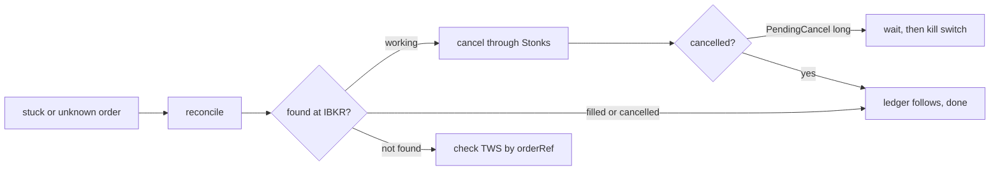

# Runbook: stuck or unknown order

Use this when an order is still working at the end of the day, when an order is `unknown` (a submit or cancel got no answer), or when IBKR shows `PendingCancel` for a long time.



## Why orders get stuck

- `unknown`: the link dropped or timed out after the order may have left. Stonks never sends that client id again until reconciliation finds it at the broker.
- Working at the close: a limit that never crossed, or an auction that did not fill.
- `PendingCancel`: IBKR accepted the cancel but the exchange has not confirmed it.

While any order of a portfolio is `unknown`, that portfolio neither decides nor sends.

## Steps

1. List the portfolio's orders and note the client id:

   ```bash
   uv run stonks orders list --portfolio <id>
   ```

2. Reconcile. It syncs every open order by client id, the way the tick and the submit job do before they act. It only reads the broker:

   ```bash
   uv run stonks live reconcile --portfolio <id>
   ```

   It lists what is still unknown and exits 1 while anything is. Run `stonks orders list` again. Most unknown orders resolve here.
3. Still working and you want it gone: cancel it through Stonks, never by hand in TWS, so the ledger follows.

   ```bash
   uv run stonks orders cancel <client-id> --portfolio <id> --reason "stuck at close"
   ```

4. Still unknown after a reconcile: open TWS or the IBKR portal and search the order reference. It is the client id, or a short hash of it for long ids (`orders.broker_ref`). If IBKR has it, the next reconcile will find it. If IBKR has no such order and no execution, it never arrived. Reconcile marks it `rejected` with the reason, and the next run may decide again.
5. `PendingCancel` for more than a few minutes: wait for the exchange. If the market is about to move or you are unsure, turn on the kill switch for the portfolio (see [kill-switch-drill.md](kill-switch-drill.md)). It stops new orders and retries the cancel.
6. If the order filled while you were busy, reconciliation books the fill once. Check the position in `stonks orders list` and the Health page.

## Never

- Never cancel or change a Stonks order by hand in TWS. The ledger would not know.
- Never place the same trade again by hand while an order is unknown. It may already be at IBKR.
