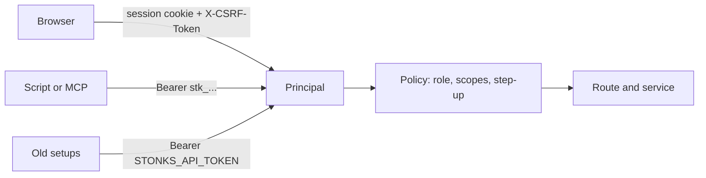

# Sign-in and access

How people and scripts prove who they are, and what each one may do. Design: `docs/design/accounts-and-modes.md` sections 2, 3 and 8. Code: `src/stonks/auth/`.

## Who can call the API



Every request becomes one `Principal`: the user, their role, the scopes of the credential, and whether the second factor was checked in the last 10 minutes.

Only health, the probes and the sign-in routes are open. Everything else needs a credential, reads included.

## Browser sign-in

1. `POST /api/auth/login` with email and password. This opens a short pending session (10 minutes). It can do nothing except the second factor.
2. First time: `POST /api/auth/mfa/enrol`, scan the QR code, then `POST /api/auth/mfa/enrol/confirm` with a code. You get ten recovery codes once. Save them.
3. Next times: `POST /api/auth/mfa/verify` with a code from the app or one recovery code.
4. The pending session is replaced by a new one. Idle timeout 12 hours, hard limit 7 days.

The second factor is required for every person. There is no way to skip it.

Emails are stored and matched in lower case, so `Alice@Example.com` and `alice@example.com` are the same account.

Cookies: `stonks_session` is `HttpOnly; Secure; SameSite=Lax`. `stonks_csrf` is readable by the app. Send its value as `X-CSRF-Token` on every POST, PUT, PATCH and DELETE made with the cookie.

## Roles and scopes

| Role | Scopes it can hold |
|---|---|
| viewer | read |
| trader | read, trade, lab |
| admin | read, trade, lab, admin |

A token never exceeds its user's role. If the role is lowered later, the token shrinks with it. A credential without `trade`, `lab` or `admin` can only read.

## Permissions

Every route that changes something names one permission. A test walks the route table and fails if one is missing. The OpenAPI spec shows it as `x-permission`, and `docs/api/rest.md` lists it per route. The table lives in `src/stonks/auth/policy.py`.

| Permission | Roles | Credential scope | Used for |
|---|---|---|---|
| `data.read` | all | read | stream tokens, reads of your own data |
| `portfolio.manage` | trader, admin | trade | link and sync a broker account |
| `connection.manage` | trader, admin | trade, step-up | connect or delete a broker |
| `killswitch.user` | trader, admin | trade | turn the kill switch on (global needs admin) |
| `killswitch.resume` | trader, admin | trade, step-up | turn the kill switch off |
| `risk.reset` | trader, admin | trade | clear a circuit breaker or other halt |
| `notifications.manage` | trader, admin | trade | push devices, preferences, quiet hours, webhook, mark read |
| `lab.run` | trader, admin | lab | backtests, lab runs, signal IC, Studio rule drafts, cancel lab jobs |
| `strategy.promote` | admin | admin | promote, retire, shadow, Studio register, enable, disable, lab runs that register |
| `strategy.code` | admin | admin | Studio code drafts |
| `operations.run` | admin | admin | ticks, ingests, scheduled run-now, cancel those jobs |
| `portfolio.totals` | admin | admin | totals across every trader |
| `users.read`, `users.manage` | admin | admin (manage needs step-up) | people admin |
| `tokens.manage` | all | browser session only | create tokens |
| `tokens.revoke` | all | any | revoke your own token |
| `password.change`, `mfa.recovery_codes` | all | step-up | your password and recovery codes |

The audit actor is always the caller (`user:<id>`). A request body cannot choose it. The old `actor` field on status changes is accepted and ignored.

## Your data only

Portfolio, orders, fills and P&L reads take an optional `portfolio_id`. It must be one of your portfolios, or the answer is `404`. Without it you get your own book. Admins get the same `404` for other people's portfolios. They see `GET /api/portfolio/totals` instead: cash and value summed over every book, with no tickers. Connections, notifications, halts and tokens follow the same rule.

## Step-up

Some actions need a second factor checked in the last 10 minutes: user admin, a password change, new recovery codes, a token with `trade` or `admin`, connecting or deleting a broker, and turning the kill switch off. Confirm with `POST /api/auth/mfa/verify` in the browser first. API tokens can never do these actions. They get `403 step_up_required`. The CLI on the server may still resume, because shell access already implies admin.

## API tokens

Create one in the browser with `POST /api/auth/tokens` (name, scopes, optional expiry in days). The token looks like `stk_<id>_<secret>` and is shown once. Only its SHA-256 is stored. List with `GET /api/auth/tokens`, revoke with `DELETE /api/auth/tokens/{id}`. Use it as `Authorization: Bearer stk_...`, for example in the MCP server's `STONKS_API_TOKEN`.

## Job event streams

A browser `EventSource` cannot send a header. So it asks `POST /api/jobs/{id}/stream-token` for a short token and puts it in the URL. The token opens that one job's stream for a few minutes. It names the user who asked for it and stops working if that user is disabled.

## The old shared token

`STONKS_API_TOKEN` still works. It acts as the bootstrap admin (`usr_owner`) and logs a warning. It cannot do step-up actions. Move scripts to personal tokens. The shared token goes away one release after the sign-in screen ships.

## Limits and lockout

Three counters, each five failures in 15 minutes:

- wrong passwords per account,
- wrong second-factor codes per account,
- all failures per client IP.

When one is full, tries get `429` with a `Retry-After` header. A right password resets the password counter only. The code counter resets only on a right code, so a stolen password does not buy more code guesses. A TOTP code is never accepted twice.

## Client IP behind the proxy

In Compose, Caddy sits in front of the API. `stonks serve` believes `X-Forwarded-For` only from `[api].trusted_proxies` (env `STONKS_API_TRUSTED_PROXIES`). Compose sets it to its own Docker network (`STONKS_DOCKER_SUBNET`, default `172.31.250.0/24`). So the login limit and `audit_log` see each visitor's real IP. The header from any other peer is ignored. The default is `127.0.0.1`.

## Loopback reads

`[api].open_reads_on_loopback` lets `GET` calls from 127.0.0.1 skip the credential. It is off. Set `STONKS_PROFILE=dev` on your own machine to turn it on for UI work. Never set it on a server. Personal data (portfolios, connections, notifications, halts) always needs a credential.

## CORS

Only `[api].ui_origin`, the Angular dev server (`http://localhost:4200`), may call the API from another origin. It may send the cookie and `X-CSRF-Token`. The built console is served from the same origin and needs no CORS.

## What is stored

| Secret | Stored as |
|---|---|
| Password | argon2id hash |
| TOTP secret | sealed with `STONKS_SECRET_KEYS` (AES-GCM) |
| Session id, CSRF token, API token, recovery codes | SHA-256 |

Without `STONKS_SECRET_KEYS` nobody can set up the second factor, so nobody can sign in with a password. The shared token keeps working.

## Admins

Admins manage people under `/api/auth/users`: add a person with a first password, change role or status, reset a password, reset the second factor. Disabling a person signs them out everywhere and revokes their tokens. The last active admin cannot be demoted or disabled. Admins see names, roles and status here, never anyone's holdings.

## First admin

On the server:

```bash
uv run stonks users bootstrap --email you@example.com
uv run stonks users reset-password --email you@example.com
uv run stonks users list
```

The password is prompted without echo, or read from `STONKS_AUTH_PASSWORD` in scripts. It is never a command option. The second factor is set up at the first sign-in. `python -m stonks.auth bootstrap-admin|reset-password` does the same.

## Audit

Logins, failed logins of known accounts, second-factor set-up and checks, logouts, password changes, token creation and revocation, kill switch changes, strategy status changes and every admin change write a row to `audit_log` or `status_changes`, with the caller as actor.

## Settings

The `[auth]` section of `config/default.toml`. Each value can be overridden by `STONKS_AUTH_<NAME>` in the environment.

| Setting | Default |
|---|---|
| `cookie_secure` | true |
| `session_idle_hours` | 12 |
| `session_absolute_days` | 7 |
| `pending_login_minutes` | 10 |
| `step_up_minutes` | 10 |
| `max_failures` | 5 |
| `failure_window_minutes` | 15 |
| `totp_issuer` | Stonks |

Secrets stay in the environment only: `STONKS_SECRET_KEYS`, `STONKS_API_TOKEN`. See `.env.example`.
