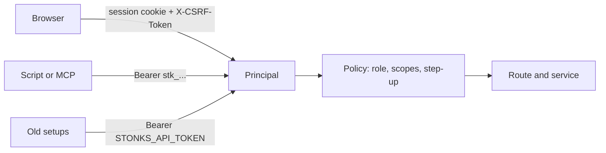

# Sign-in and access

How people and scripts prove who they are, and what each one may do. Design: `docs/design/accounts-and-modes.md` sections 2, 3 and 8. Code: `src/stonks/auth/`.

## Who can call the API



Every request becomes one `Principal`: the user, their role, the scopes of the credential, and whether the second factor was checked in the last 10 minutes.

Only health, the probes and the sign-in routes are open. Everything else needs a credential, reads included. `GET /metrics` needs the scrape token (`STONKS_METRICS_TOKEN`) or a loopback peer (`STONKS_METRICS_ALLOW_LOOPBACK`, on by default).

## Browser sign-in

1. `POST /api/auth/login` with email and password. This opens a short pending session (10 minutes). It can do nothing except the second factor.
2. First time: `POST /api/auth/mfa/enrol`, scan the QR code, then `POST /api/auth/mfa/enrol/confirm` with a code. You get ten recovery codes once. Save them.
3. Next times: `POST /api/auth/mfa/verify` with a code from the app or one recovery code.
4. The pending session is replaced by a new one. Idle timeout 12 hours, hard limit 7 days.

The second factor is required for every person. There is no way to skip it.

Emails are stored and matched in lower case, so `Alice@Example.com` and `alice@example.com` are the same account.

Cookies: `stonks_session` is `HttpOnly; Secure; SameSite=Lax`. `stonks_csrf` is readable by the app. Send its value as `X-CSRF-Token` on every POST, PUT, PATCH and DELETE made with the cookie.

## Roles and scopes

| Role | Scopes it can hold |
|---|---|
| viewer | read |
| trader | read, trade, lab |
| admin | read, trade, lab, admin |

A token never exceeds its user's role. If the role is lowered later, the token shrinks with it. A credential without `trade`, `lab` or `admin` can only read. The one exception is a POST whose permission is `data.read` (a stream token, marking your feed read): it only touches your own things, so viewers may call it.

## Permissions

Every route that changes something names one permission. A test walks the route table and fails if one is missing. The OpenAPI spec shows it as `x-permission`, and `docs/api/rest.md` lists it per route. The table lives in `src/stonks/auth/policy.py`.

| Permission | Roles | Credential scope | Used for |
|---|---|---|---|
| `data.read` | all | read | stream tokens, mark your feed read, reads of your own data (portfolios, subscriptions) |
| `portfolio.manage` | trader, admin | trade | link and sync a broker account |
| `portfolio.trade` | trader, admin | trade | subscribe to a strategy, turn a subscription on or off, notify or paper, place, change or cancel your own orders |
| `orders.approve` | trader, admin | trade, step-up | approve an order draft, so it is placed as a manual order |
| `orders.live` | trader, admin | trade, step-up | a manual order on a book that trades real money (checked by the service on top of `portfolio.trade`) |
| `subscription.auto_enable` | trader, admin | trade, step-up | switch a subscription to auto |
| `connection.manage` | trader, admin | trade, step-up | connect or delete a broker |
| `killswitch.user` | trader, admin | trade | turn the kill switch on for your books |
| `killswitch.global` | admin | admin | turn the kill switch on or off for every book |
| `killswitch.resume` | trader, admin | trade, step-up | turn the kill switch off |
| `risk.reset` | trader, admin | trade | clear a circuit breaker or other halt |
| `risk.global` | admin | admin | clear a global halt |
| `notifications.manage` | trader, admin | trade | push devices, preferences, quiet hours, webhook, price alerts, the Telegram link |
| `lab.run` | trader, admin | lab | backtests, lab runs, signal IC, Studio rule drafts, cancel lab jobs |
| `strategy.promote` | admin | admin | promote, retire, shadow, Studio register, enable, disable, lab runs that register |
| `strategy.code` | admin | admin | Studio code drafts |
| `operations.run` | admin | admin | ticks, ingests, backups (take, list, verify), scheduled run-now, cancel those jobs |
| `backups.restore` | admin | admin, step-up | staged restore of a backup (typed `RESTORE <id>`) |
| `portfolio.totals` | admin | admin | totals across every trader |
| `users.read`, `users.manage` | admin | admin (manage needs step-up) | people admin |
| `tokens.manage` | all | browser session only | create tokens |
| `tokens.revoke` | all | any | revoke your own token |
| `password.change`, `mfa.recovery_codes` | all | step-up | your password and recovery codes |
| `live.manage` | trader, admin | trade, step-up | a live portfolio's allocation and account profile |

The audit actor is always the caller (`user:<id>`). A request body cannot choose it. The old `actor` field on status changes is accepted and ignored.

Global halt actions check the permission, not only the role. An admin's token with only `read` and `trade` cannot stop or clear a global halt. A refusal is always `403`, never `422`.

Cancelling a job needs `operations.run` for operator jobs (ticks, ingests, backups) and `lab.run` for research jobs, universe refresh and ensure included.

## Your data only

Portfolio, orders, fills, P&L and insights reads take an optional `portfolio_id`. It must be one of your portfolios, or the answer is `404`. Without it you get your own book. Admins get the same `404` for other people's portfolios. They see `GET /api/portfolio/totals` and `GET /api/insights/totals` instead: cash, value, asset classes and exposure summed over every book, with no tickers. A paper account counts with its broker book. While fewer than three people besides the admin own books, the sums could reveal one person's numbers, so the money figures read 0 and `suppressed` is true. Connections, notifications, alerts, subscriptions, halts and tokens follow the same rule.

- `GET /api/alerts` shows your alerts. Admins also see the admin audience (alerts with no single recipient).
- Jobs and Studio drafts record who made them (`owner_id`). Only the owner sees, cancels or changes one. Admins see all of them. Anyone else gets `404`.
- `GET /api/brokers/alpaca/status` reads the configured Alpaca account, which backs the default portfolio. Only that portfolio's owner may read it. Answers are cached for 30 seconds, so polling never uses up the owner's Alpaca rate limit.
- A test walks every GET route as one user with another user's rows seeded and fails if any of them shows up.

## Step-up

Some actions need a second factor checked in the last 10 minutes: user admin, a password change, new recovery codes, a token with `trade` or `admin`, connecting or deleting a broker, turning the kill switch off, changing a live portfolio's allocation or account profile, and a manual order on a book that trades real money (a preview of it needs none). Confirm with `POST /api/auth/mfa/verify` in the browser first. API tokens can never do these actions. They get `403 step_up_required`. The CLI on the server may still resume, because shell access already implies admin.

## API tokens

Create one in the browser with `POST /api/auth/tokens` (name, scopes, optional expiry in days). The token looks like `stk_<id>_<secret>` and is shown once. Only its SHA-256 is stored. List with `GET /api/auth/tokens`, revoke with `DELETE /api/auth/tokens/{id}`. Use it as `Authorization: Bearer stk_...`, for example in the MCP server's `STONKS_MCP_TOKEN`.

## Job event streams

A browser `EventSource` cannot send a header. So it asks `POST /api/jobs/{id}/stream-token` for a short token and puts it in the URL. The token opens that one job's stream for a few minutes. It names the user who asked for it and stops working if that user is disabled.

## The old shared token

`STONKS_API_TOKEN` still works. It acts as the bootstrap admin (`usr_owner`) and logs a warning. It cannot do step-up actions. Move scripts to personal tokens. The shared token goes away one release after the sign-in screen ships.

## Limits and lockout

Three counters, each five failures in 15 minutes:

- wrong passwords per account,
- wrong second-factor codes per account,
- all failures per client IP.

When one is full, tries get `429` with a `Retry-After` header. A right password resets the password counter only. The code counter resets only on a right code, so a stolen password does not buy more code guesses. A TOTP code is never accepted twice.

Each try is counted before the slow check runs, in one locked write. So a burst of parallel tries gets no more guesses than the limit. The TOTP step is claimed with one conditional update, so of two parallel checks of the same code only one wins.

## Client IP behind the proxy

In Compose, Caddy sits in front of the API. `stonks serve` believes `X-Forwarded-For` only from `[api].trusted_proxies` (env `STONKS_API_TRUSTED_PROXIES`). Compose sets it to its own Docker network (`STONKS_DOCKER_SUBNET`, default `172.31.250.0/24`). So the login limit and `audit_log` see each visitor's real IP. The header from any other peer is ignored. The default is `127.0.0.1`.

## Loopback reads

`[api].open_reads_on_loopback` lets `GET` calls from 127.0.0.1 skip the credential. It is off. Set `STONKS_PROFILE=dev` on your own machine to turn it on for UI work. Never set it on a server. Personal data (portfolios, connections, notifications, halts) always needs a credential.

## CORS

Only `[api].ui_origin`, the Angular dev server (`http://localhost:4200`), may call the API from another origin. It may send the cookie and `X-CSRF-Token`. The built console is served from the same origin and needs no CORS.

## What is stored

| Secret | Stored as |
|---|---|
| Password | argon2id hash |
| TOTP secret | sealed with `STONKS_SECRET_KEYS` (AES-GCM) |
| Session id, CSRF token, API token, recovery codes | SHA-256 |

Without `STONKS_SECRET_KEYS` nobody can set up the second factor, so nobody can sign in with a password. The shared token keeps working.

## Admins

Admins manage people under `/api/auth/users`: add a person with a first password, change role or status, reset a password, reset the second factor. Disabling a person, resetting their password or resetting their second factor signs them out everywhere and revokes their API tokens. The last active admin cannot be demoted or disabled. Admins see names, roles and status here, never anyone's holdings.

## First admin

On the server:

```bash
uv run stonks users bootstrap --email you@example.com
uv run stonks users reset-password --email you@example.com
uv run stonks users list
```

The password is prompted without echo, or read from `STONKS_AUTH_PASSWORD` in scripts. It is never a command option. The second factor is set up at the first sign-in. `python -m stonks.auth bootstrap-admin|reset-password` does the same.

## Error codes

Every error is a problem-details body with `detail` for people and a stable `code` for programs: `not_authenticated`, `mfa_required`, `forbidden`, `step_up_required`, `csrf_failed`, `too_many_attempts`, `not_found`, `conflict`, `auto_blocked`, `invalid_request`, `validation_failed`, `not_configured`. A 401 `mfa_required` also says `next_step`: `enrol` or `verify`. A 409 `auto_blocked` lists `blockers`.

## Outbound webhooks

A trader's own webhook URL points at a host they chose. So it must be `https`, its host must not be a local name, and a numeric host must be public in every form (`127.1`, `2130706433` and `0x7f000001` are all loopback and are refused). On every send the host is resolved again, the request is refused unless every address is public, and the connection goes to that checked address (no DNS rebinding). Redirects are never followed.

## Manual orders

- A manual order is placed as the caller, on a portfolio they own (404 otherwise, admins included). It runs through the kill switch, every halt and every risk rule of the book.
- On a book that trades real money the service also asks for `orders.live`, so it needs a fresh second factor. API tokens, MCP, the assistant and the Telegram bot can never place one. The CLI on the server asks for the typed phrase `PLACE LIVE ORDER`.
- Each order records who placed it and why, and writes an `audit_log` row. The same client id never places twice.

## Telegram bot

- The bot token is read from `STONKS_TELEGRAM_BOT_TOKEN` only. It is never in TOML, never logged, and scrubbed from errors.
- A chat is linked to exactly one person, and a person to at most one chat. Linking needs a one-time code made while signed in (or by the operator on the server). Only its SHA-256 is stored. It works once and expires after 10 minutes. A new code retires the old ones.
- Every command acts as the linked person with their role's permissions and sees only their portfolios. A viewer cannot use the kill switch.
- The bot never has a fresh second factor, so step-up actions are refused. Resuming the kill switch is done in the web app.
- `/kill` needs the typed confirmation `KILL ALL` as the next message, within 2 minutes.
- Only private chats are answered. If a person blocks the bot, their link is removed.
- An admin or shell reset of a person's password or second factor removes their link and any unused link code. They link again after they sign in.
- Linking, unlinking and making a code write an `audit_log` row.

## Model endpoint (AI assistant)

- The assistant acts as the signed-in person. Its tools are the MCP tools, run inside the API process against the same routes, so every call checks the same permission and ownership as the web app. A viewer's assistant can only read.
- It never has a fresh second factor. Step-up actions are refused with a pointer to the web app.
- The model proposes, deterministic code decides. The assistant never places an order. With `[assistant.envelope] order_tools` on it may only draft one (`draft_order`). The server resolves the instrument, sets the reference price and the notional, checks the price band, the ticker allowlist and the per-order and per-day caps, and keeps the draft for a limited time. Approving a draft needs `orders.approve`: a signed-in browser with a fresh second factor. Nothing is approved through the assistant, Telegram, MCP or a token. Off (the default) is research only: no order tool at all.
- A draft may only name an instrument that `search_instruments` returned in the same conversation, never a ticker from the model's own text. Each draft gets a retry key from the loop, so a retried call never makes two.
- Tool results reach the model inside `<tool_result trust="untrusted">` tags, and the system prompt says never to follow instructions in them. The eval set (`stonks assistant eval`) plants an instruction in an instrument description and checks nothing is drafted.
- Only the tools in `assistant/catalog.py` are offered: a default set of about twenty and the categories the conversation turns on. Direct orders, ticks, strategy status changes and broker actions are in none.
- A tool that changes something else (the kill switch, deleting an alert) never runs on the model's word. The person approves or rejects it in the chat first. The model cannot set `confirm` itself. Research writes (strategy drafts, lab jobs, price alerts) run at once and stay research only: registering a strategy still needs the person.
- Every write is counted. More than `max_writes_per_minute` or `max_writes_per_hour` freezes the person's assistant for `freeze_minutes`: it runs research only until then, or until they unfreeze it in the web app with a fresh second factor. While a kill switch covers them it is research only too, and the kill switch cancels their pending drafts. A failed check means research only: it fails closed.
- Every turn is recorded (`assistant_turns`): the model, the prompt version, each tool call and result, and the drafts it made.
- The research loop (`start_research`) only runs lab trials. Its model sees two tools, propose and finish. Every proposal is recorded before it runs, budgets are checked in code, validation windows must start after the model's training cutoff, and no proposal can register or promote a strategy. Lab results reach it as untrusted data too.
- Only code in the API process can make a request act for the assistant. No header, cookie or token turns it on.
- The model endpoint sees the system prompt, the conversation and the tool results, which can include your holdings and orders. Run it on your own server or a host you trust, over a private network or https.
- The key, if any, is read from `STONKS_ASSISTANT_API_KEY` only, never from TOML, and is scrubbed from errors and logs.
- Conversations are yours. Another person's conversation reads as not found, admins included.

## Secrets in logs

Job errors, API errors and log lines are scrubbed of every configured secret: each `SecretStr` in the settings, the EODHD key, the global webhook URL, and the env-only secrets (`STONKS_SECRET_KEYS` and each of its keys, `STONKS_METRICS_TOKEN`, `STONKS_SMTP_PASSWORD`, `STONKS_VAPID_PRIVATE_KEY`, `STONKS_SNAPTRADE_CONSUMER_KEY`, `STONKS_TELEGRAM_BOT_TOKEN`, `STONKS_ASSISTANT_API_KEY`).

## Audit

Logins, failed logins of known accounts, second-factor set-up and checks, logouts, password changes, token creation and revocation, kill switch changes, manual orders, Telegram links, tax settings, strategy status changes and every admin change write a row to `audit_log` or `status_changes`, with the caller as actor.

## Settings

The `[auth]` section of `config/default.toml`. Each value can be overridden by `STONKS_AUTH_<NAME>` in the environment.

| Setting | Default |
|---|---|
| `cookie_secure` | true |
| `session_idle_hours` | 12 |
| `session_absolute_days` | 7 |
| `pending_login_minutes` | 10 |
| `step_up_minutes` | 10 |
| `max_failures` | 5 |
| `failure_window_minutes` | 15 |
| `totp_issuer` | Stonks |

Secrets stay in the environment only: `STONKS_SECRET_KEYS`, `STONKS_API_TOKEN`, `STONKS_MCP_TOKEN`. See `.env.example`.
