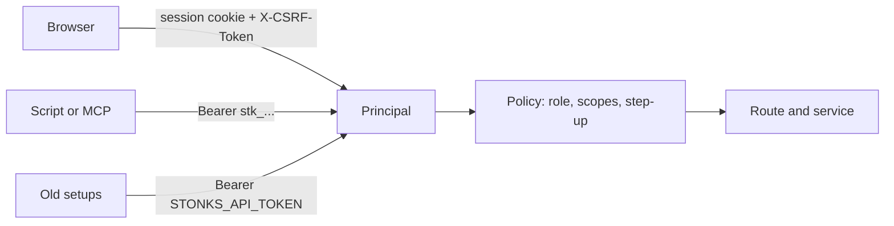

# Sign-in and access

How people and scripts prove who they are, and what each one may do. Design: `docs/design/accounts-and-modes.md` sections 2 and 8. Code: `src/stonks/auth/`.

## Who can call the API



Every request becomes one `Principal`: the user, their role, the scopes of the credential, and whether the second factor was checked in the last 10 minutes.

## Browser sign-in

1. `POST /api/auth/login` with email and password. This opens a short pending session (10 minutes). It can do nothing except the second factor.
2. First time: `POST /api/auth/mfa/enrol`, scan the QR code, then `POST /api/auth/mfa/enrol/confirm` with a code. You get ten recovery codes once. Save them.
3. Next times: `POST /api/auth/mfa/verify` with a code from the app or one recovery code.
4. The pending session is replaced by a new one. Idle timeout 12 hours, hard limit 7 days.

The second factor is required for every person. There is no way to skip it.

Cookies: `stonks_session` is `HttpOnly; Secure; SameSite=Lax`. `stonks_csrf` is readable by the app. Send its value as `X-CSRF-Token` on every POST, PUT, PATCH and DELETE made with the cookie.

## Roles and scopes

| Role | Scopes it can hold |
|---|---|
| viewer | read |
| trader | read, trade, lab |
| admin | read, trade, lab, admin |

A token never exceeds its user's role. If the role is lowered later, the token shrinks with it. A credential without `trade`, `lab` or `admin` can only read.

The full permission table is `src/stonks/auth/policy.py`. Routes and services call `require(principal, Permission.X)`. Routers never check roles themselves.

## Step-up

Some actions need a second factor checked in the last 10 minutes: user admin, a password change, new recovery codes, a token with `trade` or `admin`. Confirm with `POST /api/auth/mfa/verify` in the browser first. API tokens can never do these actions. They get `403 step_up_required`.

## API tokens

Create one in the browser with `POST /api/auth/tokens` (name, scopes, optional expiry in days). The token looks like `stk_<id>_<secret>` and is shown once. Only its SHA-256 is stored. List with `GET /api/auth/tokens`, revoke with `DELETE /api/auth/tokens/{id}`. Use it as `Authorization: Bearer stk_...`, for example in the MCP server's `STONKS_API_TOKEN`.

## The old shared token

`STONKS_API_TOKEN` still works. It acts as the bootstrap admin (`usr_owner`) and logs a warning. It cannot do step-up actions. Move scripts to personal tokens. The shared token goes away one release after the sign-in screen ships.

## Limits and lockout

Five failed attempts in 15 minutes, per account or per IP, block further tries with `429` and a `Retry-After` header. Wrong second-factor codes count too. A TOTP code is never accepted twice.

## What is stored

| Secret | Stored as |
|---|---|
| Password | argon2id hash |
| TOTP secret | sealed with `STONKS_SECRET_KEYS` (AES-GCM) |
| Session id, CSRF token, API token, recovery codes | SHA-256 |

Without `STONKS_SECRET_KEYS` nobody can set up the second factor, so nobody can sign in with a password. The shared token keeps working.

## Admins

Admins manage people under `/api/auth/users`: add a person with a first password, change role or status, reset a password, reset the second factor. Disabling a person signs them out everywhere and revokes their tokens. The last active admin cannot be demoted or disabled. Admins see names, roles and status here, never anyone's holdings.

## First admin

On the server:

```bash
uv run python -m stonks.auth bootstrap-admin --email you@example.com
uv run python -m stonks.auth reset-password --email you@example.com
```

The password is prompted without echo, or read from `STONKS_AUTH_PASSWORD` in scripts. The second factor is set up at the first sign-in.

## Audit

Logins, failed logins of known accounts, second-factor set-up and checks, logouts, password changes, token creation and revocation, and every admin change write a row to `audit_log`.

## Settings

Env only for now, all optional:

| Variable | Default |
|---|---|
| `STONKS_AUTH_COOKIE_SECURE` | true |
| `STONKS_AUTH_SESSION_IDLE_HOURS` | 12 |
| `STONKS_AUTH_SESSION_ABSOLUTE_DAYS` | 7 |
| `STONKS_AUTH_PENDING_LOGIN_MINUTES` | 10 |
| `STONKS_AUTH_STEP_UP_MINUTES` | 10 |
| `STONKS_AUTH_MAX_FAILURES` | 5 |
| `STONKS_AUTH_FAILURE_WINDOW_MINUTES` | 15 |
| `STONKS_AUTH_TOTP_ISSUER` | Stonks |
