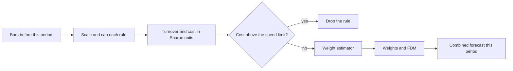

# Forecast weights

`forecast_blend` combines Carver's trend rules on each instrument with weights fitted after costs. A rule that costs too much to trade on an instrument is dropped for that instrument. This is roadmap item 22.7, modelled on Robert Carver's books and his pysystemtrade.

## How it works

1. **Rules.** EWMAC at fast spans 2, 4, 8, 16, 32 and 64 (the slow span is four times the fast one) and scaled time-series momentum at 125 and 250 sessions. Each forecast is scaled to an average of 10 and capped at 20.
2. **Fit window.** Weights are fitted at the start of each year (or quarter, or month, with `refit`). The fit reads only bars dated before that start, so there is no look-ahead (principle P12).
3. **Cost of a rule.** Each rule trades on its own at one unit of daily risk. Its turnover is how many average positions it trades a year. Its cost in Sharpe units is `turnover * cost per trade / annual volatility`. The cost per trade is the half-spread plus fee of the asset class, times `cost_multiplier`. The costs come from the run (see below).
4. **Speed limit.** A rule that costs more than `max_cost_sr` (0.13 Sharpe a year, about a third of a realistic Sharpe of 0.4) is dropped for that instrument (principle P19). Fast rules on a crypto coin often go, while the same rules on a cheap stock stay.
5. **Weights.** An estimator weights the rules that are left, from their returns after costs.
6. **FDM.** The forecast diversification multiplier is `1 / sqrt(w'Hw)`, with `H` the correlation of the kept rules' forecasts, capped at 2.5.
7. **Combine.** The weighted forecast times the FDM, capped at 20. Sizing is the same `vol_target` path as `ewmac_trend`.

With less than a year of bars before the fit window, the fit is a warm-up. Every rule then gets an equal weight and the fixed FDM.

## Where the costs come from

The strategy never reads config. The code that runs it hands it a cost model through the `CostAware` seam in `stonks.strategies.costs`:

| Runner | Cost model |
|--------|------------|
| Lab run | The dataset's costs (`--cost-model`, else `[backtest.costs]`). A cost stress rerun keeps them, so the strategy believes the normal costs while the broker charges the stressed ones. |
| Backtest | The request's `cost_model`, else `[backtest.costs]`. |
| Tick | `[backtest.costs]`, bound to every strategy it loads. |

Without a cost model, or with one that charges nothing, the realistic defaults (`CostModelSettings.realistic()`) apply. A saved strategy keeps its cost model in `costs.json`. Dearer costs drop more rules, cheaper ones keep more.

## Estimators

Estimators sit behind the `ForecastWeightEstimator` seam in `stonks.features.forecast_weights`. A new one is one new module with `@register_weight_estimator("name")`.

| Name | What it does |
|------|--------------|
| `handcraft` | The default. Groups rules by correlation and shares weight between groups by their effective number of independent rules. Then moves weight from dearer rules to cheaper ones. Pre-cost Sharpe ratios are ignored because they are too noisy. |
| `bootstrap` | Averages long-only maximum Sharpe weights over 100 block resamples of the returns after costs. Seeded. |
| `equal` | One over the number of rules. |

## Parameters

| Name | Default | Meaning |
|------|---------|---------|
| `rules` | all eight | Which rules to combine. |
| `weight_method` | `handcraft` | The estimator. |
| `max_cost_sr` | 0.13 | The speed limit in Sharpe a year. |
| `cost_multiplier` | 1.0 | Scales the asset class's cost per trade. |
| `refit` | `year` | How often the weights are fitted. |
| `scalar_mode` | `fixed` | Carver's published scalars, or `estimate` from the fit window. |
| `fdm_mode` | `estimate` | Estimate the FDM in the fit window, or use `fdm`. |

## See the weights

`stonks report --backtest forecast_blend --tickers ... --start ... --end ...` adds a **Forecast weights** section to the tear sheet. For each instrument it lists every rule with its weight, scalar, turnover, cost in Sharpe units, Sharpe before and after costs, and whether it was kept or dropped.
