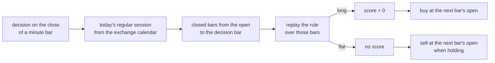

# Intraday strategies

Three reference strategies that decide on minute bars (roadmap 21.3.1): an opening range breakout, VWAP reversion and intraday momentum. They are normal catalogued strategies. The lab, the backtester and the registry treat them like any other.

Today they run on the bar-based backtester at a minute interval. The event driver of roadmap 21.2 will call the same code in replay, paper and live. See [the intraday design](../design/intraday.md).

```bash
uv run stonks ingest intraday --tickers SPY.US --interval 1m
uv run stonks lab run intraday_orb --start 2025-01-02 --end 2025-06-30 --interval 1m \
  --tickers SPY.US --params '{"ticker": "SPY.US"}'
```

## How they decide



- **Closed bars only (P12).** A decision on the bar stamped `t` is made at that bar's close. It reads bars stamped up to `t`, and a 5m bar only once it has closed (`visible_cutoff`). Fills come at the next bar's open (P21).
- **Regular hours.** The session comes from the ticker's exchange calendar (`features.sessions.regular_session`). Pre-market and after-hours bars are ignored. Early closes and daylight saving move the open and the close. A ticker without a known calendar never trades.
- **No overnight risk.** Every strategy is flat `exit_minutes_before_close` minutes before the close (default 5) and flat at the next session's first bar.
- **No state.** Each call replays the rule over today's bars. The answer at a bar does not depend on what the run did before, so a restart or a replay gives the same decision.
- **One ticker, long only.** Each trades its `ticker` param (default `SPY.US`) with `allocation` of cash, like the other single ticker examples.

Shared params: `interval` (`1m`, `5m`, `15m` or `30m`, default `1m`), `ticker`, `allocation`, `exit_minutes_before_close`. None of them is tuned.

## Opening range breakout (`intraday_orb`)

The opening range is the high and low of the bars that close within `range_minutes` of the open. The first close above the range high buys. A close below the range low exits, and the strategy does not trade again that session. The score is how far the close sits above the range high.

| Param | Default | Tuned | Meaning |
|---|---|---|---|
| `range_minutes` | 30 | yes, 5 to 120 | Minutes that form the opening range |

Asset classes: equity and commodity.

**Hypothesis card.** The first half hour sets the day's reference range while overnight news is priced. A close above it shows buyers still arriving. Late buyers, short sellers' stops and trend followers carry the move for part of the day, so the long pays for the false breakouts it stops out of. Who loses: short sellers who faded the open and must cover. When it fails: quiet days with no follow-through, and when costs are large against a small range.

## VWAP reversion (`intraday_vwap_reversion`)

VWAP is the volume weighted average of the typical price `(high + low + close) / 3` from the open (`features.intraday.session_vwap`). With no volume yet, as on quote-only feeds, it is the running mean. After `warmup_minutes`, a close at least `entry_bps` below VWAP buys. A close at or above VWAP exits. A close `entry_bps * stop_multiple` or more below VWAP exits too, and blocks new entries for the rest of the session. The score is the gap back up to VWAP.

| Param | Default | Tuned | Meaning |
|---|---|---|---|
| `entry_bps` | 30 | yes, 5 to 200 | Distance below VWAP that buys |
| `stop_multiple` | 3.0 | yes, 1.5 to 6 | The stop, in entry distances below VWAP |
| `warmup_minutes` | 15 | no | No entries in the first minutes |

Asset classes: equity.

**Hypothesis card.** Large orders worked through the day push a liquid stock away from VWAP for a while, and the price comes back once the pressure passes. Buying a stretch below VWAP supplies liquidity to the impatient seller, who pays us the spread and the temporary impact. Expected sign: a positive return from entry back to VWAP. When it fails: trend days and news, when the move is information, not pressure. The stop caps that loss.

## Intraday momentum (`intraday_momentum`)

After Gao, Han, Li and Zhou (2018), "Market intraday momentum". The signal is the return from the previous session's last close to the last close within `signal_minutes` of the open. From `entry_minutes_before_close` before the close, a signal above `threshold_bps` buys. The score is the signal return.

| Param | Default | Tuned | Meaning |
|---|---|---|---|
| `signal_minutes` | 30 | yes, 15 to 90 | Minutes after the open that end the signal |
| `entry_minutes_before_close` | 30 | yes, 10 to 90 | When the entry window opens |
| `threshold_bps` | 0 | no | The signal must beat this |

Asset classes: equity and commodity.

**Hypothesis card.** Overnight news is priced by the end of the first half hour, but slow traders, and dealers hedging their gamma late in the day, trade the same way near the close. So the first half hour's return predicts the last half hour's return in liquid index products and futures. When it fails: an afternoon news shock, thin markets, and late flow too small for the costs.

## The lab on sessions

An intraday lab dataset splits by whole trading sessions, not calendar days (`lab/dataset.py`):

- the sessions are the days the universe has bars at the run's interval
- `train_ratio` splits those sessions and always leaves one for validation
- the embargo (P9) is whole sessions: the bars of `max(embargo_bars, label_horizon_bars)` rounded up to 6.5-hour sessions, so at least one full session
- walk-forward folds count sessions too, and `test_days` and `train_days` then mean sessions

Each strategy's label horizon is at most one session of bars, so the default embargo skips one whole session between train and validation. The run manifest records the number of sessions.

## Limits

- The backtester steps bar by bar, so a year of 1m bars is slow. Use a few months, or `5m` bars, for tuning.
- Sessions in the lab are UTC days. That is exact for US, European and crypto markets, and off by one day for exchanges whose session crosses UTC midnight.
- Intraday risk rules (loss limits per minute, stale data) come in 21.3.2. Until then only the daily risk rules apply.
