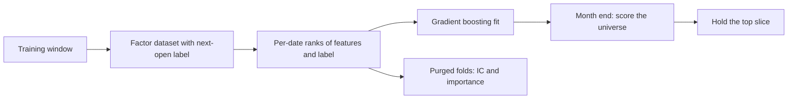

# Learning ranker

`learning_ranker` is a gradient-boosting model that ranks a universe from many factors and holds the top slice. It learns from the [factor dataset](../factors.md) and is governed like every model: each choice is a lab trial, and new fits go through the [model lifecycle](../model-lifecycle.md). This is roadmap item 23.12.

## How it works



1. **Data.** For each training window the factor dataset gives every factor (by default the 157 `alpha158` features) and the label `O[t+1+h] / O[t+1] - 1`, the return from the next open over `horizon_bars` bars. Bars are read up to the window's last day and never later. The last labels of a window are empty and drop out, so no label ever reaches past it (principles P9 and P12).
2. **Folds.** In a cross-validation fold the lab hands several purged training segments. Each segment builds its own labels, so none spans a test block.
3. **Target.** Features become per-date percentile ranks around zero, and the label becomes its per-date percentile rank. The model learns the order of the next period's returns, not their size.
4. **Model.** Histogram gradient boosting from scikit-learn, behind the `Regressor` seam in `stonks.features.ml`. Early stopping is off, so no unpurged random split picks the model, and a seed makes the fit repeatable.
5. **Scoring.** On the last session of each rebalance month the model scores the universe from the factor values known that day, through a point-in-time view. The best `top_pct` are held. Between month ends the answer stays the same.
6. **Orders.** `decide` rebalances equal weight on month ends through the `equal_weight_top_n` constructor. When a backtest or the tick runs the construction pipeline, any constructor applies to the held slice.

Unfitted, the strategy holds nothing. It trades daily bars only.

## Why not LightGBM

LightGBM needs `libgomp`, which the slim Docker image does not have. scikit-learn is already a dependency. A LightGBM model would be one more `Regressor` kind, with no change to the strategy.

## Choices are trials

The factor list, the label horizon and every hyperparameter are params. The lab records every trial of every run in the trial ledger, and repeated runs of one strategy count together, so the deflated Sharpe sees them all (principle P5).

The fit also scores the model on purged, embargoed k-fold out-of-fold predictions (`cv_folds`, `embargo_pct`). It reports the daily IC, its mean, IR and hit rate, and each feature's importance: the drop in fold IC when that feature is shuffled. This is a diagnostic. Nothing is picked from it.

## Params

| Param | Default | Meaning |
|-------|---------|---------|
| `factors` | `alpha158` | Factor sets, library ids or formulas, comma-separated. |
| `horizon_bars` | 21 | Bars the label looks ahead. |
| `sample_step` | 5 | Train on every n-th date, so labels overlap less. |
| `top_pct` | 0.2 | Share of the scored universe held (tunable). |
| `model` | `hist_gbm` | Regressor kind. |
| `learning_rate` | 0.05 | Boosting learning rate (tunable). |
| `max_iter` | 200 | Boosting rounds. |
| `max_leaf_nodes` | 15 | Leaves per tree (tunable). |
| `min_samples_leaf` | 50 | Rows a leaf needs (tunable). |
| `l2_regularization` | 1.0 | L2 penalty on leaf values. |
| `cv_folds` | 3 | Folds of the diagnostic, 0 turns it off. |
| `embargo_pct` | 0.01 | Share of rows embargoed after each diagnostic fold. |
| `rebalance_months` | every month | Months whose last session rebalances. |
| `universe` | empty | Tickers ranked together. Empty uses the lab's universe to train and the lake's to score. |
| `seed` | 0 | Model and diagnostic seed. |

## Lifecycle

The class learns in `fit`, so it is retrainable. The weekly `model_retrain` job refits it on the trailing window into a candidate version. The candidate runs as a model book beside the live version, and only a governed swap puts it live. See [model lifecycle](../model-lifecycle.md).

## Report

A backtest tear sheet of the ranker adds a section with the model settings, the out-of-fold IC tiles, the IC by month and the 20 most important features.

## Try it

```bash
uv run stonks lab run learning_ranker --start 2020-01-01 --end 2025-01-01 --universe-id sp500 --preset promotion
uv run stonks lab run learning_ranker --params '{"factors": "classic"}' ...
```
