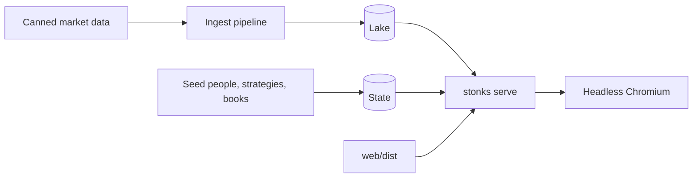
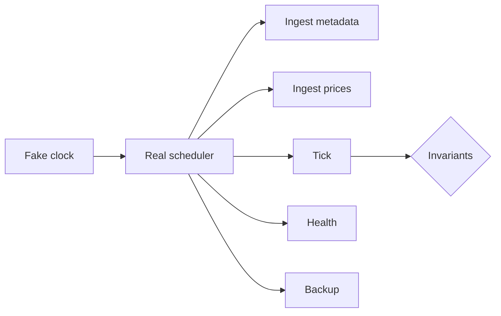

# Testing

Stonks has three kinds of tests.

| Kind | Where | Runs by default |
|---|---|---|
| Unit and integration | `tests/unit`, `tests/integration` | yes |
| Live vendor contracts | `tests/integration/live` | no, needs `STONKS_RUN_LIVE_TESTS=1` |
| End to end in a browser | `tests/e2e` | no, needs `-m e2e` |
| Paper soak, long run | `tests/soak` | no, needs `-m soak` (the smoke run is in the default suite) |

```bash
uv run pytest -n auto          # the default suite, no network, no browser
```

## End to end in one command

Build the console once, install Chromium once, then run the suite:

```bash
(cd web && npm ci && npm run build)
uv run playwright install chromium
uv run pytest -m e2e tests/e2e
```

Add `--headed` to watch the browser, or `--slowmo 300` to slow it down. Run one journey with `-k`, for example `-k "kill_switch and phone"`.

The e2e tests run one after another on one server. Do not add `-n`.

## What the suite starts



`tests/e2e/stack.py` builds a throwaway install in a temp folder:

- Both stores are migrated.
- Canned bars go in through the real ingest pipeline. `AAA.US` rises, `BBB.US` has a 2:1 split, `CCC.US` pays a dividend, `SPY.US` is the benchmark and `BTC-USD.CC` is crypto. The data ends on the last weekday before today.
- An admin and a trader are enrolled with known TOTP secrets. Tests compute codes with `pyotp`.
- The trader has a paper book with its own cash. The admin has the default book.
- Four active buy and hold strategies, one per ticker, so a tick limited to one ticker places one order. One shadow strategy per viewport waits for the promote journey.
- `stonks serve` runs on a free localhost port with the built console. `tests/e2e/serve.py` swaps every data source for the canned one, so nothing reaches a vendor. The broker is the simulated one. The fake connection provider is enabled.

To click around the same stack by hand:

```bash
uv run python -m tests.e2e.stack --root .e2e-stack --port 8765
```

It prints the emails, the password and the TOTP secrets.

## Why Playwright for Python

The suite uses `pytest-playwright`, not Playwright Test in `web/e2e`.

- The stack is Python. The fixtures seed the stores, compute TOTP codes and publish notifications with the same code the server uses.
- One runner, one report and one set of markers for the whole repo.
- The `e2e` marker keeps it out of the default run with no extra config.

## The journeys

Every journey runs twice, on a desktop (1280 by 800) and on a phone (375 by 812).

| Journey | What it proves |
|---|---|
| First sign-in | Password, TOTP enrolment from the key on screen, recovery codes shown once, sign out, then sign in with a code |
| Trader home | The home shows the trader's own portfolio value, a fresh signal and the strategies panel |
| Notifications | A new item appears in the feed with the unread mark, Mark all read clears it on screen and on the server |
| Universe from CSV | Create a list universe from a CSV file, refresh it and see its three members |
| Lab run | Run momentum with the quick preset and see the verdict |
| Promote | A trader is refused, the go-live gate refuses the admin, then the admin overrides with a reason and the strategy turns active |
| Paper tick | A real tick on the simulated broker places one order and one fill, both listed on the Orders and Fills tabs, and the session strip stays calm |
| Kill switch | Engaging it turns the strip red and the next tick places no orders. Resume needs RESUME TRADING and a fresh code |
| Backup | Back up now finishes and shows in the backup list |
| Tenant isolation | The trader gets 404 for the admin's book and sees only their own value and orders |

Each journey also checks:

- no console errors,
- no failed request other than the refusals it expects,
- no sideways scroll on the phone,
- no axe-core violation on every page it visits.

`test_accessibility.py` runs axe on every page of the console as the admin and the trader, on both viewports.

## When a test fails

Traces, the axe report and the server log land in `test-results/`. Open a trace with:

```bash
uv run playwright show-trace test-results/<test>/trace-0.zip
```

## Known app issues

The suite lets these through today. Each one has a test that fails while the issue is there. Remove the entry once the fix lands.

| Id | Issue | Where it is allowed |
|---|---|---|
| BUG-1 | The shell calls `/api/halts`, `/api/schedule` and `/api/strategies` before anyone signs in, and gets 401 | `KNOWN_NOISE` in `tests/e2e/conftest.py` |
| BUG-2 | The home calls `/api/subscriptions`, which has no route yet, so My strategies says Coming soon | `KNOWN_NOISE`, strict xfail `test_trader_home_lists_followed_strategies` |
| BUG-3 | A trader with no portfolio gets 404 from `/api/portfolio` and `/api/pnl` and the home shows an error | strict xfail `test_new_trader_home_loads_without_errors` |
| BUG-4 | Traders see Promote to active. The server refuses them with 403 | the promote journey expects the 403 |
| A11Y-1 | On Settings the Notifications panel has the same landmark name as the toast region | `KNOWN_AXE` in `tests/e2e/conftest.py` |
| A11Y-2 | The data table's scroll region takes its caption as its name, which repeats the panel heading on Universes and Halts | `KNOWN_AXE` |

## The CLI golden run

`tests/integration/test_cli_golden_run.py` runs the daily loop through the CLI on a fresh folder: `db init`, ingest from the canned source, a lab run that registers the strategy, `registry promote --override`, a tick and the report. It compares the key numbers with `tests/fixtures/golden/cli_golden_run.json` within a small tolerance. It is part of the default suite.

After a change that should move those numbers, refresh the file and check it in:

```bash
STONKS_UPDATE_GOLDEN=1 uv run pytest tests/integration/test_cli_golden_run.py
```

## The paper soak

`tests/soak` runs the whole daily loop for many trading days in fast forward, in one process, on the simulated broker.



`tests/soak/harness.py` builds a throwaway install: both stores, the canned market from `tests/e2e/fake_market.py`, buy and hold strategies and a churn strategy that trades every day. The real scheduler runs the real jobs through the `local` backend. The clock jumps from one fire to the next, so a quarter takes about two minutes.

The run adds trouble on purpose:

- **Crashes.** On chosen days the tick dies mid-portfolio, after the order reaches the broker and before the ledger commits. A new scheduler starts, recovers the interrupted rows, and the day's tick is run again by hand.
- **Kill switch.** Engaged before one day's tick and resumed after it.
- **DST.** The window crosses a clock change, so ticks must keep firing once per session at 16:45 New York time.
- **Holidays.** No tick fires on an exchange holiday.

After every tick it checks:

- cash plus positions at the day's closes equals the snapshot's equity, and cash is not negative,
- positions equal the net of all fills,
- no fill is booked twice, no order fills more than its size, no order repeats, no order stays open from an earlier day,
- snapshots never go back in time,
- no order goes out under the kill switch,
- no tick or scheduled run is stuck in `running`,
- the day's bar landed and the day has one risk snapshot.

At the end: one successful tick per session, one New York time for every tick, and a non-empty backup folder.

```bash
uv run pytest tests/soak                 # the smoke run: 4 sessions across the March 2026 DST switch
uv run pytest -m soak tests/soak -s      # the long run: February to April 2026, 62 sessions
```

The long run prints one line, for example `62 sessions, 62 ticks, 61 orders, 61 fills, 3 restarts, 89 backups, 177 health runs, ...`. The smoke run also breaks the ledger on purpose and checks that each invariant reports it.

`.github/workflows/soak.yml` runs the long soak every Monday and by hand, and uploads its log.

## In CI

`.github/workflows/e2e.yml` builds the console, caches the Playwright browsers, runs the suite headless in Chromium and uploads `test-results/` when it fails. It is not a required check yet.
