# Trader console (web UI)

The Angular app in `web/` is the trader console: sign-in, a simple home,
profile, the first-run guide, watchlists, charts, the calendar, strategies, orders and
trade costs, insights, notifications, the research pages (trial results,
leaderboard and tear sheets, screener, options, studio, lab, strategy review) and the admin pages
(overview, health, schedule and backups, data, data quality, universes,
halts, users). It talks only to the
REST API (`src/stonks/api/`) through a client generated from the checked-in
contract `web/openapi.json`.


## Run it

Node 22+ and npm. From `web/`:

```bash
npm install                 # once
npm start                   # dev server on http://localhost:4200, proxies /api to 127.0.0.1:8000
```

In another terminal, from the repo root, run the API:

```bash
STONKS_API_TOKEN=... uv run stonks serve     # 127.0.0.1:8000
```

`npm run build` writes the production bundle to `web/dist/`; `stonks serve` then
serves it at `/` with single-page fallback (`[api].ui_dist`), so one process
serves both. The dev server origin (`http://localhost:4200`) is the API's
`[api].ui_origin` for CORS in the dev profile only (`STONKS_PROFILE=dev`),
although the proxy makes CORS unnecessary in dev.

Every call needs a credential. Sign in, or paste an API token (in the
closed "For scripts" section of the sign-in page, open only in dev, or of
**Settings**; kept in `sessionStorage` for that tab only). For local UI work, start the API with
`STONKS_PROFILE=dev` so reads from 127.0.0.1 work without signing in. See
`docs/security.md` and [Sign-in and the trader home](#sign-in-and-the-trader-home).

| Command | What it does |
|---|---|
| `npm start` | Dev server with the `/api` proxy (`proxy.conf.json`) |
| `npm run build` | Production build into `web/dist/`, then `scripts/preload-routes.mjs` (see [Lighthouse budget](#lighthouse-budget)) |
| `npm test` | Unit tests once, headless (Vitest + jsdom via `ng test`) |
| `npm run test:watch` | Unit tests in watch mode |
| `npm run lint` | ESLint (angular-eslint, template accessibility rules), the node specs in `scripts/`, and the copy check |
| `npm run format` / `format:check` | Prettier |
| `npm run api:generate` | Regenerate the typed client from `openapi.json` |
| `npm run api:check` | Regenerate and fail if the committed client differs (CI) |

When the backend changes a route: `uv run python -m stonks.api.openapi` (writes
`web/openapi.json`), then `npm run api:generate` in `web/`, and commit both.

## Stack

- Angular 22 (standalone components, signals, `resource()`, new control flow,
  zoneless, OnPush everywhere), TypeScript 6 strict with strict templates.
- `@hey-api/openapi-ts` generates `src/app/api/generated/` (Angular HttpClient
  client, so interceptors apply). Never edit it; ESLint and Prettier skip it.
- TradingView Lightweight Charts, behind the `ChartEngine` seam.
- `@angular/service-worker` for the app-shell cache and Web Push.
- Public Sans, Archivo and IBM Plex Mono, self-hosted from `@fontsource` (see [Identity](#identity)).
- Vitest (Angular's default runner) with jsdom; ESLint; Prettier.

## Folders

```
web/src/
  styles.scss                 global primitives: buttons, fields, panels, page grid
  styles/_tokens.scss         design tokens + light/dark palettes
  styles/_breakpoints.scss    phone / tablet / desktop mixins
  testing/                    test helpers (nextRequest, tick, fake chart)
  app/
    api/                      the only code that touches the generated client
      generated/              openapi-ts output (do not edit)
      models.ts               contract types re-exported for the app
      api-call.ts             unwrap(): SDK result -> data or ApiError
      provide-api.ts          HttpClient + interceptors + client binding
      <domain>.service.ts     portfolio, ticks, health, strategies, lab, market,
                              orders, shadow, ingest, studio, system, jobs-api
    core/                     cross-cutting services
      auth/                   AuthTokenService (sessionStorage only), SessionService,
                              session interceptor, guards, StepUpService + dialog, qr.ts
      commands/               CommandRegistry (palette commands), ShortcutsService (keys)
      help/                   glossary.ts: one-line help for every metric
      http/                   ApiError + problem-details mapping, interceptors
      jobs/                   JobsService (SSE via fetch + polling), SseParser
      notify/                 ToastService
      confirm/                ConfirmService
      theme/                  ThemeService
      format/                 money / percent / date formatting; FormatService (locale, time zone)
      pwa/                    ConnectivityService (offline, updates), NotificationPermissionService,
                              PushSubscriptionApi (Web Push seam, HTTP implementation)
    shared/
      ui/                     page header, stat tile, status pill, data table,
                              loading/empty/error states, confirm dialog, toasts,
                              help tip, command palette, shortcut cheat sheet,
                              display and notification settings panels, offline page
      chart/                  ChartEngine seam, lightweight-charts engine,
                              <app-time-series-chart>
      format.pipes.ts         money, pct, num, day, dateTime, ago pipes
    shell/                    app frame, navigation, palette commands (shell-commands.ts)
    pages/<name>/             one folder per page: <name>.routes.ts + <name>.page.*
```

## Conventions for page agents

Follow these exactly; the dashboard (`pages/dashboard/`) is the reference
implementation.

### Add or build a page

1. Your page already has a folder, a lazy route file and a placeholder
   component (`pages/<name>/`). Replace the placeholder's template; delete the
   `<app-planned-page>` usage.
2. Child routes (e.g. `strategies/:id`) go in your own `<name>.routes.ts`:
   ```ts
   export default [
     { path: '', title: 'Strategies', loadComponent: () => import('./strategies.page').then((m) => m.StrategiesPage) },
     { path: ':id', title: 'Strategy', loadComponent: () => import('./strategy-detail.page').then((m) => m.StrategyDetailPage) },
   ] satisfies Routes;
   ```
   Route params bind to inputs (`withComponentInputBinding`): `readonly id = input.required<string>()`.
   Do not edit `app.routes.ts` or `shell/nav-items.ts` unless you add a new
   top-level page.
3. Every page starts with `<app-page-header title=".." description="..">` and
   puts page actions in `<button actions ...>`. The shell focuses the page's
   `h1` after each navigation.
4. Components: standalone, `ChangeDetectionStrategy.OnPush`, `inject()` (no
   constructor injection), `input()` / `output()` / `model()`, signals and
   `computed()`, `@if` / `@for` / `@switch`. Page-only components live in the
   page folder; anything two pages use goes to `shared/ui/`.
5. Name files `<thing>.page.ts` for routed pages, plain `<thing>.ts` for
   components; styles in `.scss` next to them, using tokens only.

### Load data

- Call domain services in `src/app/api/`; never import from
  `api/generated/sdk.gen` or `api/generated/client` in components (ESLint
  enforces it). Types come from `api/models`.
- Missing a call? Add a method to the matching domain service, one line per
  route: `get(id: string) { return unwrap(getThing({ path: { thing_id: id } })); }`.
- Reads use `resource()`, one per panel, so one failing route never blanks the
  page:
  ```ts
  protected readonly strategies = resource({
    params: () => ({ status: this.status() }),
    loader: ({ params }) => this.strategiesApi.list(params),
  });
  ```
- Every panel renders four states in this order:
  ```html
  @if (res.error(); as err) { <app-error-state [error]="err" (retry)="res.reload()" /> }
  @else if (!res.hasValue()) { <app-loading-state label="Loading strategies" /> }
  @else if (res.value().items.length === 0) { <app-empty-state title=".." message="what fills this and how" /> }
  @else { ...data... }
  ```
  Never read `res.value()` without `hasValue()`; it throws in the error state.
- Errors are `ApiError`s with a ready-to-show `message` (the API's
  problem-details `detail`, field errors for 422s, a Settings hint for 401s).
  Failed mutations are toasted by the error interceptor; don't toast them again.

### Mutations (promote, retire, tick, ingest, backtest, ...)

Every mutating action asks first, then calls the service, then says what
happened with the same verb:

```ts
async runTick(asOf: string) {
  const ok = await this.confirm.confirm({
    title: `Run a tick for ${asOf}?`,
    message: 'Active strategies decide and place orders through the broker.',
    confirmLabel: 'Run tick',
    typedConfirmation: asOf,          // required for ticks
  });
  if (!ok) return;
  try {
    await this.ticksApi.start({ as_of: asOf });
    this.toasts.success(`Started the tick for ${asOf}.`);
  } catch {
    // The error interceptor already showed the API's message.
  }
}
```

Status changes (promote, retire, …) need a reason: see below.

Use `tone: 'danger'` for retire/delete and anything touching a live broker.
Disable the triggering button while the request runs.

#### Status changes need a reason (governance)

Promote, move to shadow, retire (Strategies) and enable, disable (Studio)
send a `StatusChangeRequest` body: `{ reason, override }`. The API records it
in the strategy's status history (`GET /api/strategies/{id}/history`, shown
as a timeline on the strategy page). Use `<app-status-change-dialog>` instead
of `ConfirmService` for these: host one in the page and call `open()`; it
resolves to the body, or `null` when cancelled.

```ts
private readonly dialog = viewChild.required(StatusChangeDialog);

const body = await this.dialog().open({
  title: `Retire ${id}?`, message: '…', confirmLabel: 'Retire', tone: 'danger', minReason: 1,
});
if (body) await this.strategiesApi.retire(id, body);
```

Promotions go through `promoteThroughGate()` (`shared/governance.ts`):

1. it loads the go-live report and shows its verdict and failing checks
   above the reason field (typed id to confirm);
2. it promotes silently; a **409** means the gate refused, so it opens the
   dialog again with the failing checks and offers **Override and promote**,
   which needs a reason of at least 20 characters and the typed word
   `override`;
3. it retries with `override: true`. Other errors are toasted.

Check labels, measures and value/limit formatting for all go-live checks
live in `shared/golive-checks.ts` (`checkRow`, `checklistItems`).

### Background jobs

Backtests, lab runs, ingest and ticks return a `Job`. Follow it with
`JobsService.track()`, which streams progress over SSE (short-lived stream
token in the URL, never the bearer token) and falls back to polling:

```ts
private readonly jobs = inject(JobsService);
private readonly destroyRef = inject(DestroyRef);
protected readonly run = signal<JobHandle | null>(null);

async start(request: BacktestRequest) {
  const job = await this.lab.startBacktest(request);
  const handle = this.jobs.track(job.id, this.destroyRef);
  this.run.set(handle);
  const last = await handle.finished;
  if (last?.status === 'succeeded') this.result.set(await this.lab.backtestResult(job.id));
}
```

Template: `handle.progress()` (0..1, show as `<progress>` with a label),
`handle.message()`, `handle.status()` in an `<app-status-pill>`,
`handle.error()`. Offer Cancel via `JobsApiService.cancel()` where the API
supports it (queued jobs, lab runs).

### Tables

```ts
protected readonly columns: TableColumn<OrderView>[] = [
  { key: 'ticker', label: 'Ticker', mobile: 'title' },     // card heading on phones
  { key: 'side', label: 'Side' },
  { key: 'quantity', label: 'Qty', format: 'number' },
  { key: 'status', label: 'Status' },                      // custom cell below
  { key: 'created_at', label: 'Created', format: 'datetime', mobile: 'hide' },
];
```
```html
<app-data-table caption="Orders placed by ticks" [rows]="page.items" [columns]="columns"
                [rowKey]="orderKey" [total]="page.total" [pageSize]="50"
                (pageChange)="offset.set($event.offset)">
  <ng-template appCell="status" [appCellOf]="page.items" let-o>
    <app-status-pill [status]="o.status" />
  </ng-template>
</app-data-table>
```

- Formats: `text`, `number`, `money`, `signedMoney`, `percent`, `signedPercent`
  (fractions), `date`, `datetime`; `tone: true` colours numbers by sign.
- Client paging by default; pass `total` for server paging and refetch on
  `pageChange` (put `offset` in the resource `params`). Server mode has no
  sort buttons and keeps the API's row order.
- Keep the last page on screen while the next loads: build the page from
  `keepLatest(res)` (`shared/ui/data-table/keep-latest.ts`) and pass
  `[busy]="res.isLoading()"`, which dims the rows under a thin progress bar.
- Pages that should stay fresh call `autoRefresh(() => [resources])` from
  `shared/auto-refresh.ts`: a reload every minute while the tab is visible,
  paused when hidden. Show `<app-updated-ago [at]="auto.updatedAt()" />` in
  the page header. `TicksService.finished` changes when a trading run this
  tab followed ends, and the dashboard reloads then.
- Always give a `caption` (screen readers) and a `rowKey`.
- Links in rows: put an `<a routerLink>` in a custom cell of the title column.

### Charts

Use `<app-time-series-chart>` for lines and `<app-price-chart>` for candles (see [Trader workspace](#trader-workspace-phase-13)). Never import `lightweight-charts`
outside `shared/chart/lightweight-chart-engine.ts`.

```html
<app-time-series-chart ariaLabel="Backtest equity, with drawdown below"
  [summary]="summary()" [series]="series()" [height]="300" />
```

Series: `{ id, label, kind: 'line' | 'area', color: 'brass' | 'primary' | 'gain' | 'loss' | 'muted' | 'violet', pane?: 0 | 1, format?: 'money' | 'percent' | 'number', points: { time, value }[] }`.
`time` is `YYYY-MM-DD` for daily data or an ISO timestamp. Equity is a
`primary` line in pane 0 (`brass` only for a live portfolio); drawdown is a `loss` area in pane 1. Comparison lines (other strategies on the shadow chart) use `violet`, never amber or brass. Always pass a one or two
sentence `summary` (the canvas is invisible to screen readers). Tests use
`provideFakeChart()` from `src/testing/fake-chart.ts`.

With a benchmark, the strategy and the benchmark share pane 0, both rebased
to 100 (`rebase()` in `shared/lab-results/result-figures.ts`, `format: 'number'`);
the benchmark is a `muted` line and a small legend names it.

### Results and missing figures

The result views live in `shared/lab-results/`: `<app-backtest-result>`,
`<app-lab-run-result>` (with `<app-preflight-issues>`, the run's data
checks) and `<app-figure-grid>`. The Lab page and Studio's backtest and lab
panels both use them.

The API sends non-finite figures (a Sharpe with no variance, a payoff ratio
with no losing trades) as `null`. Show them as **n/a**, never 0 or a dash:
`formatMetric(key, value)` and `metricLabel(key)` in `shared/metrics.ts` do
this for robustness-test metrics, and `pctOrNa` / `numOrNa` for fixed
fields. Lab results group figures with `<app-figure-grid>`: risk (Sortino,
Calmar, Ulcer, VaR/ES, longest drawdown), trades (count, win rate,
expectancy, payoff, holding time, turnover, cost drag), the benchmark
(excess CAGR, alpha, beta, IR, capture ratios) and trial counts. Each
robustness test shows its deciding figures first (`KEY_METRICS`: DSR, PBO,
the Monte Carlo drawdown band, cost stress, walk-forward efficiency…) and
folds the rest into "All figures".

### Lab form

The Lab opens on a **simple test** (`pages/lab/simple-test-form.ts`):
three plain steps, then a strategy, what to trade (typed tickers or a saved
list) and two dates. **Test it** sends a lab run on the Standard suite with
every other setting at its default (`simpleTestRequest`): daily bars, never
on trial. The result shows the plain verdict (below). **Advanced** in the
panel head swaps to every setting: the Backtest and Lab run tabs. The
choice is kept in this browser only (`stonks.lab.view`). A saved strategy
(`?strategy=`), a suite (`?preset=`) or a prefilled re-run opens Advanced.

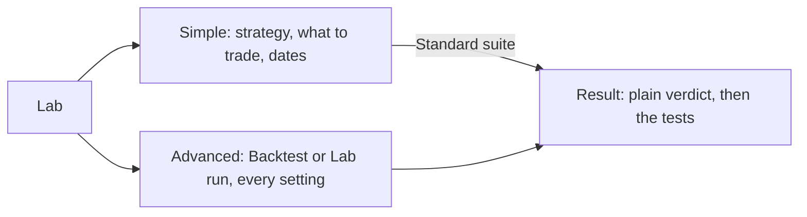

The strategy picker (`strategy-picker.ts`) never shows code. Each strategy
shows its plain name and one line on what it does, from the catalog's
`title` and `description` (the class `summary` in Python, else the first
sentence of its hypothesis, never a docstring). Groups follow the kind of
idea (`alpha_family`: Yardsticks, Trend following, Value and quality,
Patterns and models...), with add-ons that wrap another strategy last
(`is_wrapper`). Search matches the name and the description only.

The lab-run form sends a named suite (`preset`: quick, standard,
promotion) unless the trader picks custom tests (`survival_tests`). The
tests each suite runs come from `GET /api/lab/survival-presets`
(`suitesFromPresets` in `pages/lab/lab-requests.ts`); the console's own
lists stand in only while that loads. With stored universes, "Run on"
picks one instead of typed tickers (`universe_id`), and "Fetch missing
data first" sends `ensure_data`: the server fetches the missing prices in
a data job before tuning, and the result says so when `ensure_job_id` is
set.
The form shows only what a first run needs: strategy, tickers or
universe, window, suite, hypothesis ("Why it should work") and "Put it on
trial if it passes" (`register_if_passes`, with the Full suite and a
required hypothesis). Everything else (search space and method,
objective, trials, seed, tuning share, embargo, benchmark, walk-forward
and MCPT options, pass rules, premortem, and "Put it on trial whatever
the verdict", which sends `register_strategy`) sits in one closed
**Advanced** fold that opens itself when one of its fields is wrong. The
`promotion` preset is called the **Full** suite everywhere. `/lab?preset=`
picks a suite, with `?strategy=` and `?tickers=`, so a failing approval
check links straight to a prefilled run. `/lab?universe=` opens both forms
with that stored universe picked. A universe's page (Test in the lab) and a
screen saved as a universe link there. A backtest or plain lab run starts with
no confirm; a run that may put a strategy on trial asks once, plainly. A
finished run shows a next step: Put it on trial (a prefilled re-run),
what failed and "Change and run again", or Open strategy and Follow. Costs
use the shared `<app-cost-field>` (`pages/lab/cost-field.ts`), and
Studio's backtests default to the configured costs and run the same suites. Walk-forward,
MCPT and the per-test "advanced options" start blank, meaning "the test's
default", and only filled fields are sent, so presets keep their own
settings. The options come from `GET /api/lab/survival-tests`: each test's
options schema gives labels, defaults, bounds and choices
(`pages/lab/test-options.ts`), so a new backend option needs no console
change. Field errors show next to the field, and the advanced panel opens
when one of its fields is wrong.

### Robustness tests and the verdict

People read "robustness tests" (the code says survival tests). The console
names all 22 the engine runs in `shared/lab-results/survival-tests.ts`:
a plain label ("Higher costs", "Nearby settings", "Many splits (CPCV)") and
one line on what it guards against. The custom suite lists them all, slow
ones marked, and Signal ranking (IC) says it never fails a run.
`production/golive.py` names them the same way for the approval check.

A lab run's result opens with the **Robustness verdict** tile and one
sentence (`verdictSentence`): "It held up: it passed all 7 robustness
tests..." or "It did not hold up: it failed 2 of 7 robustness tests
(Higher costs, Nearby settings)...". A second line says why a run can fail
with every trial done: trials are the settings the search tried, and a
trial only says a setting ran. The trial ledger uses the same split:
trials read **Done** or **Error**, the run reads Passed or Failed under
"Robustness verdict". Each test card repeats what it guards against, and
quant words (deflated Sharpe, PBO, CPCV, MCPT, IC, walk-forward, purged
folds) carry a tip from the glossary's Research words.

The search settings in the Advanced fold include the Optuna tuner. Pick it
and the form shows its sampler (TPE, NSGA-II or random) and "Stop weak
trials early" (`prune`). Objectives include Sortino, Calmar, Sharpe less
twice the drawdown, and a combined score. "Draw a parameter heatmap" sends
`heatmap: {x, y, grid_size, fast}`: pick two parameters or leave them on
Auto. The result then shows `<app-param-heatmap>`
(`shared/lab-results/param-heatmap.ts`): a real table of scores, green for
high and red for low. The tuned cell is outlined and the plateau
neighbourhood is bordered, with the plateau verdict above. On phones the
table scrolls inside its own labelled box.

The Lab's screens sit in one row of underline tabs (`pages/lab/lab-nav.ts`)
that scrolls sideways on phones: Test a strategy (`/lab`) and Trial ledger
(`/lab/ledger`), then **More tools**: Sweep (`/lab/sweeps`), Signal IC
(`/lab/signal-ic`), Factors (`/lab/factors`) and Research sessions
(`/lab/research`). A sweep
runs every strategy, or the ones picked, on typed tickers or a saved
universe, and `<app-sweep-result>` ranks the rows best first. Signal IC
shows how well a strategy's scores ranked the moves that followed, per
look-ahead (`<app-signal-ic-result>`). Both follow the job with
`<app-job-progress>` and show a failed result load inline with Retry
(`pages/lab/job-follower.ts`). The Lab history lists and opens them too,
by the strategy's plain name.

The trial ledger lists every recorded lab run from `GET /api/lab/ledger`
(server-paged, filtered by `?strategy=`): strategy, hypothesis, trials run
and errors, best score and robustness verdict. `/lab/ledger/:runId` shows
one run from `GET /api/lab/ledger/{run_id}`: the hypothesis and premortem,
the data, the search in words, every trial with its settings, and the
strategy's trial count across all runs, with one line on why it matters
(more trials make a good result more likely to be luck). A lab run's
result links to it.

Factors (`pages/lab/factors/`, `api/factors.service.ts`):

- `/lab/factors` lists the library from `GET /api/factors`. Set, family
  and kind go to the server as `?set=`, `?family=` and `?kind=`. The search
  box filters the loaded list on the page.
- `/lab/factors/:id` shows one factor: what it measures, why it should
  work, direction, warm-up and its formula, with "Edit as a formula".
- `/lab/factors/formula?expression=` is the formula workbench.
  `<app-formula-editor>` checks the formula with `POST /api/factors/check`
  as you type (a short pause first, and only the last edit counts). It
  shows the canonical form and the warm-up, or why the formula is refused.
- Below either one sit three tools. Each picks its names with
  `<app-basket-picker>`: a stored universe, a watchlist or typed tickers.
  - Values on a date: `POST /api/factors/values`, best first.
  - Tear sheet: a job followed over SSE, then
    `<app-factor-tearsheet-result>`. It shows tiles, IC per horizon, a bar
    per bucket, cumulative returns per bucket and top minus bottom, IC by
    group, a monthly IC heatmap, and alpha and beta.
  - Test as a strategy: a lab run of the `factor` strategy with
    `strategy.params.factor` set. The API keeps a class ref's params fixed
    for the whole search, so the tuner only moves the slice held. A
    library factor starts from its own hypothesis. A formula starts blank,
    and a hypothesis is required (P1).

Research sessions (`pages/lab/research/`, `api/research.service.ts`):

- `/lab/research` lists your sessions from `GET /api/assistant/research`.
  A start form sends a goal, a universe or tickers, and budgets only when
  you lower them. The page follows the job and links the new session.
  When research is off (no model endpoint or no model cutoff), it says so.
- `/lab/research/:id` shows the goal, model and cutoff, meters for trials,
  proposals and compute, and one card per proposal. A card shows its
  status, hypothesis and premortem, validation start, trials, best score,
  verdict, why it was rejected, and a link to its run in the trial ledger.
  It reloads every minute while the session runs.

### Formatting and copy

- Numbers through `formatMoney/formatPercent/...` or the `money`, `pct`, `num`,
  `day`, `dateTime`, `ago` pipes; percentages are fractions from the API.
  Numeric cells get `.num` (mono tabular figures). Never call `Intl` or
  `toLocaleString` yourself: the formatters follow the trader's locale, time
  zone and date style from Settings (`FormatService`, kept in `localStorage`)
  and re-render when they change. Defaults: the browser's locale and zone,
  ISO dates (`2026-09-26`). Date-only values are never shifted by zone.
- Sentence case, plain verbs, buttons name the action ("Run tick", not "OK").
  Errors say what failed and what to do; empty states say what will fill the
  space and how.

### Metric help

Every metric shows a "?" tip with one plain sentence and a link to the
in-app glossary (`/help/glossary#<key>`, account menu, Help). The text
lives in one file, `core/help/glossary.ts`, and the glossary page is built
from it. Tips close when the page scrolls.

- `app-stat-tile` and `app-data-table` headers add the tip on their own when
  the label is in the glossary ("Sharpe", "Max drawdown", "CAGR"...). Pass
  `help="deflated_sharpe"` (tile) or `help: 'deflated_sharpe'` (column) when
  the label differs, or `false` to hide it.
- Anywhere else: `<dt>{{ m.label }} <app-help-tip [term]="m.key" /></dt>`;
  unknown terms render nothing.
- New metric: add a key to `METRIC_KEYS`, an entry (the compiler insists) and
  its labels or API keys as `aliases`, and add the label to `LABELS_SHOWN` in
  `glossary.spec.ts`. Keep `short` to one sentence a trader understands.
- Research words (backtest, lab run, robustness tests, verdict, trial ledger,
  CPCV, factor, tear sheet, point in time, survivorship bias, EPS, the
  Greeks...) live in `core/help/research-glossary.ts` and show under their
  own heading on the glossary page.

### Command palette and shortcuts

Ctrl+K / Cmd+K (or `/`, or the search button in the top bar and sidebar)
opens the palette: pages, actions, strategies, tickers and recent jobs.
The shell registers pages and global actions in `shell/shell-commands.ts`.
A page can add its own while it is open:

```ts
inject(CommandRegistry).register(
  [{ id: 'lab.compare', label: 'Compare backtests', group: 'Actions', run: () => this.compare() }],
  inject(DestroyRef), // removed when the page goes
);
```

Actions that change something confirm first, exactly like buttons do.
Searches go through `api/search.service.ts` (silent: no error toasts).
Tickers open `/data?instrument=<id>`.

## Operations pages

| Page | Route | What it does |
|---|---|---|
| Halts | `/ops/halts` | Active and past halts, Stop trading (the same sheet as the strip), Resume and Clear |
| Schedule and backups | `/ops/schedule` | Jobs with next and last run, recent runs and Run now. Every backup on disk with its size, Back up now, Verify and a staged Restore (admins) |
| Data quality | `/ops/data-quality` | Statement audit flags, filtered by ticker and severity |
| Model versions | `/ops/models` | Candidates across strategies and Retrain all (see Model versions below) |
| Users | `/admin/users` | People, roles, sign-in app and password resets. Alone, the admin reads how to add the next person |
| Settings, System | `/settings` | Broker, risk policy, data sources and cost presets, and the System settings form (`/api/settings/system`) |
| Universes | `/universes`, `/universes/:id` | List, create and edit each kind, index history import, members on a date, membership history, Refresh, Fetch missing data and Delete (see Universes below) |

- `<app-session-strip>` sits above every page: the next trading run with
  a live countdown (`GET /api/schedule`), Stop trading, and the halt state. It turns red
  while a kill switch is on and amber for a breaker or operational halt.
  `HaltStateService` (`core/halts/`) reads active halts every minute and
  right after any halt action.
- **One Stop trading pattern (M7).** The kill switch is called "Stop
  trading" everywhere. The strip's button, the command palette and the
  Halts page's "Stop trading…" button all open the one `<app-kill-sheet>`
  through `StopTradingService`. The sheet starts on the portfolio on screen,
  fills in a reason you can edit, and is itself the ticket (scope, what
  stops, what still goes out, reason, PAPER or LIVE stamp). It says that
  approved tickets not yet sent are held and orders still working at the
  broker are cancelled. Halts has no form of its own.
- Server-paged tables pass the API page's offset: `[total]="p.total"
  [offset]="p.offset"`. The table is re-created after each load, and the
  offset keeps the pager on the right page.
- Resume needs the typed words `RESUME TRADING` and a fresh second factor.
  Its confirm button is red only when a covered portfolio trades real
  money. On paper it is the primary button.
  The page calls `StepUpService.ensure()` (`core/auth/step-up.service.ts`)
  first, and again with `force` when the API answers 403
  `step_up_required`. The default service never prompts. The sign-in work
  provides the real one.
- Refresh, Fetch missing data, Update data, a trading run and Back up now
  return a job. Pages follow it with `JobsService.track()` and show
  `<app-job-progress [result]="r">` with a `jobActions` slot for Cancel.
  Every read after a job goes through `JobResult.load()`
  (`shared/ui/job-progress.ts`), which shows a failed read inline with Try
  again, never a silent "Finished".
- Run now on the trading run is the same order ticket as the runner
  (`tickTicket()`): broker, PAPER or LIVE stamp, and the broker label
  typed. The stamp is LIVE when the system broker is live or when
  `GET /api/brokers` counts `real_money_books` (portfolios at a real-money
  stage with an approve or automatic follow). The approval ticket does the
  same with the go-live report's `real_money_books` for that strategy.
  Other jobs ask plainly, named by `jobLabel()`
  (`core/schedule/job-labels.ts`: Trading run, Price update, Broker sync,
  Health check, Broker check before the open, ...). Every default job has
  a name there, never its id. A real run cannot be dated before the last
  real run.
- **Status words.** Runs and checks use one vocabulary
  (`core/schedule/run-status.ts`, docs/design/vocabulary.md): `runWord()`
  turns `ok`, `succeeded`, `partial`, `error` into Done, Partly done and
  Failed, and `CHECK_WORDS` holds Passed, Failed and Not enough data yet.
  Pass the word as the pill's `label`.
- **Schedule.** A line says whether a scheduler runs (inside the server,
  on its own, or none, with the fix for admins). Recent runs lists
  scheduled runs, Run now and trading runs started by hand (`origin`),
  with Started by and a link to the trading run. Jobs whose feature is off
  (`off_reason`: intraday engine, live options, no broker gateway) fold
  into "Waiting on a feature that is off" with no Run now.
- **Health checks.** `CHECKS` in `pages/health/health-state.ts` gives each
  server check a name and a one-line meaning (Lab workers, Trading stops,
  Risk estimate accuracy, ...), `plainDetail()` rewrites the server's
  detail without ids, and `CHECK_ACTIONS` links admins to the page that
  fixes a failing check. A new server check needs an entry there. Admins
  never read "ask your admin": empty states name the fix.
- Schedule, Health, Data quality and Halts refresh on their own
  (`autoRefresh`, `<app-updated-ago>`). Schedule also reads again just
  after a job's time passes, so "due now" never sticks.
- Data says "Update data" (the action) and "Data updates" (the history),
  with labels for providers, kinds and outcomes from
  `pages/data/data-labels.ts`, never raw ids. Each universe kind asks for
  its own fields, JSON is behind "Edit as JSON", and members are a paged
  table with a search box.
- A trading run shows "Dry run" or its PAPER or LIVE stamp
  (`<app-tick-mode>`) when the summary carries `dry_run` and
  `broker_mode`.
- **Run checks now** on Health (admins, `operations.run`) calls
  `POST /api/health/run`. It asks first, because stale data or a stuck run
  opens the operational halt and passing checks clear it. Then it reloads
  the report and `HaltStateService`.
- The backup list comes from `GET /api/backups`: every backup on disk,
  also those made from the command line, with its size. Verify is
  `POST /api/backups/{id}/verify`. Restore is
  `POST /api/backups/{id}/restore` with `{"confirmation": "RESTORE <id>"}`
  and a fresh second factor (`StepUpService.ensure()` first, and the
  session interceptor asks again on 403 `step_up_required`). It returns a
  job. The restore is staged: the server restores into a new folder and
  never touches the live data. The job result
  (`GET /api/backups/restores/{job_id}/result`) says where the data went
  and how to switch to it, shown above the list with Verify's outcome.
  Only admins load the list (`operations.run`, and `backups.restore` for
  Restore).
- `GET /api/schedule` also returns `market`: the calendar, `is_open`, and
  `today` and `next` sessions, each with `pre_open` (30 minutes before the
  open), `open` and `close` in UTC. `today` is null on days the market is
  closed.

### System settings (admins)

`<app-system-settings>` (`pages/settings/system-settings.ts`) sits at the
top of Settings, System. It reads `GET /api/settings/system` through
`SystemService` (`api/system.service.ts`):

- Each item has `key` (never shown), `group` (`risk`, `trading`,
  `notifications`, `schedule`), `label`, `help`, `applies` (`next_run` or
  `restart`), `value`, `default`, `overridden`, who changed it, when and
  why, `problem` when a stored value no longer validates, and `choices`.
  The form groups items by `group`. It reads how to edit each from its
  value and default: a switch, a number (empty when the help says Empty),
  a list, pairs written like the default, or text. `choices` show as a
  select, `production.universe` too, with the current value kept when it
  is a ticker list.
- Save asks for the fresh second factor (`StepUpService.ensure()`), then
  sends one `PUT /api/settings/system/{key}` per changed key with
  `{ value, reason }`. A 422 says `<key>: <message>`, shown under that
  field. "Use the default" posts `.../{key}/reset` with the same reason.
- The reason (5 characters or more) goes to the audit log. Secrets never
  show.

## Trader screens added in 18.2

| Page | Route | What it does |
|---|---|---|
| Notifications | `/notifications` | The in-app feed, unread first marks, Mark read and Mark all read, deep links, and "Your devices" (push devices, Remove) |
| Broker connections | `/connections`, `/connections/:id`, `/connections/callback` | Provider cards (reads only, or reads and trades when you allow it), "When Stonks trades", connect by keys or the provider's sign-in page, accounts, Link to a portfolio, Sync now, Disconnect |
| Trade costs | `/trades`, `/trades/orders/:clientId` | A tab of Orders (the page keeps the Orders title): totals and shortfall by strategy, ticker or portfolio, the trade journal, and each order as a ticket with notes |
| Journal | `/journal`, `/journal/trades/:tradeId` | Round trips from fills with excursions, R and exit efficiency, the P&L calendar, results by plan, tag, mistake, playbook, strategy or exit, playbooks, and a review per trade |
| Sweep, Signal IC | `/lab/sweeps`, `/lab/signal-ic` | See Lab form above |
| Help | `/help/glossary` | How Stonks works in five sentences, then every term the help tips explain |

## Approvals (19.8, F9)

| Page | Route | What it does |
|---|---|---|
| Approvals | `/tickets` | The one inbox for orders that wait for you. **From strategies you follow**: the orders a book at a broker decided after the close, one order ticket each, grouped by portfolio and run, with Approve, Reject and Approve all. **Suggested orders**: orders the assistant proposed. Two tabs, Waiting for you and History. The old `/orders/drafts` redirects here |

- **Approve each trade** is the optional mode between Paper trading and
  Auto on Today's mode switch. Turning it on asks for a fresh code, then a
  ticket (no typed name, since each order still waits for you). The two live
  modes stay locked, with the reason, until the auto checklist passes.
- **A ticket** shows the side, ticker, quantity, the price (a limit, or at
  the open), the price the book decided at, the notional, the strategy and
  its signal score, the broker's commission estimate when it gave one, why
  it waits (approve mode, or a runaway run) and the rules that touched it.
  Brass and LIVE for a portfolio that trades real money.
- **Approving** calls `StepUpService.ensure()` first, so one code covers a
  single ticket or a whole run. Approve all shows one ticket for the run
  (orders, notional, send by) before the code. Reject opens a sheet that
  asks for a reason, kept in the audit log.
- The push that tickets wait is high urgency and names only the count and
  the portfolio. It opens `/tickets`. Approvals sits in the main menu for
  traders. It has no `g` shortcut because every letter is taken.
- The Approvals item shows a badge with everything that waits: strategy
  tickets plus suggested orders (`TicketCountService` in `core/tickets/`,
  read quietly from `/api/tickets/summary` and
  `/api/orders/drafts?status=pending&limit=1` every minute while the tab is
  visible). The page updates it after each decision. The number is hidden
  from screen readers and the link's label says it, for example
  "Approvals, 3 tickets waiting".
- **Suggested orders** (`pages/tickets/suggested-orders.ts`) show each as a
  ticket with "Suggested by the assistant". **Approve** asks for a fresh
  code, shows the order ticket (the ticker typed for real money), then
  places it as a manual order through every halt and risk rule. A refused
  approval shows its reason on the card. **Reject** takes an optional note.

- **Notifications.** `NotificationFeedService` (`core/notify/`) keeps the
  unread count, read quietly every minute while the tab is visible and after
  any mark-read. `<app-notification-bell>` sits in the top bar and sidebar.
  `<app-alerts-panel>` shows recent system alerts on Health. Alert settings
  in Settings also take a webhook address (write-only, shown as scheme and
  host after saving).
- **Connections.** Each provider card says what Stonks may do there:
  "Reads only. It never places an order there." or "Reads, and places
  orders when you allow it." (`providerReach()`, from the provider's
  `can_trade`, which for eToro is true only when an admin turned its trading
  on). "When Stonks trades" spells it out: a broker that can trade
  (Interactive Brokers, eToro) gets orders only in the portfolio linked to it, and
  only for follows set to Approve each trade (after each ticket) or
  Automatic, for orders placed by hand there and for suggested orders you
  approve, at the portfolio's stage. Alerts only and Paper follows never
  place an order at the broker. A provider with paper accounts (Alpaca,
  eToro) adds the tick box "These are paper or demo account keys (no real
  money)", sent as `paper`. eToro asks for its API key and user key. Key fields are password inputs, cleared when the form
  closes and never shown again. Portal providers leave through the
  `BROWSER_REDIRECT` seam and come back to `/connections/callback`, which
  calls the callback route once. Link sends a new broker portfolio by
  default. Connect and disconnect need `connection.manage`, link and sync
  `portfolio.manage`.
- **Trade costs.** Shortfall is the gap between the price when the order was
  decided and the price paid, fees included. Positive figures are costs.
  The featured Total cost tile spans two columns so its figure is never
  smaller than its neighbours'.
  Orders and fills link to the order ticket. Notes need `portfolio.manage`.
- **Journal.** A trade runs from the fill that opened it to the fill that
  closed it, and a partial exit is its own line. Views: Trades, Calendar,
  Results and Playbooks. The calendar is a month grid, Monday first, with the
  week's total at the end of each row. A review (tags, mistakes, playbook,
  followed or broke the plan, a note) needs `portfolio.manage`. See
  [the journal](journal.md).
- **Order tickets.** `ConfirmService.confirm({ ticket: { lines, side, live } })`
  shows a confirmation as an order ticket: `<app-side-tag>` (solid B, outlined
  S), mono figures and `<app-mode-stamp>` (grey PAPER, brass LIVE). A real
  trading run confirms this way. Brass means real money only.
- **Strategy status.** One vocabulary in `shared/governance-labels.ts`
  (`docs/design/vocabulary.md`): Put on trial, Approve, Back on trial,
  Retire, and the ladder Draft, On trial, Approved, Retired. A strategy is
  never "live". Studio and the strategy page both use it. An approval the
  go-live check allows needs a reason and a one-second hold
  (`app-hold-button`); an override still needs the typed word. The approval
  ticket's words follow its PAPER or LIVE stamp, and only real money makes
  its button red. Retire is a quiet button on the Review tab, never red and
  never next to the kill switch.
- **Dialogs** are built on `app-sheet` (`shared/ui/sheet.ts`) with
  `app-typed-confirm`.
- **Settings** shows one section at a time (M14), picked with
  `<app-page-tabs>` and kept in the address (`/settings?tab=alerts`):
  Account (sign-in and security, the For scripts fold), Alerts (one panel that opens
  Alert settings, the one home of every alert setting), Display (theme, numbers and dates, keyboard), Risk limits,
  and System for admins (broker, risk policy, data sources, cost models,
  and how to turn the assistant on while it is off). Alert settings have
  **Send a test notification** (`POST /api/notifications/test`): it goes to
  every channel you turned on, skips quiet hours, and the toast says how
  many deliveries went out and on which channels.
- **Alert settings.** The table has a row per kind of alert and a column
  per channel: Signals, Price alerts, Upcoming events, Orders and fills,
  Risk alerts and System. Price alerts and upcoming events have their own
  rows, so turning them off keeps strategy signals. Below it, "Upcoming
  events" has one switch per kind: Earnings coming up, Ex-dividend dates
  coming up and Economic releases coming up. All are on until you turn one
  off. Off means none of that kind, not even in the app. The feed labels
  them "Price alert" and "Upcoming event".
- **Economic releases.** Below the switches, "Economic releases" picks the
  importance (High importance only by default, Medium and high, or All
  releases) and the countries, one checkbox each. Until you pick, the
  countries follow the base currencies of your portfolios (US when you have
  none), and the hint says so. Each change saves at once. The last country
  cannot be unticked: turn the kind off instead. "Follow my portfolio
  currencies" goes back to the default. The alert links to
  `/calendar?country=&date=`, which opens the Economic tab for that country.
- **Toasts.** Success and info leave after a few seconds and pause while
  hovered or focused. Errors stay until dismissed. The toast layer is a
  manual popover in the top layer, so toasts over a modal stay usable.

## Model versions (22.6)

| Page | Route | What it does |
|---|---|---|
| Model versions tab | `/strategies/:id?tab=versions` | Every fit of the strategy's model, the candidate's test book against the model in use, the swap check, the forecast calibration of the model in use and the candidate, Swap in and Reject, a retrain of this strategy, and the version log |
| Model versions | `/ops/models` | Admins: every candidate across strategies, each linking to its tab, and Retrain all |

- **The tab** is the last tab of the strategy page, shown to people who may
  run the Lab. The choice goes into the address, so a link opens it.
- **The candidate** shows its training window, the two test books over
  the same days as bars (return, the difference, the candidate's
  drawdown), and each swap check with its value and limit.
- **Swap in** opens a Model swap ticket that asks for a reason, then a
  fresh code (`StepUpService.ensure()`). A failing check turns the button
  into Override and swap in, which needs a reason of at least 20
  characters. Reject asks for a reason only. Both need `strategy.promote`.
  A trader sees the check with the buttons off and a note.
- **Retrain** (`<app-retrain-job>`, `lab.run`) starts the job, follows it
  with `<app-job-progress>` and lists what each strategy got: a new
  candidate, skipped, or a failed fit. "Refit even when fitted in the last
  few days" sends `force`.

## Judging a strategy (release polish)

One strategy page judges a strategy, and the Leaderboard compares them.
Every other page links there.

| Page | Route | What it does |
|---|---|---|
| Strategy page | `/strategies/:id?tab=` | Tabs: Overview (verdict, follow, trial results, orders in this portfolio), Results (the tear sheet's figures), Review (the go-live check, Change its status, status history), Details (why it should work, parameters, robustness tests, technical details), Model versions |
| Leaderboard | `/leaderboard` | Every strategy side by side with its verdict, status and trial figures |
| Trial results | `/paper` (`/shadow` redirects) | Each test book against your portfolio over the same days, with a Review link |
| Strategy review | `/go-live` | Admins: strategies on trial, the ready ones first, each linking to its Review tab, and the broker an approval sends orders to. `?strategy=<id>` opens that Review tab |

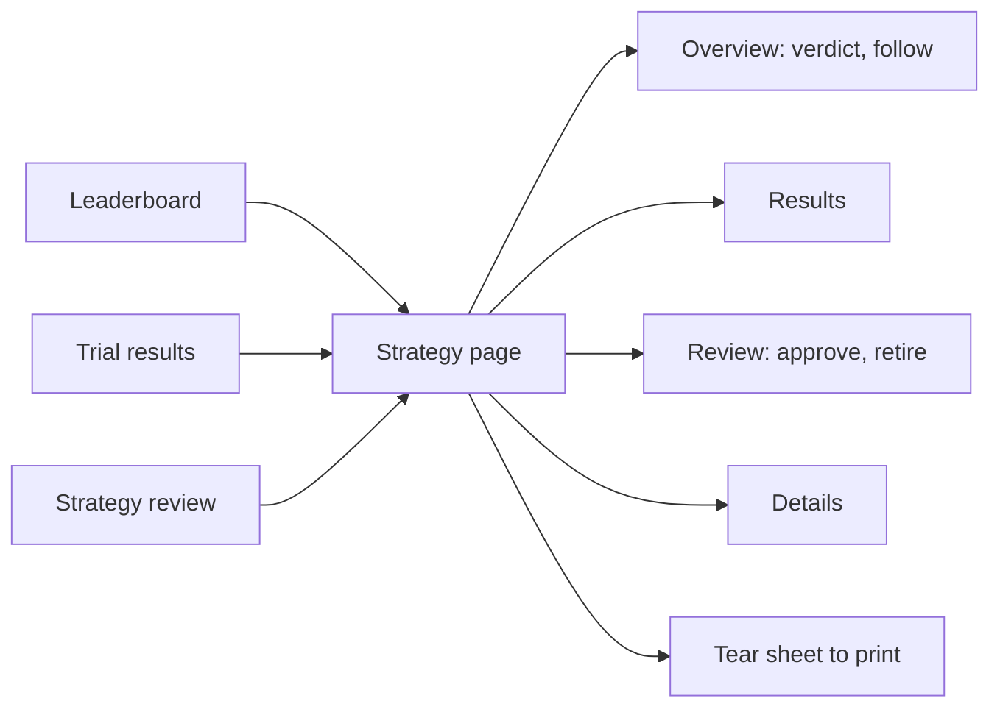

- **One verdict.** `strategyVerdict()` (`shared/strategy-verdict.ts`) turns
  the go-live check, the trial result and the robustness tests into Worth
  following, Promising, needs more data, or Not good enough yet, with the
  reasons in plain sentences. A deep drop, drift from the backtest or a
  failed robustness test gives Not good enough yet. Too few days or trades
  give Promising. `<app-strategy-verdict>` shows it, with the figures under
  a Details fold, and `compact` shows the pill alone in tables.
- **Never empty.** The page reads the tear sheet
  (`GET /api/strategies/{id}/tearsheet`) for every status, so an approved
  strategy shows the record it earned on trial. Without one, it says so and
  suggests following it on Paper.
- **One follow control.** `<app-follow-control>` (`shared/follow/`) is the
  switch and the four follow modes (Alerts only, Paper, Approve each trade,
  Automatic) in one row, with the current mode's line and why the gated
  modes are closed. The strategy page's Follow panel uses it once you
  follow, and Today uses it for each row. Automatic asks you to type the
  strategy's display name, never its id, and the ticket's words and button
  follow the portfolio's PAPER or LIVE stamp.
- **Header actions.** The header offers one forward step: Put on trial,
  Approve (once the check passed) or the admin's Override. Back on trial and
  Retire sit on the Review tab as quiet buttons.

## Insights and risk

| Page | Route | What it does |
|---|---|---|
| Insights | `/insights` | The picked portfolio's value, beta, exposure and largest holding, where the money sits (asset class, sector, currency or holding), returns over periods, a monthly returns heatmap, risk, which strategies agree with each holding, and the snapshot history |
| Behaviour | `/insights/behaviour` | How you trade by hand: manual and synced broker trades as round trips, P&L by holding time and weekday, win rate, the disposition effect, busy days, revenge trades after a loss, and what trading against the active strategies cost |
| Risk | `/insights/risk` | Each measure against the limit it trades under (your own limits where they are stricter), today's VaR and ES with how often the model missed, each strategy's part with its alpha-decay check, and the daily history as a chart and a table |

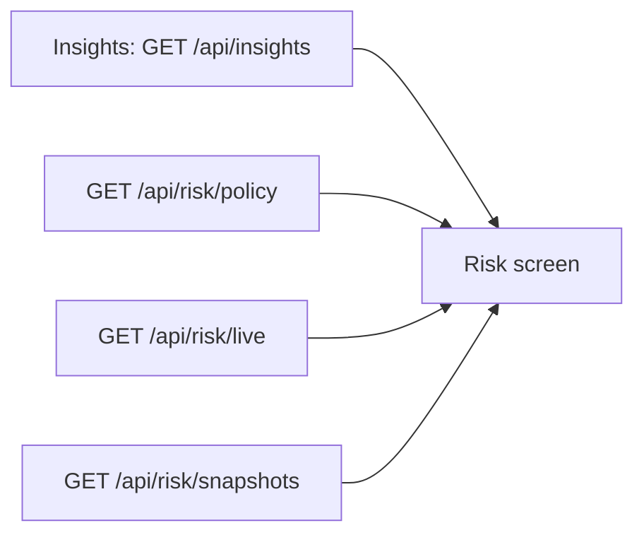

- Both screens read the portfolio picked in the session strip (a synced
  broker account too) through `api/insights.service.ts` and
  `api/risk.service.ts`. `<app-insights-nav>` links them and the Cash flows and Tax screens,
  as underline tabs like the Notifications tabs (sections of one page).
- **Every number is explained where it shows.** Beta, gross exposure,
  net exposure and the largest holding have help tips, and "What these
  figures mean" under the tiles says each in one line with an example.
  The Returns panel works one example through change, the time-weighted
  and the money-weighted return. Asset classes read as words ("Equity").
  Strategies are named with `strategyDisplayName()`.
- **Portfolio history** leads with the trading day a snapshot is for
  (`SnapshotView.as_of`) and links it to its trading run. When it was
  saved is a second column, hidden on phones.
- **Insights** reads `GET /api/insights`, `GET /api/insights/agreement` and
  `GET /api/portfolio/snapshots` (server paged). Each stance is a word and a
  mark (agrees, disagrees, has no view), never colour alone. Admins
  (`portfolio.totals`) also get "All portfolios" from
  `GET /api/insights/totals`: sums only, never holdings. While the sums are
  held back (fewer than three people with real money) it is one quiet line.
  The headline value is brass only for a live portfolio.
- **Risk** puts each reading next to its limit in `limitRows()`
  (`pages/insights/limit-rows.ts`): largest holding, open positions,
  largest sector, asset-class weights, gross and net exposure, volatility
  and drawdown from `GET /api/insights`, against `GET /api/risk/policy`,
  and the VaR violation ratio from `GET /api/risk/live` against its 0.5 to
  1.5 band. At 80% of a limit a row reads "Near the limit". The status is
  always written out next to the meter.
- **Your own limits.** The rows use `GET /api/risk/limits` `effective`:
  the system policy tightened by your own limits (largest holding, open
  positions, cash to keep). A row your own limit sets carries a "Your
  limit" tag, the smallest order size is said under the list, and "Change
  your risk limits" links to Settings. When your limits fail to load the
  system limits still show, and the page says so.
- The risk figures (VaR, ES at 95% and 99%, the VaR misses) each have a
  tip and a one-line reading ("on 19 days out of 20 the loss should be
  smaller"). "Strategy sleeves" is now "Each strategy's part".
- The chart draws the last 200 readings (`GET /api/risk/snapshots`, 95%
  VaR and ES in pane 0, the day's loss in pane 1). The table below it is
  server paged.
- New glossary terms: violation ratio, alpha decay and concentration.
  The money pages add a group of their own, "Your money and alerts":
  gross and net exposure, beta coverage, a strategy's part, base
  currency, lot, FIFO, specific lots, cost basis, wash sale, long term,
  cash flow, price alert and quiet hours. An entry may carry an `example`
  in numbers, shown on the glossary page (TWR, MWR and exposure do).
- **Inside your funds** (23.14, `pages/insights/look-through.ts`) reads
  `GET /api/insights/look-through` and shows single names, sectors or
  countries with each held fund split into what it owns. Each row says how
  much is direct and how much comes through which funds. See
  [look-through](look-through.md).
- **Market breadth** on Today (23.14, `pages/home/breadth-card.ts`) reads
  `GET /api/market/breadth`: up and down, the share above the 50 and 200
  day averages, new highs and lows and distribution days, each with a plain
  sentence and a dot whose colour is never the only signal. Display only.
  See [breadth](breadth.md).

## Live trading screens (Phase 19 wave 1)

| Page | Route | What it does |
|---|---|---|
| Going live | `/going-live?portfolio=` | The checklist of every step from paper to real money for one portfolio, in order, each done or not with a link (F52) |
| Real-money settings | `/profile/live/:id` | A broker portfolio's stage, allocation and account profile, which safeguards and account rules act on it, the dry-run preview, and its options state ("Options live: off" by default) with the options approval level |
| Broker gateways | `/health` (a panel) | Each IB Gateway: connected or down, the last good check, the fault, and the auto strategies it paused |

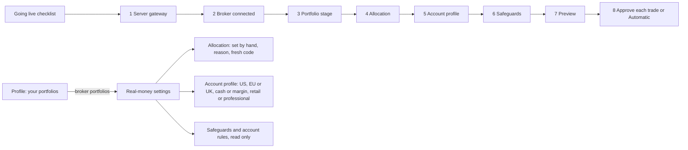

- **Going live checklist** (`pages/going-live/`). One page walks the whole
  path for the portfolio on screen, or `?portfolio=`, with a picker when
  there are several: (1) the server's IB Gateway lists and connects this
  portfolio (`GET /api/brokers/gateways`), done at once for a broker whose
  provider has `needs_gateway` false (eToro), (2) the portfolio is linked to a
  broker connection that can trade, (3) its stage (done at a Real money
  stage; otherwise the checks still missing for the next stage), (4) the
  allocation, (5) the account profile, (6) every safeguard on, (7) a dry-run
  preview ran on this device, (8) a follow here set to Approve each trade or
  Automatic. Each step reads Done, Not yet, Waiting for your admin or Needs
  an earlier step, with one sentence and a link to where it is done; the
  first step still yours is the primary button. The page only reads. Brass
  and LIVE show only once the portfolio is at a Real money stage. The logic
  is `goingLiveSteps()` in `going-live-steps.ts`; the preview date is kept in
  the browser (`preview-memory.ts`). Real-money settings and Broker
  connections link to it.
- **Stage words** (`shared/live-stages.ts`, docs/design/vocabulary.md):
  Simulated, Broker paper, Real money, small, Real money, full. The typed
  confirmation to move up is the next stage's name ("Broker paper"). Server
  sentences with stage ids go through `stageText()`.
- **Getting there.** Profile lists "Real-money settings" next to each broker
  portfolio at any stage (`atBroker()` in `shared/live-stages.ts`). A paper
  portfolio has none, and the page says so and links the checklist.
- **Brass only for real money.** The page reads the stage from the stage
  card (`(stageChange)`). The header stamp, the brass allocation frame and
  red buttons show only at Real money, small or Real money, full. At
  Simulated or Broker paper the stamp is PAPER and the tickets are PAPER.
- **Stage everywhere.** `GET /api/portfolios` and `.../trading-modes` send
  `live_stage`, and a broker portfolio's `trading` is `live` only at
  `live_small` or `live_scale`. So the portfolio picker, Profile, ticket
  cards and linked accounts show brass and LIVE only for real money. Pass
  the stage to the stamp (`<app-mode-stamp [live]="..." [stage]="p.live_stage">`)
  and Broker paper reads BROKER PAPER in the paper style; the picker writes
  "(broker paper)" after the name (`portfolioModeNote()`).
- **Allocation.** The page's one brass figure at a Real money stage, in a
  `.live-frame` panel. Unset reads "Not set" and "Nothing opens". A note says there are no
  automatic steps: Stonks never raises or lowers the amount, and a bad week
  only alerts. Set allocation needs an amount, a currency and a reason, then
  the order ticket and a fresh code (`StepUpService.ensure()`, and
  the interceptor on 403 `step_up_required`). `PUT
  /api/portfolios/{id}/live/allocation`, permission `live.manage`.
- **Account profile.** Three `<app-segmented>` choices, with one line each
  on what the choice means (settlement days, day trades, fund documents).
  Save profile keeps the stored currency, currency policy and wash sale
  mode, and turns shorts off on a cash account. A missing profile is a 404
  from the API, which the page reads as "Not set".
- **Safeguards and account rules, read only.** `GET /api/portfolios/{id}/live/rules` lists
  each safeguard with On or Off from the policy the book follows, and
  each account rule with whether it applies to the profile. Words for every
  rule live in `shared/live-rules.ts`.
- **Options** (roadmap 17.8, `live-options-card.ts`). A lamp reads
  "Options live: off" until the admin's switch, a `live_small` stage and an
  approval level all hold, and the card lists every missing one. While
  the server's switch is off the card shows one line, "Not available on
  this server yet", with the rest folded under "Why, and the approval
  level" (F58). The owner
  picks the level (None, Covered, Spreads, Naked) with a reason, then the
  order ticket (LIVE) and a fresh code. `GET` and `PUT
  /api/portfolios/{id}/live/options[/approval]`, permission `live.manage`
  for the change.
- **Trading run detail.** A risk adjustment tagged `account_rules.<rule>`
  reads "Account rule: Settled cash only", a live safeguard its own name
  (`liveAdjustmentLabel()`).
- **Fine order state.** `<app-order-status>` takes `state` besides
  `status`, and the state wins when the order has one: Pending, Sent,
  Working, Partially filled, Filled, Cancelling, Cancelled, Expired,
  Rejected and Outcome unknown. Sent, Working, Cancelling, Expired and
  Outcome unknown carry a line on what they mean. The orders list, the
  trading run detail and the strategy page show it. The status filter keeps
  the coarse statuses.
- **Broker gateways.** `<app-gateway-panel>` on Health reads `GET
  /api/brokers/gateways` every minute. Each gateway is a card with its
  PAPER or LIVE stamp and Connected, Down or Not checked yet. A down
  gateway shows the fault and detail. Paused auto strategies link to their
  page, where auto is turned on again with a fresh code. Other people's
  paused books show as a count only. The `broker:<gateway>` health checks
  still count toward the overall state, but leave the Runs list.

## Intraday engine (Phase 21.3.4)

"Live" only means real money, so the page is Intraday engine (it can
drive paper portfolios too).

| Page | Route | What it does |
|---|---|---|
| Intraday engine | `/live` | Each intraday engine: running or not, its market, the silent-engine alarm, the price stream, speed from bar close to decision and from decision to order, and steps that failed |

- **Getting there.** System group, admins. The page reads `GET
  /api/stream/status` (`data.read`) every 15 seconds and on Refresh.
- **Engine card.** One card per engine, headed by its id, with a status
  pill in words: Running, Market closed, Reconnecting, Silent, Not
  reporting or Stopped. A line under it says what that means for trading.
  A silent engine shows how long it has been silent, and a banner counts
  the engines that need a look.
- **Price stream.** Connected or not, the source, the age of the last
  price, bars built, late prices dropped, connection drops, gaps, and the
  last problem (scrubbed of keys by the API).
- **Speed.** Median and 95% upper estimates from the histograms, the
  slowest order and how many orders were measured. Nothing measured yet
  reads so.
- **Intraday P&L.** A panel for P&L per portfolio. Until live marks exist
  (21.3.3) it shows the API's note.
- **No engine.** An empty state in an Engines panel says intraday
  trading is off (the default, and what turns it on), or that minute
  prices are on and the engine has not reported yet, with a link to
  Schedule.
- Words avoid system names: "late prices", not ticks. `live-state.ts`
  holds them, with tests.

## Assistant, cash flows and tax (Phase 20)

| Page | Route | What it does |
|---|---|---|
| Assistant | `/assistant`, `/assistant?c=<id>` | Chat with the AI assistant: streamed answers, each tool it uses as a step, a yes or no step for anything that changes something, the trace, and your conversations |
| Cash flows | `/insights/cash-flows` | Returns with deposits and withdrawals left out, the list of flows, and a form to record one |
| Tax | `/insights/tax` | Base currency, where you file, the lot method, US wash sales, specific lot picks, the yearly gains and dividends CSVs, and the open lots on a day as CSV |

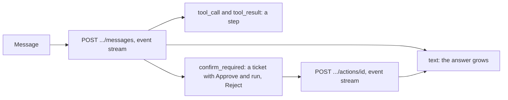

- **The chat.** `AssistantService.send()` and `decide()` stream the turn's
  events. They go through `fetch`, so the service adds the credential
  itself: the tab's API token, else the CSRF header for the session cookie.
  A refused stream becomes an `ApiError` with the API's message, and a
  stream is never retried. `pages/assistant/chat-model.ts` folds the events
  into the transcript (`applyEvent`) and rebuilds a stored conversation
  (`fromHistory`), pending actions included.
- **Steps.** `<app-chat-step>` names the tool in words (`tool-labels.ts`),
  writes its state as a word and a mark (Working, Waiting for you, Done,
  Failed, Not run), and folds the inputs and what it saw under Details.
- **The yes or no step.** `<app-confirm-step>` is a ticket: what it will do,
  its inputs and the tool's own preview. Nothing runs until Approve and run.
  Stopping trading or deleting is a danger button. A new message skips the
  step, and the hint under the box says so.
- **Research only** is picked when a conversation starts. It reads and
  researches but changes nothing. The conversation and the list show a
  Research only tag.
- **Trace** opens a sheet with each turn: model, prompt version, steps,
  order drafts, and every tool call with its inputs and result.
- **Frozen.** After a burst of changes the assistant freezes itself. A
  warning banner says until when, and Unfreeze now asks first and then for a
  fresh code (`killswitch.resume`).
- **Off.** Without a model server the page is a calm state, not an error:
  "The assistant is not set up on this server", that nothing is wrong,
  what it needs, who sets it up (the admin's next step shows only to
  admins) and Back to Today. No chat is shown. The menu hides the item
  while it is off, and a direct link to `/assistant` still opens this.
- **Phones.** The list and the open conversation are one screen each, with
  "All conversations" to go back. Stop ends the answer early.
- **Cash flows.** Recording a deposit or withdrawal moves the paper book's
  cash, so it confirms as a ticket (`portfolio.manage`). A broker book gets
  its flows from the sync, so the form is replaced by a note. The page
  works one example through both returns, says before you type that a
  withdrawal can take at most the cash (and refuses more), and that
  nothing can be recorded while a trading run is running.
- **Returns.** Insights shows each period's change (deposits count) and its
  time-weighted return (they do not), the money-weighted return per year
  and net deposits. Today's portfolio card adds a one-line summary. Both
  show the value in the base currency when it differs, or which exchange
  rate is missing (`shared/base-currency.ts`). Glossary terms: time-weighted
  return and money-weighted return.
- **Monthly returns.** `InsightsView.monthly_returns` is the time-weighted
  return of each month from the daily values, so a deposit is never a
  gain. `<app-monthly-returns>` (`shared/ui/monthly-returns.ts`) draws it:
  a row per year, a cell per month shaded by sign and size (three steps),
  the signed percent in every cell and the year compounded at the end,
  headed "Year total" (the first column is "Year"). Where the grid does
  not fit (a container under about 46rem: phones, narrow panels) it
  stacks by year instead: the year and its total, then only the months
  from the first to the last with a return, so the latest month is never
  off screen. A container query decides, so the tear sheet, which uses
  the same component, gets the same behaviour.
- **Tax.** Save stays off until something changed. While the portfolio
  trades real money (`TaxSettingsView.locked`, a Real money stage) base
  currency and where you file are locked: the page says so above the
  form, why (they are the broker account's profile too, and the account
  rules and tax files rely on them) and how to change them (back to
  Broker paper on the live settings page). The base currency field is
  disabled and where you file shows as text. The lot method and wash
  sales still change. Lots, FIFO, specific lots, cost basis, wash sale
  and long term have help tips. Specific lots
  (`<app-lot-picks>`) lists your sales, then the earlier buys of that ticker
  with a number field each. Picks may not add up to more than the sale.
  "Use oldest first" clears them. The yearly CSVs download through
  `TaxService.download()` and `saveFile()`. "Open lots on" (a day, today by
  default) downloads every lot still held with its cost basis, days held,
  short or long term, the day it turns long term and the gain at the latest
  close (`TaxService.openLots()`, `GET /api/tax/exports/lots`).

## Trader workspace (Phase 13)

| Page | Route | What it does |
|---|---|---|
| Get set up | `/welcome` | The first-run guide: five steps, each can be skipped, kept per user on the server. Admins also see the install checklist |
| Watchlists | `/watchlists` | Your own ticker lists: create, edit, delete, open in the lab, chart a ticker |
| Charts | `/charts`, `/charts/:ticker?vs=` | Daily candles, volume, moving averages, your fills (B and S) and strategy signals, other tickers compared on one scale, the rolling Sharpe and drawdown, with the fills and signals listed below |
| Leaderboard | `/leaderboard` | The comparison view: every strategy ranked by its trial result, with its status and verdict, each linking to its strategy page |
| Tear sheet | `/strategies/:id/tearsheet` | The printable version of the strategy page: verdict, trial figures and curve, monthly returns, test book trades, robustness tests, go-live check, status history, Download PDF |

```mermaid
flowchart LR
  T[Today: setup card] --> W[/welcome]
  W --> P[Portfolio] & L[Watchlist] & F[Follow] & A[Alerts]
  L --> C[/charts/:ticker]
  L --> Lab[/lab?tickers=...]
  B[/leaderboard] --> S[/strategies/:id] --> TS[/strategies/:id/tearsheet]
```

- **First-run guide.** `GET /api/onboarding` returns each step as `done`,
  `skipped` or `todo`, and `derived` when the data shows it done (a second
  factor, a portfolio, a watchlist, a subscription, a push device).
  `PUT /api/onboarding/steps/{step}` stores a skip or a done mark
  (`todo` clears it), `PUT /api/onboarding` closes or reopens the guide.
  `<app-setup-card>` shows on Today while `show` is true. Admins read
  `GET /api/onboarding/system` (`operations.run`): data source key, first
  data load, a backup on disk, a running scheduler, each with a link to fix it.
  Profile links back to the guide.
- **Watchlists.** `WatchlistContextService` (`core/watchlists/`) holds your
  lists and the one picked as a filter, remembered per browser.
  `<app-watchlist-filter>` ("Show") sits in the Today and chart headers;
  Today keeps fills and signals of the picked list's tickers (a signal's
  ticker is read from its title). "Open in the lab" goes to
  `/lab?tickers=A,B`, and both lab forms start from those tickers.
- **Charts.** `GET /api/charts/{ticker}` returns the bars, your fills in the
  picked portfolio (none without one) and every strategy's signal events.
  `<app-price-chart>` (`shared/chart/price-chart.ts`) draws them through
  `ChartEngine.createPrice`: candles in gain and loss colours, volume in grey
  along the bottom, overlays, markers (B below, S above, dots for signals).
  Moving averages are computed in the page (`pages/charts/chart-data.ts`)
  over 199 extra bars so the 200-day line starts at the left edge. The wheel
  scrolls the page; zoom with the range buttons, a pinch or the price axis.
- **Compare, rolling Sharpe and drawdown.** Under the candles,
  `GET /api/charts/compare?tickers=&limit=&window=` returns each ticker's
  adjusted close rebased to 100 on the first day they all have a price, its
  drawdown from the running peak and its rolling Sharpe (the window's bars
  before the range feed the first points; 365 days a year for crypto).
  Compare adds up to five tickers next to the chart's own, kept in `?vs=`
  so a link reopens the same view, each a categorical line
  (`pages/charts/compare-data.ts`), with a table of change, worst drawdown
  and Sharpe. The second panel draws the ticker's rolling Sharpe (3M, 6M or
  1Y window) with its drawdown below. Both go through
  `<app-time-series-chart>`, so the `ChartEngine` seam stays the only door
  to the charting library.
- **Leaderboard and tear sheets.** `GET /api/strategies/leaderboard?sort=`
  (`sharpe`, `return`, `drawdown`, `trades`) and
  `GET /api/strategies/{id}/tearsheet`. The test book value is a `primary`
  line, never brass. The status words come from `shared/governance-labels.ts`
  and the verdict from `shared/strategy-verdict.ts`.
- **Download PDF.** The tear sheet's Download PDF opens the browser's print
  dialog, where you pick Save as PDF (`PrintService`, `shared/print.service.ts`).
  No PDF library runs on the server: WeasyPrint needs GTK libraries that do
  not install cleanly on Windows, and a headless browser would grow the
  Docker image a lot. The print stylesheet at the end of `styles.scss` keeps
  only the content, on white, without navigation, the session strip, toasts
  or buttons, and keeps panels and table rows whole. A dark theme switches
  to light for the print and back, so charts print in ink colours. Add
  `.print-only` or `.print-hide` to show or hide a block on paper. The
  backtest tear sheet file (`stonks report --backtest`) carries its own
  print rules, so it saves to an A4 PDF the same way.
- **Risk limits.** `<app-risk-limits-panel>` in Settings reads
  `GET /api/risk/limits` (system, yours, what you follow, ignored) and saves
  with `PUT /api/risk/limits` (`portfolio.manage`). Percents are typed 0 to
  100 and sent as fractions. A limit looser than the system one is kept but
  changes nothing, and the panel says so.
- **CSV downloads.** `<app-export-button kind="...">` calls
  `ExportsService.download()`, which asks the generated client for a blob
  (`responseType: 'blob'`) over the session, then saves it through a
  temporary link. Orders and fills (Orders page), the journal (Trade costs),
  P&L and snapshots (Insights) and lab trials (trial ledger, and one run).
  A failure toasts the API's reason.

## Trader screens added in Phase 20

| Page | Route | What it does |
|---|---|---|
| New order | `/orders/new` | The order ticket: check an order, place it, and change or cancel your working orders by hand |
| Suggested orders | `/tickets` (the old `/orders/drafts` redirects) | Orders the assistant proposed, in the Approvals inbox, each a ticket to approve (fresh code) or reject |
| Price alerts | `/notifications/price-alerts` | Make, switch off, change and delete price alerts, and see when they fired |
| Alert settings | `/notifications/settings` | Every alert setting in one place: what reaches you and when, and where it reaches you |
| Telegram | Alert settings, Where alerts reach you | Link status, a one-time link code, and Unlink |

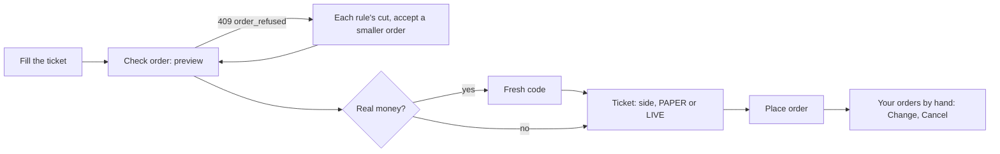

- **Order ticket.** `pages/orders/manual-ticket.page.ts`. Ticker, side, quantity, market or limit, and a reason (kept with the order). Side and order type use `<app-segmented emphasis="strong">`: the picked option is a solid block, and a line under Side says "You are buying" or "You are selling" with the side tag (M13). **Check order** calls `POST /api/orders/manual/preview`: every halt and risk rule runs and nothing is placed. The ticket then shows the last close, the value and any cut. **Place order** checks again, asks with the order ticket (`ConfirmService`, `ticket`), then places it. A real-money book asks for a fresh code first (`StepUpService.ensure()`) and the ticker typed on the ticket. `?ticker=&side=` prefill it.
- **Refusals.** A 409 `order_refused` carries `risk_adjustments`. `refusalOf()` (`pages/orders/order-refusal.ts`) reads them from `ApiError.problem`, the whole problem body. `<app-order-refusal>` lists each rule with what it did ("Cuts 100 to 40", "Drops the order") and, when the rules allow a smaller order, offers **Accept a smaller order**, which sends `allow_reduce` and checks again. Preview, place and change are silent: the ticket shows the failure, so no toast repeats it.
- **Idempotency.** The ticket sends its own `client_id`. A new key is made when the order changes and after it is placed, so a retry of the same order never places it twice.
- **Change and cancel.** "Your orders by hand" lists `GET /api/orders?origin=manual`. A working order (pending, submitted, partly filled) has **Change** (`<app-order-change-sheet>`: new quantity or limit and a reason, the same refusal panel) and **Cancel** (a reason, `<app-status-change-dialog>`).
- **Suggested orders.** The Approvals page reads `GET /api/orders/drafts` once: pending ones under Waiting for you, the rest under History. `pages/tickets/suggested-orders.ts` shows them. **Approve** asks for a fresh code, shows the order ticket (the ticker typed for real money), then calls `.../approve`. A refused approval shows its reason on the card, and the order turns rejected. **Reject** takes an optional note.
- **Price alerts.** `<app-notifications-tabs>` links the Feed, Price alerts and Alert settings. The page says alerts check each day's closing price after the evening data update, not live prices. The editor watches one ticker or a watchlist and fires when the price rises above or falls below a level, or moves by a percent either way over some days (`pct` is in percent, 8 means 8%). Changing an alert keeps its target and condition and starts it fresh. Firings are a server-paged table filtered by alert, with the ticker linking to its chart.
- **Telegram.** `<app-telegram-link>` (`pages/notifications/telegram-link.ts`) reads `GET /api/telegram/link`. **Get a link code** shows `/link CODE` once in `<app-one-time-secret>`, with the bot's `t.me` link and the time it runs out. **Check the link** reads the status again. **Unlink** asks first. Without a bot on the server the panel says so and offers nothing, and an admin also gets the next step (the operations guide's Telegram section).
- **Alert settings** (`pages/notifications/alert-settings.page.ts`) is the one home of every alert setting. Two groups, in this order: "Where alerts reach you" (`<app-notification-settings title="Push on this device">`, `<app-push-devices>`, `<app-telegram-link>`, and the webhook through `[only]="['webhook']"`), first so turning push on leads on a phone, then "What reaches you, and when" (`<app-notification-prefs [only]="['channels', 'events', 'quiet']">`: the alert and channel grid with a one-line hint per alert on wider screens and the test button, upcoming events and economic releases with the countries folded, quiet hours, and a Price alerts panel that links to the tab). The server's own `log` channel is never offered. Two columns on a desktop, one on a phone. Settings keeps one Alerts panel that links here, and the Feed no longer carries the devices list.
- `<app-notification-prefs>` shows one titled panel per part (`[only]` picks some; all by default). The alert settings table scrolls inside its own box on phones.

## Calendar, news and the screener (20.7, 20.8)

| Page | Route | What it does |
|---|---|---|
| Calendar | `/calendar` | Earnings, ex-dividend dates, economic releases, SEC filings and news for your holdings, a watchlist, some tickers or everything |
| Screener | `/screener` | Filter instruments on price and fundamentals, keep screens, and save one as a universe for the lab |

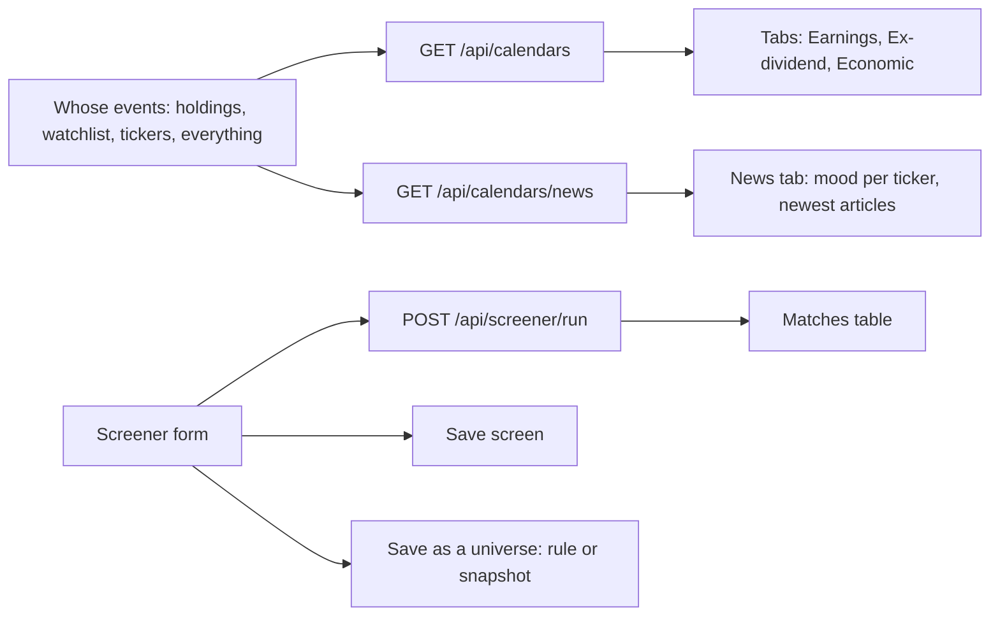

- **Needs a data plan.** Calendars, news, fundamentals and option chains come with a paid data plan. `GET /api/market/data-coverage` says which kinds the lake holds at all, and `<app-data-plan-note kind="...">` (`shared/ui/data-plan-note.ts`) says plainly when one is missing, instead of an empty page that looks broken. Traders read who can fix it; admins read what to do and get a link (Data, or the schedule for the calendar update). It renders nothing while the data is stored or unknown. The Calendar, the News tab, the screener's filters, the factor library and Options research show it. `provideFakeDataCoverage()` (`src/testing/fake-data-coverage.ts`) keeps specs free of the call.
- **Calendar.** `pages/calendar/calendar.page.ts`. "Whose events" picks the scope. Watchlists offers one list or all of them, and Tickers waits until you name some. From and To span at most 120 days, checked before any call. The tabs count each calendar. Countries shows on the Economic tab only. A cut read says so. `?ticker=&date=` opens one ticker from that day, which is where the event alerts link. `?country=&date=` opens the Economic tab for one country, where the economic release alerts link. The Economic tab shows each release's importance. The Filings tab lists the SEC current reports (8-K) in `CalendarView.filings`: when filed, the ticker, the form, what it announces in words (`filingItemsLabel()`, "Item 5.02" when the name is unknown) and "Open on SEC" in a new tab, over http or https only. The link is 44px tall on phones. Filings are past events and follow named companies, so the empty state says to pick an earlier From date, or a narrower scope than Everything. Pure helpers live in `calendar-view.ts`.
- **News.** `<app-news-panel>` (`pages/calendar/news-panel.ts`) takes the scope as `query`. Everything has no news, so the panel asks for a narrower scope and calls nothing. Each ticker gets a mood card (the 30-day score weighted by articles, in words, a shape and a signed number). Articles link out only over http or https, in a new tab.
- **Ticket warning.** `<app-earnings-warning>` (`pages/orders/earnings-warning.ts`) sits under the ticker on the order ticket. For a full ticker it calls `GET /api/calendars/earnings-warnings` silently and shows one warning line when the report falls before the next open, with a link to the calendar. A failed check shows nothing and never blocks the ticket.
- **Event alerts.** Alert settings has an Upcoming events row in the channel grid (where they reach you) and an Upcoming events panel with one switch per kind (earnings, dividends, economic releases) plus the economic release importance and countries. A kind switched off sends nothing, not even to the Feed.
- **Screener.** `pages/screener/`. Where to look (a universe, a date, asset classes, sectors, exchanges, lowest price and dollar volume), metric filters from `GET /api/screener/metrics` grouped by price and fundamentals, then sort, rows and extra columns. Percent metrics are typed in percent (8 means 8%) and sent as fractions. `screen-form.ts` turns the form into a spec and back, and says what is wrong in words before anything is sent. Results link each ticker to its chart and format each column by the metric's unit.
- **Saved screens.** Your screens list sits beside the form. Open reads the screen by id and fills the form. Save changes stays off until something changed. Delete asks first.
- **Save as a universe.** `<app-save-universe-sheet>` asks for a name and a short name (the universe id), then the members: Re-run the screen (rule mode, from a start date, weekly, monthly or quarterly) or Today's matches (snapshot mode, with the survivorship warning). An unchanged saved screen goes by its id, so the universe follows it. The call is silent and a refusal shows in the sheet. The page then shows the saved universe and the server's warnings.
- `TableColumn.display` gives a column its own text (a unit per column) while sorting still uses `value`.
- `provideFakeCalendars()` (`src/testing/fake-calendars.ts`) keeps specs of pages that embed a calendar piece free of calendar calls.

## Smaller comforts (23.17)

| Page | Route | What it does |
|---|---|---|
| Demo portfolio | `/demo` | Open, look around in and remove a sample book of made-up holdings and prices |
| Import a CSV statement | `/connections/import` | Map a broker's CSV onto trades, dividends and cash flows, or read a DEGIRO export with its preset, preview, import and undo |

- **Privacy mode.** `PrivacyService` (`core/privacy/`) holds one switch per device (localStorage). While on, `formatMoney` returns a mask, so the money pipe, tables, tiles and chart axes hide amounts. Percentages, counts and dates stay. `html[data-privacy="on"]` is there for a figure a page formats itself. The eye button in the top bar and the sidebar, the palette, `h` and Alt+Shift+H (always on) toggle it, and Settings has a check box.
- **Demo portfolio.** `pages/demo/demo.page.ts`. Every view says Sample data in a note above the tiles. The instruments end in `.DEMO`. The welcome page and the setup card link to it.
- **Screen alerts.** `<app-screen-alerts>` (`pages/screener/screen-alerts.ts`) sits under Your screens. A When select per screen turns an alert on (Daily, or Weekly on a weekday), Remove asks first, and the newest finds list below. The Screen alerts row in the notification settings decides where alerts reach you.
- **CSV import.** `pages/connections/statement-import.page.ts`, linked from Broker connections. The first Preview sends no mapping and fills the column selects from the server's guess. Preview and import are silent calls, and a refusal shows under the buttons. Pure helpers live in `statement-mapping.ts`.
- **Broker exports (DEGIRO).** What file is it? on the import page picks a broker export (`GET /api/statement-imports/presets`), Find out from the headers (the default), or Another broker: I map the columns (`preset: none`). A preset reads the columns itself, so the mapping panel stays hidden, and the preview says Read as DEGIRO Transactions, Dutch, with notes on what it left out. A holdings export (DEGIRO Portfolio) asks the day of the export. `?preset=degiro_transactions` opens the page with that export chosen (router input binding). Broker connections shows `<app-broker-exports-panel>` (`broker-exports-panel.ts`): each broker read from its exports, marked Reads only, with a link per export and where to find it. DEGIRO is never offered as a connection. See [DEGIRO](design/degiro.md).

## Options research (17.6)

| Page | Route | What it does |
|---|---|---|
| Options | `/options` | Read a stored chain with IV and Greeks, draw a structure's payoff, list the options strategies and backtest one. Research only |

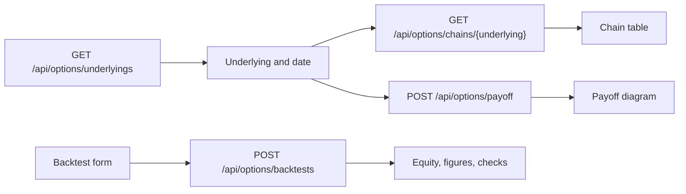

- **Research note.** The page opens with "Research only, nothing trades options." No order, paper portfolio or real-money portfolio uses anything on it. With no chains stored it shows the data-plan note.
- **Plain names.** Options strategies show their names in words (`optionsStrategyName`), pricing models by name ("Barone-Adesi Whaley (American)", `pricingModelName`), and chain columns keep short forms in capitals ("Call IV"). IV, delta, gamma, theta, vega and open interest carry glossary tips.
- **Chain.** `pages/options/options.page.ts`. Underlying, date (empty means the latest stored day), expiry and a Show switch for both sides, calls or puts. The table is `<app-data-table>` with the strike as the card title on phones. With both sides, phone cards keep bid, ask and delta of each. A hint names the units: theta per share per day, vega per share per vol point. Generated chains carry a tag, "Generated chains, not market quotes".
- **Payoff.** Pick a structure from `GET /api/options/structures`. Its fields follow the parameters it reads (days to expiry, delta, long leg, short leg or wing delta). `<app-payoff-diagram>` (`payoff-diagram.ts`) draws the profit at expiry in SVG: the line, gain and loss shaded on either side of zero, today's price dashed. The cost, max loss, max gain ("Unlimited" when there is no bound) and breakevens sit above it and the legs below. The SVG has `role="img"` and a one sentence summary. A payoff the chain cannot supply shows inline with Retry.
- **Strategies.** Each options strategy with its structures and hypothesis.
- **Backtest.** `<app-options-backtest>` (`options-backtest.ts`) fills the underlying and window from the first stored underlying. Strategy parameters use `<app-param-form>`. It needs `lab.run` (a permission note otherwise), runs as a job followed with `JobFollower`, and shows return, Sharpe, drawdown, fills, the equity chart and each validation check with the verdict. On generated chains it says the result is never evidence.
- Pure helpers (chain columns, payoff scaling, leg text, the backtest form) live in `options-view.ts`.

## Universes (20.10)

The Universes page sits under Data: the Data page links to it, and so do
the screener and the lab forms. Anyone signed in can read it. Creating,
editing, refreshing and fetching data need `lab.run`. Delete is for
admins.

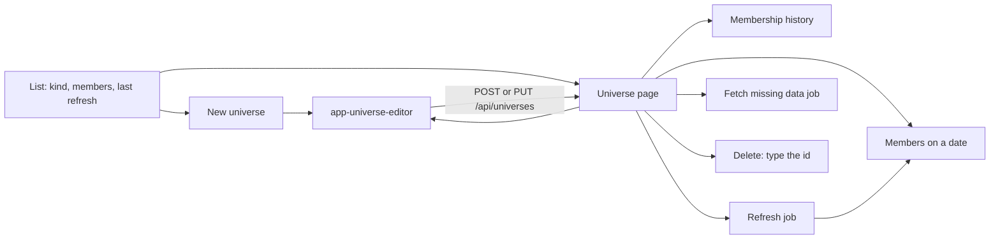

- **List.** `pages/universes/universes.page.ts`. Each row has its kind,
  member count and last refresh. "Changed since" marks a universe whose
  definition changed after its last refresh, so its members are behind.
- **The form.** `<app-universe-editor>` (`universe-editor.ts`) serves both
  New universe and Edit. Each kind has its own fields:
  - list: tickers, or a CSV with optional dated spans,
  - exchange: a code with suggestions from `GET /api/universes/exchanges`
    (the exchanges our instruments name, with counts), a source and
    "Include delisted names",
  - rule: the window, how often the screen runs, a universe to start
    from, where to look, the screener's filter builder
    (`<app-screen-filters>`, shared with the screener) and an optional
    top N,
  - index: the index id, where its history comes from, and an optional
    history file that is imported before the save.
  "Edit as JSON" shows every setting. An edit opens in JSON when the
  fields cannot hold the stored definition (dated spans, security types),
  so a save never drops a setting. The id cannot change on an edit.
  `universe-form.ts` turns the form into a spec and back.
- **Universe page.** `universe-detail.page.ts`. Facts, a notice when the
  definition changed after the last refresh, members on a date (a paged
  table with a finder), and the membership history from
  `GET /api/universes/{id}/history`: one row per stretch of membership,
  latest change first, "From the start" and "Still a member" for open
  ends, a ticker search on Enter and Show more for the next page.
- **Jobs.** Refresh and Fetch missing data queue jobs and follow them with
  `<app-job-progress>` to their typed results. Refresh reloads the facts,
  members and history.
- **Delete** asks for the universe id typed (`typedConfirmation`), then
  goes back to the list.
- **Links.** The screener's saved universe panel has Open the universe and
  a link to the list beside Start from. The lab run form links a picked
  universe to its page, and offers Make a universe when none is stored.

## Shared pieces from the usability pass (18.6)

| Piece | Where | Use it for |
|---|---|---|
| `jobLabel()`, `nextTradingRun()` | `core/schedule/job-labels.ts` | Naming a scheduled job, finding the run that trades |
| `TradingDayService.runsPassed`, `loaded`, `hasTradingRun` | `core/schedule/` | Reloading after a trading run, telling "nothing scheduled" from "not read yet" |
| `<app-kill-sheet>`, `StopTradingService`, `killTicket()` | `shared/ui/`, `core/halts/` | Stop trading from anywhere |
| `haltScopeText()` | `core/halts/halt-view.ts` | "Every portfolio", "Your portfolios", a portfolio's name, never an id |
| `<app-account-menu>` | `shell/` | Profile, Settings, Broker connections, Get set up, Help, Sign out |
| `<app-page-tabs>` | `shared/ui/page-tabs.ts` | The one tab style (M4): links when each view has its address, a tablist when sections share a page; underline, 44px on phones, a fading edge when the tabs scroll |
| `<app-follow-control>` | `shared/follow/follow-control.ts` | How you follow a strategy: the switch, the four modes, why the gated ones are closed, the same on Today and the strategy page |
| `dayChangeLine()`, `sessionLabel()` | `core/format/day-change.ts` | The day's change, the same on Today, Dashboard and Insights |
| `RUN_WORDS`, `runWords()` | `shared/status-words.ts` | Done, Partly done, Failed for a trading run |
| `FeatureFlagsService` | `core/features/` | Hide a page whose feature is off (the assistant) |
| `<app-segmented>` | `shared/ui/segmented.ts` | One choice out of a few: a radio group with arrow keys, 44px on phones |
| `<app-no-book>`, `bookState()` | `shared/ui/no-book.ts` | A money page for someone with no portfolio |
| `<app-orders-tabs>` | `pages/orders/orders-tabs.ts` | Orders, New order, Fills, Trading runs, Trade costs and Journal, one tap apart. On phones a cut tab fades at the edge |
| `<app-segmented>` | `shared/ui/segmented.ts` | One choice out of a few. `emphasis="strong"` fills the picked option solid, for Buy or Sell and the order type on the manual ticket |
| `<app-copy-button>`, `copyText()`, `downloadText()` | `shared/ui/copy-button.ts` | Copy with a visible message when the clipboard is blocked |
| `JobResult`, `<app-job-progress [result]>` | `shared/ui/job-progress.ts` | A job's result read with an inline error and Try again |
| `<app-tick-mode>` | `pages/orders/tick-mode.ts` | "Dry run" or the PAPER or LIVE stamp for a trading run |
| `<app-cost-field>` | `pages/lab/cost-field.ts` | Backtest costs in the Lab and Studio |
| `strategyDisplayName()`, `strategyKindName()` | `shared/strategy-names.ts` | Names, not ids |
| `goLiveTicket()`, `demoteOptions()`, `checkFix()` | `shared/governance.ts`, `shared/golive-checks.ts` | Approve, Back on trial, Retire, and the fix for a failing check |
| `<app-stage-bar compact>` | `pages/strategies/stage-bar.ts` | The lifecycle steps, framed on the strategy page, bare in Studio |
| Trading words | `core/help/glossary.ts` (`PRODUCT_KEYS`, `TRADING_KEYS`, `GLOSSARY_GROUPS`) | Help tips for the product words and ladders (On trial, Test book, Portfolio stage, ...), the modes, Kill switch, Dry run, Trading run, ... |

## Permissions

The console hides or disables what the signed-in user may not do, so nobody
fills in a form that ends in a 403. The server still decides.

- `scripts/gen-permissions.mjs` writes `core/auth/route-permissions.gen.ts`
  from each route's `x-permission` in `openapi.json` (run by
  `npm run api:generate`, checked by `npm run api:check`).
- `core/auth/permissions.ts` mirrors the server policy (roles, token scopes,
  browser-session-only). Step-up is not checked: the interceptor asks for a
  code when the API wants one.
- `SessionService.can('strategy.promote')` and `whyNot(...)`. Put
  `<app-permission-note permission="...">` after a disabled action: it
  prints "Admins only." and renders nothing when allowed.
  `route-permissions.gen.ts` supplies the permission names, and
  `permissions.spec.ts` fails if a route's permission has no rule.
- The sidebar shows the user's name and role.

## Portfolio picker

`core/portfolio/portfolio-context.service.ts` holds which portfolio the
money pages show. It reads `GET /api/portfolios` (a 404 keeps the
picker hidden and nothing changes), remembers the pick per browser, and
never sends an id that is no longer listed. The pick is stored per user
(`stonks.portfolio.<user_id>`). A failed read retries on its own (2 s, 4
s, ... up to a minute), and `load(true)` always starts a new read, so a
network blip never hides the LIVE stamp for the session. `PortfolioService`,
`OrdersService` and `TcaService` add `portfolio_id` from it. Pages put
`portfolioCtx.selectedId()` in their resource params so a new pick reloads
them. `<app-portfolio-picker>` sits in the session strip with a PAPER or
LIVE stamp, and shows only with two or more portfolios, one option per
portfolio.

A money page puts `bookState(ctx) === 'ready' ? {...} : undefined` in its
resource params and renders `<app-no-book>` (`shared/ui/no-book.ts`) when
the state is `none`: one action, "Open a paper portfolio", to
`/welcome?step=portfolio`. It never reads a portfolio without one, and
never says "ask your admin".

## Copy rule

No CLI commands, config keys, environment variables, raw ids or system
words in trader copy. `npm run lint` runs `scripts/check-copy.mjs`, which
fails on `stonks <command>`, `STONKS_*`, `[section]` config keys and
"command line" anywhere, and on the system words tick, ingest, shadow,
promote, register, `class_path`, `python -m`, model book, kill switch,
incubating, go live and "paper trading strategies" in prose
(template text, shown attributes, string literals with a space, and
capitalised labels). Routes, API paths, snake ids, styles and bindings are
skipped. The glossary is allowlisted, since it explains the system names on
purpose, and so are the nav and command search keywords, where people may
still type "kill switch". `node scripts/check-copy.mjs src/app/pages/lab`
checks one folder. The rule's own specs are `scripts/check-copy.test.mjs`.

Names, not ids: `strategyDisplayName()` (`shared/strategy-names.ts`)
turns `stocks_on_the_move_3fa9c21b` into "Stocks on the move 3fa9" (a
starter's title, then a draft's own name, wins), with the id under
"Technical details". Views that carry a strategy id also carry
`strategy_name`, the starter's title (`winner_strategy_name` on a trading
run, `sleeve_name` on a journal trade). Pages pass it as the `name` hint,
or call `rowStrategyName(row)`, so orders, the journal, trading runs,
tickets, the leaderboard and Trial results never show `starter_trend` or
`bah_aaa` where a name belongs.
`<app-status-pill>` writes strategy statuses as On trial, Approved and
Retired and outcomes as Passed and Failed on its own. One `MODES` list
(`shared/governance-labels.ts`) names Alerts only, Paper, Approve each trade and
Automatic, and `toTraderWords()` rewrites the server's gate details.

### Words across surfaces

The console uses trader words. The API, CLI and MCP keep the system's
names. This is the mapping, so a trader, an operator and an agent can talk
about the same thing.

| Console word | API | CLI | MCP |
|---|---|---|---|
| Trading run | `/api/ticks` | `stonks tick` | `run_tick`, `list_ticks`, `get_tick` |
| On trial, test book (page Trial results at `/paper`, `/shadow` redirects) | status `shadow`, `/api/shadow/...` | `registry shadow` | `shadow_strategy`, `list_shadow_pnl` |
| Approve, Approved | status `active`, `.../promote` | `registry promote` | `promote_strategy` |
| Back on trial | `.../shadow` | `registry shadow` | `shadow_strategy` |
| Retire, Retired (a strategy) | status `retired`, `.../retire` | `registry retire` | `retire_strategy` |
| Strategies | `/api/strategies` | `stonks registry` | `*_strategy`, `list_strategies` |
| Follow a strategy | `POST /api/subscriptions` | none | `subscribe` |
| Trade costs | `/api/tca` | `stonks tca` | `get_tca_summary`, `list_trade_journal`, `get_order_tca` |
| Journal | `/api/journal` | `stonks journal` | `list_round_trips`, `get_round_trip`, `get_pnl_calendar`, `get_journal_breakdown`, `list_playbooks` |
| Stop trading (the kill switch), "Stop new buys only" | `POST /api/halts/kill`, `buys_only` | `halts kill --buys-only` | `engage_kill_switch` (`buys_only`) |
| Update data, Data updates | `/api/ingest/*`, `ingest_runs` | `stonks ingest` | `run_ingest` |
| Full robustness tests (Go-live suite) | preset `promotion` | `--preset promotion` | `run_lab` (`preset`) |
| Alerts only, Paper, Approve each trade, Automatic (follow modes) | `notify`, `paper`, `approve`, `auto` | none | `subscribe` (`mode`) |
| Approvals, order tickets | `/api/tickets` | `stonks tickets` | `list_tickets`, `get_ticket` |
| Model versions, candidate, Swap in, Retrain | `/api/strategies/{id}/versions`, `/api/model-versions` | `registry versions`, `swap`, `reject`, `retrain` | `list_model_versions`, `swap_model_version`, `retrain_models` |
| Signal IC | `/api/lab/signal-ic` | `stonks lab ic` | `run_signal_ic` |
| Trial ledger | `/api/lab/ledger` | none | `list_ledger_runs`, `get_ledger_run` |
| Notifications (feed) | `/api/notifications` | `python -m stonks.notify` | `list_notifications` |
| Alerts (Health page) | `/api/alerts` | none | `list_alerts` |
| Get set up (first-run guide) | `/api/onboarding` | none | none |
| Watchlists | `/api/watchlists` | none | `list_watchlists`, `get_watchlist`, `create_watchlist`, `update_watchlist` |
| Charts | `/api/charts/{ticker}` | none | `get_chart` |
| Compare tickers, rolling Sharpe and drawdown | `/api/charts/compare` | none | `compare_tickers` |
| Leaderboard, tear sheet | `/api/strategies/leaderboard`, `.../tearsheet` | none | `get_leaderboard`, `get_tear_sheet` |
| Your risk limits | `/api/risk/limits` | none | `get_my_risk_limits` |
| Real-money settings (allocation, account profile, safeguards, account rules) | `/api/portfolios/{id}/live/*` | none | none |
| Going live checklist | the reads above, `/api/brokers/gateways`, `/api/connections`, `/api/subscriptions` | none | none |
| Broker gateways (Health) | `/api/brokers/gateways` | none | none |
| Intraday engine | `/api/stream/status` | none | `get_stream_status` |
| Download CSV | `/api/exports/*` | none | none |
| Tax files: gains, dividends, open lots | `/api/tax/exports/*` | `stonks tax gains`, `dividends`, `lots` | none |
| Download PDF (tear sheet) | browser print, no route | `stonks report --backtest` (HTML) | none |
| New order, orders by hand | `/api/orders/manual`, `origin=manual` | `stonks orders` | `place_order`, `change_order`, `cancel_order` |
| Suggested orders (to approve in Approvals) | `/api/orders/drafts` | none | `draft_order`, `list_order_drafts` |
| Price alerts | `/api/price-alerts` | `stonks price-alerts` | `list_price_alerts`, `create_price_alert`, `update_price_alert`, `delete_price_alert`, `list_price_alert_events` |
| Telegram link | `/api/telegram/link` | `stonks telegram` | none |
| Calendar, News | `/api/calendars`, `/api/calendars/news` | `stonks calendars` | `get_calendar`, `get_news`, `get_earnings_warnings`, `list_event_alert_kinds` |
| Screener, Your screens, Save as a universe | `/api/screener/*` | `stonks screener` | `run_screen`, `list_screens`, `create_screen`, `save_screen_as_universe`, ... |
| Options (chain, payoff, strategies, backtest) | `/api/options/*` | `stonks options` | `get_option_chain`, `get_option_payoff`, `list_option_strategies`, `run_options_backtest`, ... |
| Universes (create, edit, history, refresh, fetch data) | `/api/universes/*` | `stonks universe` | `list_universes`, `update_universe`, `get_universe_history`, `list_universe_exchanges`, ... |

"Buys only" was called `flatten` before 1.0. It never closed a position,
so the old name was misleading. The API, the CLI (`--flatten`) and MCP
still accept `flatten` as a deprecated alias. No kill switch closes
positions: exits go through the strategies that hold them.

Notifications and alerts are two feeds on purpose: notifications are
yours (signals, fills, halts on your books, pushed to your devices), and
alerts are system events for the Health page (failed runs, stale data),
which admins also see without a single recipient.

## Install and notifications (PWA)

- `public/manifest.webmanifest` and `public/icons/` make the console
  installable (desktop and phone home screen).
- Angular's service worker (`ngsw-config.json`, production builds only)
  caches the **app shell only**: HTML, JS, CSS, fonts and icons. It has no
  data groups, so API responses are never cached, and `/api/**` is excluded
  from navigation handling.
- Offline, the shell swaps the page for `app-offline-page` (nothing stale is
  shown) and brings the page back, freshly loaded, when the connection
  returns. A newly deployed version shows a "reload" toast once.
- Notifications are opt-in from **Notifications, Alert settings, Push on this device** (and the setup guide); the browser
  prompt appears only after the button is pressed. On iPhone and iPad the
  panel explains Add to Home Screen first (iOS delivers Web Push only to
  installed apps). `NotificationPermissionService` subscribes with `SwPush`
  and the server's VAPID key through `PUSH_SUBSCRIPTION_API`, whose
  `HttpPushSubscriptionApi` calls `GET /api/push/vapid-key` and `POST`/`DELETE
  /api/push/subscriptions` (via `api/notifications.service.ts`). These routes
  act for the signed-in user, so they need the API token; when the server has
  no VAPID key the panel stops after permission ("waiting for the server").
- Push payloads must use Angular's format so a tap opens the deep link:
  `{"notification": {"title": "...", "body": "...", "icon": "icons/icon-192.png",
  "data": {"onActionClick": {"default": {"operation": "navigateLastFocusedOrOpen",
  "url": "/strategies/momentum-v3"}}}}}`.
- `stonks serve` sends `ngsw-worker.js` and `ngsw.json` with
  `Cache-Control: no-cache` so updates are picked up, and
  `manifest.webmanifest` as `application/manifest+json`.

### Tests

- Each service and component ships a `*.spec.ts` next to it.
- HTTP: `...provideApi(), provideHttpClientTesting()` and `HttpTestingController`.
  SDK calls go out a few microtasks late, so wait with
  `await nextRequest(controller, '/api/path', 'POST')` (from `src/testing/http.ts`)
  instead of `expectOne`. `match()` consumes every hit; flush them all.
- Components with resources: don't `await fixture.whenStable()` while requests
  are pending (it waits for them); flush, then `await tick()` and
  `fixture.detectChanges()` (see `dashboard.page.spec.ts`).

## Identity

The console should read as a trading desk, not an admin template. Three rules,
layered, apply to every page and shared component:

1. **The trading day is the spine.** `<app-session-strip>` sits on top of
   every page: the market phase (pre-open, open, closed) with a track from
   pre-open to the close, the next **trading run** with a live countdown
   (never a system job; admins get a quiet "Then Broker sync 14:00" when
   one comes first), and **Stop trading**. It reads `GET /api/schedule`
   (`market`, `jobs`) once through `TradingDayService`, whose `runsPassed`
   goes up just after each trading run starts: Today lists it as an
   `autoRefresh` trigger, so the blotter, tape and value reload by
   themselves. The strip turns red for a kill switch (the rail gets a red
   edge too) and amber for a breaker. Home is **Today**: a blotter of the next run, trading runs and
   signals in time order, a tape of the latest fills, the portfolio and my
   strategies.
2. **Tape and ticket.** Every price, quantity, date and time is set in the
   mono figure face (`.num`, and the figure columns of the data table). Sides
   are `<app-side-tag>`: a solid B and an outlined S. Money confirmations are
   order tickets (`.ticket`, `.ticket-lines`) with an `<app-mode-stamp>`.
3. **Brass means real money.** `--color-live` (brass) is used only for real
   money: a live portfolio's headline figure and frame (`.live-frame`,
   `<app-stat-tile featured live>`), the LIVE stamp, the live equity line
   and the ring around the kill switch. Paper and research stay in cool
   greys and blues (`--color-paper`, `--color-accent`, `--color-primary`).
   Use `PortfolioContextService.live()` to decide.

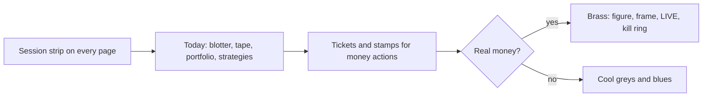

**Brand mark.** The favicon's rising line (`<app-brand-mark>`) is the loading
indicator (it draws itself), the empty-state mark (still) and the error mark
(it turns down). It also leads the wordmark in the rail and on sign-in.

**States are moments.** `<app-loading-state>` shows the drawing mark and the
label. `<app-empty-state>` shows the mark, a title in the display face, one
line on what fills the space, and one action in its content slot.
`<app-error-state>` shows the broken mark, the API's message and Try again.

**Stop trading** (UX-01) is one tap from any page, on phones too: the
strip's red-outlined button (with the brass ring when the book is live)
opens `<app-kill-sheet>`, a full-screen sheet on phones that is its own
ticket: scope preset to the portfolio on screen ("All your portfolios"
always, "Every portfolio" with `killswitch.global`), All new orders or
Stop new buys only, a reason filled in and editable, and the stamp. After
it the strip is red at once and the button becomes Resume, which leads to
the halts page (Resume keeps the typed RESUME TRADING and a fresh code).
The palette's "Stop trading" and the Halts page's "Stop trading…" open
the same sheet (`StopTradingService`). Viewers never see it.

**Every real-money moment is a ticket.** Approving a strategy (`goLiveTicket()`:
strategy, following portfolios, broker, PAPER or LIVE, and the name typed
when real money moves), turning auto on or back on (step-up first, then
the ticket), a trading run from the runner or Schedule (`tickTicket()`:
a paper run is worded as a paper run, with the primary button, and only a
real-money run is red), Stop trading and Resume (`killTicket()`,
`ConfirmTicket.kind`), and
disconnecting a broker (each linked portfolio with its mode, the provider
typed).

**Status differs by form** (`<app-status-pill>`, `pillForm()`): a lifecycle
state is a round `lamp` pill (active, shadow, retired), an outcome is a
square `receipt` tag with a tick or cross (passed, filled, failed), work in
progress is the drawing mark (queued, running), and a stop is a solid
`alarm` block (halted, unhealthy). A live portfolio or broker uses the LIVE
stamp, never a pill.

**Motion.** Only three things move without being asked: the headline figure
counts up (`countUp()`, `--dur-count`), the countdowns tick, and the fills
tape scrolls once it is full (paused on hover or focus). All three stop
under `prefers-reduced-motion`, and the tape then scrolls by hand.

**The rail.** The sidebar, the phone top bar and the drawer are a slate slab
in both themes (`--color-rail*`). Inside it the colour tokens are remapped
(`rail-scope` in `shell.scss`), so components placed there need no rules of
their own.

Tokens (`styles/_tokens.scss`), always via `var(--…)`. Light and dark each
define every colour.

| Group | Tokens |
|---|---|
| Colour | `--color-bg`, `-surface`, `-surface-2`, `-surface-3`, `-border`, `-border-strong`, `-control-border`, `-ink`, `-ink-2`, `-ink-3`. `--color-primary` (research blue), `--color-accent` (markers). `--color-live`, `-live-ink`, `-live-soft` (brass, real money only). `--color-paper`, `-paper-soft`. `--color-gain`, `-loss`, `-warn`, `-info`, each with `-soft`. `--color-focus`, `--color-scrim`. `--color-rail`, `-rail-2`, `-rail-ink`, `-rail-ink-2`, `-rail-accent`. `--color-brass` stays as an alias of `--color-live`. |
| Type | `--font-sans` (Public Sans, body), `--font-display` (Archivo at `--display-stretch` 76%: page titles, headline figures, empty-state titles, stamps), `--font-mono` (IBM Plex Mono for figures, at `--mono-scale`). `--text-xs` 12, `sm` 13, `md` 14, `lg` 16, `xl` 20, `2xl` 26, `title` 30, `figure` 44 (smaller on phones). `--weight-*`, `--leading-*`, `--tracking-display`, `--tracking-stamp` |
| Space | `--space-1`…`--space-8` = 4, 8, 12, 16, 24, 32, 48, 64 px. `--gutter` (24px, 16px on phones) |
| Radius | `--radius-xs` 2 (tags, stamps, tickets), `-sm` 4 (controls), `-md` 6 (panels), `-lg` 10 (dialogs), `-pill` (lifecycle status only) |
| Border | `--border-live` 3px (real money), `--border-rule` |
| Elevation | `--shadow-0`, `--shadow-1` (panels), `--shadow-2` (dialogs, drawer, toasts), `--shadow-ticket`, `--ring-live` |
| Motion | `--dur-fast` 120ms, `--dur` 200ms, `--dur-slow` 420ms, `--dur-count` 700ms, `--tape-speed`, `--ease`, `--ease-out`. Durations are 0 under reduced motion |
| Size | `--control-h` 32, `--touch-min` 44, `--row-h` 34, `--sidebar-w` 224, `--strip-h` 40 |

Fonts are self-hosted from npm (`@fontsource-variable/public-sans`,
`@fontsource-variable/archivo` with its width axis, `@fontsource/ibm-plex-mono`),
so they work offline and under the API's content policy. Each has a fallback
stack (Arial Narrow and Roboto Condensed for the display face, the system
monospace for figures).

Global primitives (`styles.scss`): `.btn` (+ `.btn-primary`, `.btn-danger`,
`.btn-ghost`, `.btn-icon`), `.field` / `.input` / `.check` / `.hint` / `.error`,
`.form-grid` (+ `.form-grid-2`), `.panel` / `.panel-head` / `.panel-body`,
`.page-grid` with `.span-4…12`, `.num`, `.figure`, `.display`, `.ticket`,
`.live-frame`, `.gain`, `.loss`, `.muted`, `.visually-hidden`.

Reusable components: `app-page-header`, `app-stat-tile` (`featured` for the one
headline figure, `live`, and `amount` with `format` to count up),
`app-status-pill`, `app-side-tag`, `app-mode-stamp`, `app-brand-mark`,
`app-data-table`, `app-loading-state`, `app-empty-state`, `app-error-state`,
`app-time-series-chart`, `app-session-strip`. The shell hosts
`app-confirm-dialog` and `app-toast-outlet`.

## Mobile and responsive rules

The console must work on phones (360–430px) as well as tablets and desktops.

| Breakpoint | Width | Layout |
|---|---|---|
| phone | < 768px | Top bar with menu button opening the nav drawer; one column; 16px gutter; tables become cards; dialogs are full-screen sheets |
| tablet | 768–1099px | Sidebar nav; single-column page grid; two-column tiles and forms |
| desktop | ≥ 1100px | Sidebar nav; 12-column `.page-grid` |

Use the mixins (`@use 'breakpoints' as bp;` then `@include bp.phone { … }`,
`bp.from-tablet`, `bp.from-desktop`, `bp.coarse`) and write phone styles first.

- **No horizontal page scroll.** Wide content scrolls inside its own box
  (the data table does this on tablets). Use `min-width: 0` on grid and flex
  children that hold tables or charts.
- **Tables:** under 768px each row is a card. Mark the key column
  `mobile: 'title'`, keep ticker / quantity / value / P&L / status visible, and
  mark secondary columns `mobile: 'hide'`. Sorting headers are hidden on phones,
  so set a sensible `initialSort`.
- **Charts** size to their container (plot height is 80% on phones); the legend
  shows values at the crosshair (tap and hold), and vertical swipes scroll the
  page, not the chart.
- **Touch:** every control is at least 44×44px on phones and coarse pointers
  (`.btn`, `.input`, `.check` do this already; custom controls use
  `--touch-min`). No hover-only information: anything in a hover state must
  also be visible or reachable by tap and keyboard.
- **Dialogs** (confirm) become full-screen sheets with the actions at the
  bottom; the nav drawer is a modal `<dialog>`.
- **Safe areas:** the top bar, main padding, drawer, sheets and toasts add
  `env(safe-area-inset-*)`; do the same for anything fixed to a screen edge.
- **Tiles and headers wrap:** stat tiles size their figure to the tile width
  (container queries); page header actions wrap under the title.
- **Forms:** one column on phones (`.form-grid`); `.form-grid-2` from tablet up.

Checked by hand in Chromium (Playwright) at 375×812, 390×844, 820×1000 and
1440×900 in both themes, with `scrollWidth === clientWidth` (no sideways
scroll) and every visible button and link at least 44px tall on phones:

| Phone, light (375) | Phone, dark (390) | Nav drawer (390) |
|---|---|---|
|  |  |  |

Repeat the check for every new page. Playwright smoke tests (WP 5.4) will
automate it.

## Accessibility

- Semantic landmarks: skip link, `nav aria-label="Main"`, `main`, sections
  labelled by their `h2`. One `h1` per page (from the page header).
- Keyboard: everything reachable by Tab with the blue focus ring.
  Ctrl+K / Cmd+K opens the command palette (ARIA combobox: the input keeps
  focus, arrows move `aria-activedescendant`, Enter runs, Escape closes and
  returns focus); `?` lists every shortcut; `g` then a key jumps between
  pages (`g m` Today, `g s` strategies, `g o` orders, `g t` trade costs,
  `g z` charts, `g x` watchlists, `g e` insights, `g n` notifications,
  `g w` paper trading, `g b` leaderboard, `g f` screener, `g u` studio, `g l` lab, `g g`
  go live, `g y` assistant, `g p` profile, `g ,` settings, `g c` broker connections, `g i`
  glossary, and for admins
  `g d` overview, `g h` health, `g j` schedule, `g a` data, `g q` data
  quality, `g v` universes, `g k` halts, `g r` users); `n b` new
  backtest, `n t` dry-run trading run. Pages and actions a user may not
  use are hidden from the palette, the shortcuts and the cheat sheet. Single-key shortcuts can
  be switched off in the cheat sheet (WCAG 2.1.4); Ctrl+K always works.
  Escape closes dialogs and the drawer.
- Status is text plus shape (`app-status-pill`), never colour alone; signed
  numbers carry `+`/`-`.
- Loading regions use `role="status"`, errors `role="alert"`. Each toast is
  its own live region (alert for errors, status otherwise). The table
  announces sort changes.
- Colour pairs meet WCAG AA (4.5:1 text, 3:1 focus and UI) in both themes.
  Checked for every text token on `bg`, `surface`, `surface-2`, `surface-3`
  and each `-soft` background: all at least 4.5:1. Brass (`--color-live`)
  is at least 4.5:1 on surfaces in both themes, so the LIVE stamp and a
  live headline figure can be text. Text fields use `--color-control-border` (at least 3:1); buttons are
  identified by their label, so they keep `--color-border-strong`.
- Targets: 44px on phones and coarse pointers, at least 24px elsewhere (WCAG
  2.2, 2.5.8), including the help tip, whose button itself grows to 44px
  there (negative margins keep the line height). On phones the sticky top bar never
  hides the focused element (`scroll-padding-top`, 2.4.11), and fields use
  16px text so iOS does not zoom.
- Motion is limited to the drawer slide, toast rise, the loading mark, the
  headline count-up, the countdowns and the fills tape, all off under
  `prefers-reduced-motion` (a global rule also stops any stray
  animation or transition). Forced-colours mode keeps the focus ring.
- Help tips open on click or tap, never on hover alone.

### Lighthouse budget

Lighthouse 12, mobile (Moto G Power, simulated 4G and 4x CPU), signed in as
the seeded trader on the e2e stack (`uv run python -m tests.e2e.stack`),
production build. The stack sits behind an HTTPS, HTTP/2 proxy with gzip
and brotli, as Caddy serves it in production (`deploy/Caddyfile`). The
target is 95 or more for performance, accessibility and best practices on
every main page. Dropping below a line is a bug.

| Page | Performance | Accessibility | Best practices | LCP | CLS | TBT |
|---|---|---|---|---|---|---|
| Today `/` | 98 | 100 | 100 | 2.1 s | 0.064 | 80 ms |
| Strategies | 99 | 100 | 100 | 1.8 s | 0.002 | 70 ms |
| Insights | 98 | 100 | 100 | 2.1 s | 0.047 | 70 ms |
| Orders | 98 | 100 | 100 | 2.1 s | 0.018 | 70 ms |
| Trade costs | 98 | 100 | 100 | 2.1 s | 0.055 | 70 ms |
| Chart `/charts/AAA.US` | 99 | 100 | 100 | 2.0 s | 0.002 | 60 ms |

Measured 2026-09-27. Over plain HTTP/1.1 (six connections, so the chunks
queue) the same pages score 91 to 96, with LCP near 3 s. Initial JS and CSS:
472 kB raw, 126 kB transferred (the build warns at 600 kB, fails at 1 MB).

What keeps it there:

- `index.html` paints the rail and the drawing brand mark before any
  script runs, so first paint does not wait for Angular.
- `npm run build` runs `scripts/preload-routes.mjs`: `modulepreload` for
  the chunks `main.js` imports, and a small inline script that preloads the
  current URL's lazy page chunks, so they download with `main.js` instead
  of one round trip after another. It keeps `ngsw.json`'s index hash right.
- The command palette, shortcut sheet, step-up prompt and kill sheet are
  `@defer`red until first use (the kill sheet on idle).
- The display face is Archivo cut to its one width and Latin only
  (`src/styles/fonts/`, 30 kB instead of 90 kB).
- Nothing jumps as data arrives: the strip holds its phase and trading run
  slots until the schedule is read (`TradingDayService.settled`), Today's
  blotter waits for it too, the setup card holds its place while the guide
  loads when it showed last time, and Insights keeps a fixed header line.
- Preloading the fonts was tried and dropped: it slowed first paint and did
  not reduce shifts.

Layout shift: `app-loading-state`, `app-empty-state` and `app-error-state`
all reserve at least 9.5rem (an error with a one-line message and a 44px
retry button), so a failed load no longer pushes the page down when it
replaces its skeleton. Still pass `rows` sized like the content it stands
for.

## Sign-in and the trader home

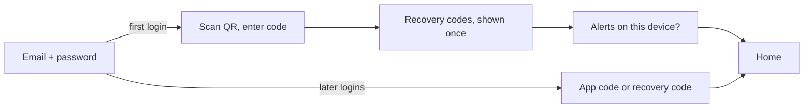

- **Routes.** `app.config.ts` wraps `app.routes.ts` with `protectRoutes()`, so
  every page gets `authGuard` unless it has `data: { public: true }`.
  `data: { bare: true }` shows a page without the app frame (sign-in).
  `/admin/users` and `/dashboard` also have `adminGuard`: anyone else sees
  the one **No access** page at the address they asked for (`/no-access`,
  kept out of the address bar). Home is `/`.
- **Nav** (M1, `shell/nav-items.ts`): seven pages on top, the rest in
  folding groups. Each group is a disclosure that remembers whether it is
  open (`localStorage`, `stonks.nav.groups`), and the group that holds the
  current page opens by itself. More starts open, Advanced and System start
  folded, so the rail fits a laptop screen.

  | Group | Pages | Who |
  |---|---|---|
  | (top) | Today, Strategies, Orders, Approvals, Insights, Charts, Notifications | everyone signed in (Approvals needs `portfolio.trade`) |
  | More | Going live (`/going-live`), Watchlists, Calendar, Screener, Trial results (`/paper`), Leaderboard, Trade costs (`/trades`), Assistant | everyone; the Assistant only while it is on |
  | Advanced | Studio, Lab, Options, Strategy review (`/go-live`), Halts (traders: their own halts) | Studio and Lab need `lab.run`, Halts `killswitch.user` |
  | System | Dashboard (`/dashboard`), Health, Live engine, Schedule, Data, Data quality, Universes, Model versions, Halts, Users | admins |
  | Account menu (pinned below the nav) | Profile, Settings, Broker connections, Get set up, Help, Sign out | everyone signed in |

  The nav scrolls between the search box and the account menu, with a
  shadow at an edge while there is more to scroll to, so the account menu
  never falls below the fold. A trader never gets a link to an admin-only
  page: the session strip's next run opens Today (admins: the schedule), and a
  trader resumes their own kill switch or clears their own breaker from the
  strip (`<app-strip-halt-actions>`), with the same ticket, typed words and
  code as the Halts page. A halt only an admin may end says so. The palette
  opens a ticker on its chart. Features that are off leave the nav
  (`FeatureFlagsService`, today the assistant): Settings, System tells
  admins how to turn it on. With open reads and nobody signed in (dev)
  everything shows.
- **Signing out** (and a different user signing in on the same tab) loads
  `/login` afresh through `HARD_NAVIGATE` (`core/auth/hard-navigate.ts`),
  so no store keeps the last user's portfolios, stamp or halts. Only a 401
  from `/me` clears the user: a network blip or a 5xx keeps them. A 401 on
  the tab's own API token clears it and goes to sign-in. A reload in the
  middle of signing in shows "Signing in" until the next step is known.
- **Session.** `SessionService` asks `GET /api/auth/me` once (with the tab's
  API token when there is one, as the server prefers it). Statuses:
  `signed-in`, `mfa-pending`, `open` (no one signed in but reads work: dev
  profile, pages behave as before), `signed-out`, `unreachable`.
- **Session interceptor** (`core/auth/session.interceptor.ts`, after the
  error interceptor): adds `X-CSRF-Token` (from the sign-in response, else the
  `stonks_csrf` cookie) to unsafe same-origin calls that ride on the cookie;
  401 `mfa_required` goes to the code screen; a 401 after being signed in
  goes to sign-in with `?next=`; 403 `step_up_required` opens the step-up
  prompt and retries once. `ApiError.code` holds the auth code. Every
  problem response now has a machine `code` field (`not_found`,
  `step_up_required`, `mfa_required`, `auto_blocked`, ...), so read it
  instead of parsing `detail`. A 401 `mfa_required` also has `next_step`:
  `enrol` or `verify`.
- **Step-up.** Any action that needs a fresh code just calls the API: the
  interceptor asks when needed. The prompt is an `<app-sheet>` (Escape
  closes it, full screen on phones) with focus in the code field, and a
  cancelled prompt fails quietly (`quietError()`), with no toast. A page that knows beforehand (turning on auto)
  calls `await inject(StepUpService).ensure('Turn on auto for X.')` first.
  API tokens cannot step up; the prompt says to sign in instead.
- **QR codes** are drawn in the browser by `uqr` (pinned), behind
  `core/auth/qr.ts`. The secret never leaves the page. On a phone, "Add to
  authenticator app" (the `otpauth_uri` link) comes first, and the key has
  a Copy button (`<app-copy-button>`, which says so when the clipboard is
  blocked). Recovery codes also offer "Download .txt". The alerts step
  moves on only once push is really on, and says why otherwise.
- **Today** (`pages/home/`): my portfolio for everyone (value, the day's
  change, biggest holdings). Admins get the totals across traders under it,
  never holdings, or one quiet line while there are too few traders with
  real money to sum. A tape of the latest session's fills, today's signals
  and trading runs in one time line with the next run on top (the feed's
  `signal` items and the runs from the last 24 hours). A run line counts
  only the orders and fills in the reader's own portfolios, as the API
  scopes them (`ownRunCounts()`). When the counts are null it says only
  "Trading run finished". Its status reads Done, Partly done or Failed
  (`shared/status-words.ts`). My strategies: one `<app-follow-control>` per
  follow (the on/off switch and Alerts only, Paper, Approve each trade,
  Automatic), the same control as the strategy page, the portfolio it trades when
  there are several, and "Paper days: 4 of 20". The unlock rule is said
  once above the list. Approve each trade and Automatic stay locked until the
  paper days and the server's other checks pass, then ask for the step-up
  and a ticket. Automatic asks for the strategy's name as shown, never its
  id. The left column flows on its own (the last grid row is
  flexible), so a tall strategies list never leaves a gap beside it.
- **Follow** (`pages/strategies/follow-panel.ts`): the strategy page of a
  strategy on trial or approved has a Follow panel. Pick "Alerts only"
  (notify) or "Paper" in one of your portfolios, then
  `POST /api/subscriptions` (`portfolio.trade`). Approve each trade and
  Automatic are never starting modes. Once you follow it, the panel shows
  `<app-follow-control>` for each portfolio, the same control Today uses,
  to switch it on or off and change the mode.
  The server routes exist now: `GET /api/subscriptions` (each row has
  `paper_days_completed`, `paper_days_required`, `auto_blockers` and
  `paused_reason`), `POST /api/subscriptions` and
  `PATCH /api/subscriptions/{id}` with `{enabled?, mode?, reason?}`. Auto
  answers 403 `step_up_required` without a fresh second factor, and 409
  `auto_blocked` with `blockers` while the checklist fails.
  `GET /api/portfolios` lists your portfolios, each with `trading` (paper
  or live). The console reads the PAPER or LIVE stamp from there, not from
  `GET /api/portfolios/trading-modes` (MCP uses that one).
  The default portfolio at Alpaca or an IB Gateway is LIVE only when its
  orders really go to a live account (`broker` is `alpaca` or `ibkr`), the
  same answer the order paths use.
- **Profile** (`pages/profile/`): password, new recovery codes, your
  portfolios and API tokens (a new token is shown once). "Your portfolios"
  lists each with its PAPER or LIVE stamp, renames one
  (`PATCH /api/portfolios/{id}`) and opens a new paper portfolio with an
  optional starting cash (`POST /api/portfolios`, both `portfolio.manage`).
  The portfolio picker reloads after each change. **Settings** adds alert settings per
  type and channel and quiet hours next to the push opt-in.
  `GET /api/notifications/preferences` has `channel_defaults`: whether each
  channel is on when you never set it, and whether it stands in for push.
  It also has `event_alerts`, one switch per upcoming-event kind (`earnings`,
  `dividends`, `economic`) with plain words. `PUT` takes `event_alerts` and
  `preferences`, and changes only what it is given.
- **Owners.** Jobs and Studio drafts record `owner_id`. A trader sees only
  their own jobs and drafts (others are 404). Admins see all of them.
  `GET /api/alerts` shows only your alerts (admins also see the admin
  audience).
- **Users** (`pages/admin-users/`): add a person, change role, disable or
  enable, reset their authenticator, and reset their password (a sheet
  with the new password and their email typed to confirm). A password reset
  signs them out and stops their API tokens. Every change asks for a fresh
  code.

Checked at 375px in Chromium: no sideways scroll and 44px targets on sign-in,
set-up, home (trader and admin), profile, settings and users.

## Security

- Every same-origin `/api/` request carries a credential, reads included:
  the auth interceptor sets `withCredentials` (session cookie) and adds
  `Authorization: Bearer` when the tab has an API token. Other origins get
  neither.
- The bearer token lives in memory and `sessionStorage` only. It is never
  logged, never put in a URL, never written to `localStorage`.
- Job event streams use the short-lived, job-scoped stream token in `?token=`.
- The console never talks to a broker directly; everything goes through the API.
