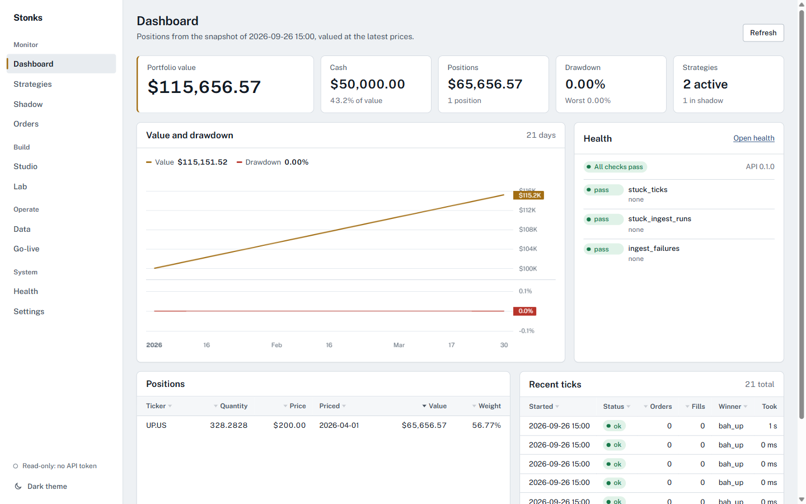
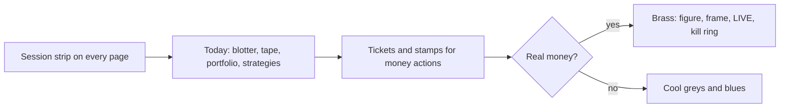
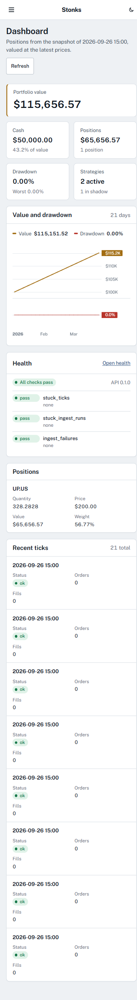
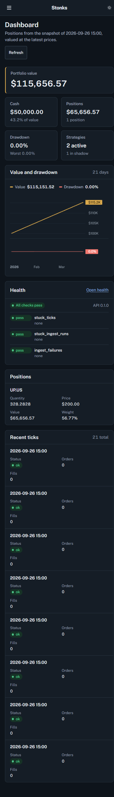
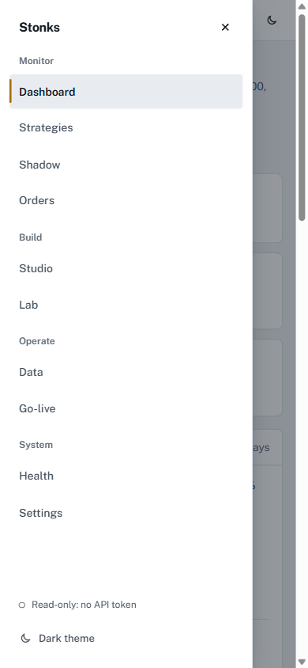
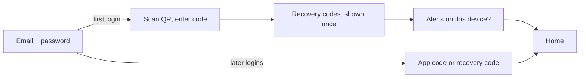

# Trader console (web UI)

The Angular app in `web/` is the trader console: sign-in, a simple home,
profile, admin users, and the advanced pages (dashboard, strategies, studio,
lab, data, universes, orders, shadow, go-live, halts, schedule and backups,
data quality, health and settings). It talks only to the
REST API (`src/stonks/api/`) through a client generated from the checked-in
contract `web/openapi.json`.



## Run it

Node 22+ and npm. From `web/`:

```bash
npm install                 # once
npm start                   # dev server on http://localhost:4200, proxies /api to 127.0.0.1:8000
```

In another terminal, from the repo root, run the API:

```bash
STONKS_API_TOKEN=... uv run stonks serve     # 127.0.0.1:8000
```

`npm run build` writes the production bundle to `web/dist/`; `stonks serve` then
serves it at `/` with single-page fallback (`[api].ui_dist`), so one process
serves both. The dev server origin (`http://localhost:4200`) is the API's
`[api].ui_origin` for CORS, although the proxy makes CORS unnecessary in dev.

Every call needs a credential. Sign in, or paste an API token (on the sign-in
page under "Use an API token instead", or in **Settings**; kept in
`sessionStorage` for that tab only). For local UI work, start the API with
`STONKS_PROFILE=dev` so reads from 127.0.0.1 work without signing in. See
`docs/security.md` and [Sign-in and the trader home](#sign-in-and-the-trader-home).

| Command | What it does |
|---|---|
| `npm start` | Dev server with the `/api` proxy (`proxy.conf.json`) |
| `npm run build` | Production build into `web/dist/` |
| `npm test` | Unit tests once, headless (Vitest + jsdom via `ng test`) |
| `npm run test:watch` | Unit tests in watch mode |
| `npm run lint` | ESLint (angular-eslint, template accessibility rules) |
| `npm run format` / `format:check` | Prettier |
| `npm run api:generate` | Regenerate the typed client from `openapi.json` |
| `npm run api:check` | Regenerate and fail if the committed client differs (CI) |

When the backend changes a route: `uv run python -m stonks.api.openapi` (writes
`web/openapi.json`), then `npm run api:generate` in `web/`, and commit both.

## Stack

- Angular 22 (standalone components, signals, `resource()`, new control flow,
  zoneless, OnPush everywhere), TypeScript 6 strict with strict templates.
- `@hey-api/openapi-ts` generates `src/app/api/generated/` (Angular HttpClient
  client, so interceptors apply). Never edit it; ESLint and Prettier skip it.
- TradingView Lightweight Charts, behind the `ChartEngine` seam.
- `@angular/service-worker` for the app-shell cache and Web Push.
- Public Sans, Archivo and IBM Plex Mono, self-hosted from `@fontsource` (see [Identity](#identity)).
- Vitest (Angular's default runner) with jsdom; ESLint; Prettier.

## Folders

```
web/src/
  styles.scss                 global primitives: buttons, fields, panels, page grid
  styles/_tokens.scss         design tokens + light/dark palettes
  styles/_breakpoints.scss    phone / tablet / desktop mixins
  testing/                    test helpers (nextRequest, tick, fake chart)
  app/
    api/                      the only code that touches the generated client
      generated/              openapi-ts output (do not edit)
      models.ts               contract types re-exported for the app
      api-call.ts             unwrap(): SDK result -> data or ApiError
      provide-api.ts          HttpClient + interceptors + client binding
      <domain>.service.ts     portfolio, ticks, health, strategies, lab, market,
                              orders, shadow, ingest, studio, system, jobs-api
    core/                     cross-cutting services
      auth/                   AuthTokenService (sessionStorage only), SessionService,
                              session interceptor, guards, StepUpService + dialog, qr.ts
      commands/               CommandRegistry (palette commands), ShortcutsService (keys)
      help/                   glossary.ts: one-line help for every metric
      http/                   ApiError + problem-details mapping, interceptors
      jobs/                   JobsService (SSE via fetch + polling), SseParser
      notify/                 ToastService
      confirm/                ConfirmService
      theme/                  ThemeService
      format/                 money / percent / date formatting; FormatService (locale, time zone)
      pwa/                    ConnectivityService (offline, updates), NotificationPermissionService,
                              PushSubscriptionApi (Web Push seam, HTTP implementation)
    shared/
      ui/                     page header, stat tile, status pill, data table,
                              loading/empty/error states, confirm dialog, toasts,
                              help tip, command palette, shortcut cheat sheet,
                              display and notification settings panels, offline page
      chart/                  ChartEngine seam, lightweight-charts engine,
                              <app-time-series-chart>
      format.pipes.ts         money, pct, num, day, dateTime, ago pipes
    shell/                    app frame, navigation, palette commands (shell-commands.ts)
    pages/<name>/             one folder per page: <name>.routes.ts + <name>.page.*
```

## Conventions for page agents

Follow these exactly; the dashboard (`pages/dashboard/`) is the reference
implementation.

### Add or build a page

1. Your page already has a folder, a lazy route file and a placeholder
   component (`pages/<name>/`). Replace the placeholder's template; delete the
   `<app-planned-page>` usage.
2. Child routes (e.g. `strategies/:id`) go in your own `<name>.routes.ts`:
   ```ts
   export default [
     { path: '', title: 'Strategies', loadComponent: () => import('./strategies.page').then((m) => m.StrategiesPage) },
     { path: ':id', title: 'Strategy', loadComponent: () => import('./strategy-detail.page').then((m) => m.StrategyDetailPage) },
   ] satisfies Routes;
   ```
   Route params bind to inputs (`withComponentInputBinding`): `readonly id = input.required<string>()`.
   Do not edit `app.routes.ts` or `shell/nav-items.ts` unless you add a new
   top-level page.
3. Every page starts with `<app-page-header title=".." description="..">` and
   puts page actions in `<button actions ...>`. The shell focuses the page's
   `h1` after each navigation.
4. Components: standalone, `ChangeDetectionStrategy.OnPush`, `inject()` (no
   constructor injection), `input()` / `output()` / `model()`, signals and
   `computed()`, `@if` / `@for` / `@switch`. Page-only components live in the
   page folder; anything two pages use goes to `shared/ui/`.
5. Name files `<thing>.page.ts` for routed pages, plain `<thing>.ts` for
   components; styles in `.scss` next to them, using tokens only.

### Load data

- Call domain services in `src/app/api/`; never import from
  `api/generated/sdk.gen` or `api/generated/client` in components (ESLint
  enforces it). Types come from `api/models`.
- Missing a call? Add a method to the matching domain service, one line per
  route: `get(id: string) { return unwrap(getThing({ path: { thing_id: id } })); }`.
- Reads use `resource()`, one per panel, so one failing route never blanks the
  page:
  ```ts
  protected readonly strategies = resource({
    params: () => ({ status: this.status() }),
    loader: ({ params }) => this.strategiesApi.list(params),
  });
  ```
- Every panel renders four states in this order:
  ```html
  @if (res.error(); as err) { <app-error-state [error]="err" (retry)="res.reload()" /> }
  @else if (!res.hasValue()) { <app-loading-state label="Loading strategies" /> }
  @else if (res.value().items.length === 0) { <app-empty-state title=".." message="what fills this and how" /> }
  @else { ...data... }
  ```
  Never read `res.value()` without `hasValue()`; it throws in the error state.
- Errors are `ApiError`s with a ready-to-show `message` (the API's
  problem-details `detail`, field errors for 422s, a Settings hint for 401s).
  Failed mutations are toasted by the error interceptor; don't toast them again.

### Mutations (promote, retire, tick, ingest, backtest, ...)

Every mutating action asks first, then calls the service, then says what
happened with the same verb:

```ts
async runTick(asOf: string) {
  const ok = await this.confirm.confirm({
    title: `Run a tick for ${asOf}?`,
    message: 'Active strategies decide and place orders through the broker.',
    confirmLabel: 'Run tick',
    typedConfirmation: asOf,          // required for ticks
  });
  if (!ok) return;
  try {
    await this.ticksApi.start({ as_of: asOf });
    this.toasts.success(`Started the tick for ${asOf}.`);
  } catch {
    // The error interceptor already showed the API's message.
  }
}
```

Status changes (promote, retire, …) need a reason: see below.

Use `tone: 'danger'` for retire/delete and anything touching a live broker.
Disable the triggering button while the request runs.

#### Status changes need a reason (governance)

Promote, move to shadow, retire (Strategies) and enable, disable (Studio)
send a `StatusChangeRequest` body: `{ reason, override }`. The API records it
in the strategy's status history (`GET /api/strategies/{id}/history`, shown
as a timeline on the strategy page). Use `<app-status-change-dialog>` instead
of `ConfirmService` for these: host one in the page and call `open()`; it
resolves to the body, or `null` when cancelled.

```ts
private readonly dialog = viewChild.required(StatusChangeDialog);

const body = await this.dialog().open({
  title: `Retire ${id}?`, message: '…', confirmLabel: 'Retire', tone: 'danger', minReason: 1,
});
if (body) await this.strategiesApi.retire(id, body);
```

Promotions go through `promoteThroughGate()` (`shared/governance.ts`):

1. it loads the go-live report and shows its verdict and failing checks
   above the reason field (typed id to confirm);
2. it promotes silently; a **409** means the gate refused, so it opens the
   dialog again with the failing checks and offers **Override and promote**,
   which needs a reason of at least 20 characters and the typed word
   `override`;
3. it retries with `override: true`. Other errors are toasted.

Check labels, measures and value/limit formatting for all go-live checks
live in `shared/golive-checks.ts` (`checkRow`, `checklistItems`).

### Background jobs

Backtests, lab runs, ingest and ticks return a `Job`. Follow it with
`JobsService.track()`, which streams progress over SSE (short-lived stream
token in the URL, never the bearer token) and falls back to polling:

```ts
private readonly jobs = inject(JobsService);
private readonly destroyRef = inject(DestroyRef);
protected readonly run = signal<JobHandle | null>(null);

async start(request: BacktestRequest) {
  const job = await this.lab.startBacktest(request);
  const handle = this.jobs.track(job.id, this.destroyRef);
  this.run.set(handle);
  const last = await handle.finished;
  if (last?.status === 'succeeded') this.result.set(await this.lab.backtestResult(job.id));
}
```

Template: `handle.progress()` (0..1, show as `<progress>` with a label),
`handle.message()`, `handle.status()` in an `<app-status-pill>`,
`handle.error()`. Offer Cancel via `JobsApiService.cancel()` where the API
supports it (queued jobs, lab runs).

### Tables

```ts
protected readonly columns: TableColumn<OrderView>[] = [
  { key: 'ticker', label: 'Ticker', mobile: 'title' },     // card heading on phones
  { key: 'side', label: 'Side' },
  { key: 'quantity', label: 'Qty', format: 'number' },
  { key: 'status', label: 'Status' },                      // custom cell below
  { key: 'created_at', label: 'Created', format: 'datetime', mobile: 'hide' },
];
```
```html
<app-data-table caption="Orders placed by ticks" [rows]="page.items" [columns]="columns"
                [rowKey]="orderKey" [total]="page.total" [pageSize]="50"
                (pageChange)="offset.set($event.offset)">
  <ng-template appCell="status" [appCellOf]="page.items" let-o>
    <app-status-pill [status]="o.status" />
  </ng-template>
</app-data-table>
```

- Formats: `text`, `number`, `money`, `signedMoney`, `percent`, `signedPercent`
  (fractions), `date`, `datetime`; `tone: true` colours numbers by sign.
- Client paging by default; pass `total` for server paging and refetch on
  `pageChange` (put `offset` in the resource `params`). Server mode has no
  sort buttons and keeps the API's row order.
- Keep the last page on screen while the next loads: build the page from
  `keepLatest(res)` (`shared/ui/data-table/keep-latest.ts`) and pass
  `[busy]="res.isLoading()"`, which dims the rows under a thin progress bar.
- Pages that should stay fresh call `autoRefresh(() => [resources])` from
  `shared/auto-refresh.ts`: a reload every minute while the tab is visible,
  paused when hidden. Show `<app-updated-ago [at]="auto.updatedAt()" />` in
  the page header. `TicksService.finished` changes when a trading run this
  tab followed ends, and the dashboard reloads then.
- Always give a `caption` (screen readers) and a `rowKey`.
- Links in rows: put an `<a routerLink>` in a custom cell of the title column.

### Charts

Use `<app-time-series-chart>` only; never import `lightweight-charts`
outside `shared/chart/lightweight-chart-engine.ts`.

```html
<app-time-series-chart ariaLabel="Backtest equity, with drawdown below"
  [summary]="summary()" [series]="series()" [height]="300" />
```

Series: `{ id, label, kind: 'line' | 'area', color: 'brass' | 'primary' | 'gain' | 'loss' | 'muted', pane?: 0 | 1, format?: 'money' | 'percent' | 'number', points: { time, value }[] }`.
`time` is `YYYY-MM-DD` for daily data or an ISO timestamp. Equity is a
`primary` line in pane 0 (`brass` only for a live portfolio); drawdown is a `loss` area in pane 1. Always pass a one or two
sentence `summary` (the canvas is invisible to screen readers). Tests use
`provideFakeChart()` from `src/testing/fake-chart.ts`.

With a benchmark, the strategy and the benchmark share pane 0, both rebased
to 100 (`rebase()` in `shared/lab-results/result-figures.ts`, `format: 'number'`);
the benchmark is a `muted` line and a small legend names it.

### Results and missing figures

The result views live in `shared/lab-results/`: `<app-backtest-result>`,
`<app-lab-run-result>` (with `<app-preflight-issues>`, the run's data
checks) and `<app-figure-grid>`. The Lab page and Studio's backtest and lab
panels both use them.

The API sends non-finite figures (a Sharpe with no variance, a payoff ratio
with no losing trades) as `null`. Show them as **n/a**, never 0 or a dash:
`formatMetric(key, value)` and `metricLabel(key)` in `shared/metrics.ts` do
this for survival-report metrics, and `pctOrNa` / `numOrNa` for fixed
fields. Lab results group figures with `<app-figure-grid>`: risk (Sortino,
Calmar, Ulcer, VaR/ES, longest drawdown), trades (count, win rate,
expectancy, payoff, holding time, turnover, cost drag), the benchmark
(excess CAGR, alpha, beta, IR, capture ratios) and trial counts. Each
survival test shows its deciding figures first (`KEY_METRICS`: DSR, PBO,
the Monte Carlo drawdown band, cost stress, walk-forward efficiency…) and
folds the rest into "All figures".

### Lab form

The lab-run form sends a named suite (`preset`: quick, standard,
promotion) unless the trader picks custom tests (`survival_tests`).
Registering defaults to `register_if_passes` (the promotion suite, a
required hypothesis); "Always" sends `register_strategy`. Walk-forward,
MCPT and the per-test "advanced options" start blank, meaning "the test's
default", and only filled fields are sent, so presets keep their own
settings. The options come from `GET /api/lab/survival-tests`: each test's
options schema gives labels, defaults, bounds and choices
(`pages/lab/test-options.ts`), so a new backend option needs no console
change. Field errors show next to the field, and the advanced panel opens
when one of its fields is wrong.

The Lab has three screens, linked at the top of each: Backtest and lab run
(`/lab`), Sweep (`/lab/sweeps`) and Signal IC (`/lab/signal-ic`). A sweep
runs every strategy, or the ones picked, on typed tickers or a saved
universe, and `<app-sweep-result>` ranks the rows best first. Signal IC
shows how well a strategy's scores ranked the moves that followed, per
look-ahead (`<app-signal-ic-result>`). Both follow the job with
`<app-job-progress>` and show a failed result load inline with Retry
(`pages/lab/job-follower.ts`). The Lab history lists and opens them too.

### Formatting and copy

- Numbers through `formatMoney/formatPercent/...` or the `money`, `pct`, `num`,
  `day`, `dateTime`, `ago` pipes; percentages are fractions from the API.
  Numeric cells get `.num` (mono tabular figures). Never call `Intl` or
  `toLocaleString` yourself: the formatters follow the trader's locale, time
  zone and date style from Settings (`FormatService`, kept in `localStorage`)
  and re-render when they change. Defaults: the browser's locale and zone,
  ISO dates (`2026-09-26`). Date-only values are never shifted by zone.
- Sentence case, plain verbs, buttons name the action ("Run tick", not "OK").
  Errors say what failed and what to do; empty states say what will fill the
  space and how.

### Metric help

Every metric shows a "?" tip with one plain sentence and a link to the
in-app glossary (`/help/glossary#<key>`, nav: System, Glossary). The text
lives in one file, `core/help/glossary.ts`, and the glossary page is built
from it. Tips close when the page scrolls.

- `app-stat-tile` and `app-data-table` headers add the tip on their own when
  the label is in the glossary ("Sharpe", "Max drawdown", "CAGR"...). Pass
  `help="deflated_sharpe"` (tile) or `help: 'deflated_sharpe'` (column) when
  the label differs, or `false` to hide it.
- Anywhere else: `<dt>{{ m.label }} <app-help-tip [term]="m.key" /></dt>`;
  unknown terms render nothing.
- New metric: add a key to `METRIC_KEYS`, an entry (the compiler insists) and
  its labels or API keys as `aliases`, and add the label to `LABELS_SHOWN` in
  `glossary.spec.ts`. Keep `short` to one sentence a trader understands.

### Command palette and shortcuts

Ctrl+K / Cmd+K (or `/`, or the search button in the top bar and sidebar)
opens the palette: pages, actions, strategies, tickers and recent jobs.
The shell registers pages and global actions in `shell/shell-commands.ts`.
A page can add its own while it is open:

```ts
inject(CommandRegistry).register(
  [{ id: 'lab.compare', label: 'Compare backtests', group: 'Actions', run: () => this.compare() }],
  inject(DestroyRef), // removed when the page goes
);
```

Actions that change something confirm first, exactly like buttons do.
Searches go through `api/search.service.ts` (silent: no error toasts).
Tickers open `/data?instrument=<id>`.

## Operations pages

| Page | Route | What it does |
|---|---|---|
| Halts | `/ops/halts` | Active and past halts, the kill switch (global or one portfolio, reason, buys only), Resume and Clear |
| Schedule and backups | `/ops/schedule` | Jobs with next and last run, recent runs and Run now. Every backup on disk with its size, Back up now, Verify and a staged Restore (admins) |
| Data quality | `/ops/data-quality` | Statement audit flags, filtered by ticker and severity |
| Universes | `/universes`, `/universes/:id` | List, create (JSON spec or CSV), index history import, members on a date, Refresh and Ensure data |

- `<app-session-strip>` sits above every page: the next scheduled run with
  a live countdown (`GET /api/schedule`), and the halt state. It turns red
  while a kill switch is on and amber for a breaker or operational halt.
  `HaltStateService` (`core/halts/`) reads active halts every minute and
  right after any halt action.
- Server-paged tables pass the API page's offset: `[total]="p.total"
  [offset]="p.offset"`. The table is re-created after each load, and the
  offset keeps the pager on the right page.
- Resume needs the typed words `RESUME TRADING` and a fresh second factor.
  The page calls `StepUpService.ensure()` (`core/auth/step-up.service.ts`)
  first, and again with `force` when the API answers 403
  `step_up_required`. The default service never prompts. The sign-in work
  provides the real one.
- Refresh, Ensure data and Back up now return a job. Pages follow it with
  `JobsService.track()` and show `<app-job-progress>`.
- Run now on a tick job needs the job name typed, like a tick.
- **Run checks now** on Health (admins, `operations.run`) calls
  `POST /api/health/run`. It asks first, because stale data or a stuck run
  opens the operational halt and passing checks clear it. Then it reloads
  the report and `HaltStateService`.
- The backup list comes from `GET /api/backups`: every backup on disk,
  also those made from the command line, with its size. Verify is
  `POST /api/backups/{id}/verify`. Restore is
  `POST /api/backups/{id}/restore` with `{"confirmation": "RESTORE <id>"}`
  and a fresh second factor (`StepUpService.ensure()` first, and the
  session interceptor asks again on 403 `step_up_required`). It returns a
  job. The restore is staged: the server restores into a new folder and
  never touches the live data. The job result
  (`GET /api/backups/restores/{job_id}/result`) says where the data went
  and how to switch to it, shown above the list with Verify's outcome.
  Only admins load the list (`operations.run`, and `backups.restore` for
  Restore).
- `GET /api/schedule` also returns `market`: the calendar, `is_open`, and
  `today` and `next` sessions, each with `pre_open` (30 minutes before the
  open), `open` and `close` in UTC. `today` is null on days the market is
  closed.

## Trader screens added in 18.2

| Page | Route | What it does |
|---|---|---|
| Notifications | `/notifications` | The in-app feed, unread first marks, Mark read and Mark all read, deep links, and "Your devices" (push devices, Remove) |
| Broker connections | `/connections`, `/connections/:id`, `/connections/callback` | Provider cards, connect by keys or the provider's sign-in page, accounts, Link to a portfolio, Sync now, Disconnect |
| Trade costs | `/trades`, `/trades/orders/:clientId` | Totals and shortfall by strategy, ticker or portfolio, the trade journal, and each order as a ticket with notes |
| Sweep, Signal IC | `/lab/sweeps`, `/lab/signal-ic` | See Lab form above |
| Glossary | `/help/glossary` | Every term the help tips explain |

- **Notifications.** `NotificationFeedService` (`core/notify/`) keeps the
  unread count, read quietly every minute while the tab is visible and after
  any mark-read. `<app-notification-bell>` sits in the top bar and sidebar.
  `<app-alerts-panel>` shows recent system alerts on Health. Alert settings
  in Settings also take a webhook address (write-only, shown as scheme and
  host after saving).
- **Connections.** Key fields are password inputs, cleared when the form
  closes and never shown again. Portal providers leave through the
  `BROWSER_REDIRECT` seam and come back to `/connections/callback`, which
  calls the callback route once. Link sends a new broker portfolio by
  default. Connect and disconnect need `connection.manage`, link and sync
  `portfolio.manage`.
- **Trade costs.** Shortfall is the gap between the price when the order was
  decided and the price paid, fees included. Positive figures are costs.
  Orders and fills link to the order ticket. Notes need `portfolio.manage`.
- **Order tickets.** `ConfirmService.confirm({ ticket: { lines, side, live } })`
  shows a confirmation as an order ticket: `<app-side-tag>` (solid B, outlined
  S), mono figures and `<app-mode-stamp>` (grey PAPER, brass LIVE). A real
  trading run confirms this way. Brass means real money only.
- **Strategy lifecycle.** One vocabulary in `shared/governance-labels.ts`:
  Start paper trading, Go live, Back to paper trading, Stop, and the stages
  Draft, Paper, Ready, Live. Studio and the strategy page both use it, and
  the strategy page has a stage bar, a paper value chart and recent orders.
  A promotion the gate allows needs a reason and a one-second hold
  (`app-hold-button`); an override still needs the typed word.
- **Dialogs** are built on `app-sheet` (`shared/ui/sheet.ts`) with
  `app-typed-confirm`.
- **Settings** has "Your account" for everyone and "System" (broker, risk
  policy, data sources, cost models) for admins only.
- **Toasts.** Success and info leave after a few seconds and pause while
  hovered or focused. Errors stay until dismissed. The toast layer is a
  manual popover in the top layer, so toasts over a modal stay usable.

## Permissions

The console hides or disables what the signed-in user may not do, so nobody
fills in a form that ends in a 403. The server still decides.

- `scripts/gen-permissions.mjs` writes `core/auth/route-permissions.gen.ts`
  from each route's `x-permission` in `openapi.json` (run by
  `npm run api:generate`, checked by `npm run api:check`).
- `core/auth/permissions.ts` mirrors the server policy (roles, token scopes,
  browser-session-only). Step-up is not checked: the interceptor asks for a
  code when the API wants one.
- `SessionService.can('strategy.promote')`, `whyNot(...)` and
  `canCall('POST', '/api/ticks')`. Put `<app-permission-note
  permission="...">` after a disabled action: it prints "Admins only." and
  renders nothing when allowed.
- The sidebar shows the user's name and role.

## Portfolio picker

`core/portfolio/portfolio-context.service.ts` holds which portfolio the
money pages show. It reads `GET /api/portfolios` (a 404 keeps the
picker hidden and nothing changes), remembers the pick per browser, and
never sends an id that is no longer listed. `PortfolioService`,
`OrdersService` and `TcaService` add `portfolio_id` from it. Pages put
`portfolioCtx.selectedId()` in their resource params so a new pick reloads
them. `<app-portfolio-picker>` sits in the session strip with a PAPER or
LIVE stamp, and shows only with two or more portfolios.

## Copy rule

No CLI commands, config keys, environment variables or raw ids in trader
copy. `npm run lint` runs `scripts/check-copy.mjs`, which fails on
`stonks <command>`, `STONKS_*`, `[section]` config keys and "command line".

## Install and notifications (PWA)

- `public/manifest.webmanifest` and `public/icons/` make the console
  installable (desktop and phone home screen).
- Angular's service worker (`ngsw-config.json`, production builds only)
  caches the **app shell only**: HTML, JS, CSS, fonts and icons. It has no
  data groups, so API responses are never cached, and `/api/**` is excluded
  from navigation handling.
- Offline, the shell swaps the page for `app-offline-page` (nothing stale is
  shown) and brings the page back, freshly loaded, when the connection
  returns. A newly deployed version shows a "reload" toast once.
- Notifications are opt-in from **Settings, Notifications**; the browser
  prompt appears only after the button is pressed. On iPhone and iPad the
  panel explains Add to Home Screen first (iOS delivers Web Push only to
  installed apps). `NotificationPermissionService` subscribes with `SwPush`
  and the server's VAPID key through `PUSH_SUBSCRIPTION_API`, whose
  `HttpPushSubscriptionApi` calls `GET /api/push/vapid-key` and `POST`/`DELETE
  /api/push/subscriptions` (via `api/notifications.service.ts`). These routes
  act for the signed-in user, so they need the API token; when the server has
  no VAPID key the panel stops after permission ("waiting for the server").
- Push payloads must use Angular's format so a tap opens the deep link:
  `{"notification": {"title": "...", "body": "...", "icon": "icons/icon-192.png",
  "data": {"onActionClick": {"default": {"operation": "navigateLastFocusedOrOpen",
  "url": "/strategies/momentum-v3"}}}}}`.
- `stonks serve` sends `ngsw-worker.js` and `ngsw.json` with
  `Cache-Control: no-cache` so updates are picked up, and
  `manifest.webmanifest` as `application/manifest+json`.

### Tests

- Each service and component ships a `*.spec.ts` next to it.
- HTTP: `...provideApi(), provideHttpClientTesting()` and `HttpTestingController`.
  SDK calls go out a few microtasks late, so wait with
  `await nextRequest(controller, '/api/path', 'POST')` (from `src/testing/http.ts`)
  instead of `expectOne`. `match()` consumes every hit; flush them all.
- Components with resources: don't `await fixture.whenStable()` while requests
  are pending (it waits for them); flush, then `await tick()` and
  `fixture.detectChanges()` (see `dashboard.page.spec.ts`).

## Identity

The console should read as a trading desk, not an admin template. Three rules,
layered, apply to every page and shared component:

1. **The trading day is the spine.** `<app-session-strip>` sits on top of
   every page: the market phase (pre-open, open, closed) with a track from
   pre-open to the close, and the next scheduled run with a live countdown,
   from `GET /api/schedule` (`market`, `jobs`, read once through
   `TradingDayService`). It turns red for a kill switch and amber for a
   breaker. Home is **Today**: a blotter of the next run, trading runs and
   signals in time order, a tape of the latest fills, the portfolio and my
   strategies.
2. **Tape and ticket.** Every price, quantity, date and time is set in the
   mono figure face (`.num`, and the figure columns of the data table). Sides
   are `<app-side-tag>`: a solid B and an outlined S. Money confirmations are
   order tickets (`.ticket`, `.ticket-lines`) with an `<app-mode-stamp>`.
3. **Brass means real money.** `--color-live` (brass) is used only for real
   money: a live portfolio's headline figure and frame (`.live-frame`,
   `<app-stat-tile featured live>`), the LIVE stamp, the live equity line
   and the ring around the kill switch. Paper and research stay in cool
   greys and blues (`--color-paper`, `--color-accent`, `--color-primary`).
   Use `PortfolioContextService.live()` to decide.



**Brand mark.** The favicon's rising line (`<app-brand-mark>`) is the loading
indicator (it draws itself), the empty-state mark (still) and the error mark
(it turns down). It also leads the wordmark in the rail and on sign-in.

**States are moments.** `<app-loading-state>` shows the drawing mark and the
label. `<app-empty-state>` shows the mark, a title in the display face, one
line on what fills the space, and one action in its content slot.
`<app-error-state>` shows the broken mark, the API's message and Try again.

**Status differs by form** (`<app-status-pill>`, `pillForm()`): a lifecycle
state is a round `lamp` pill (active, shadow, retired), an outcome is a
square `receipt` tag with a tick or cross (passed, filled, failed), work in
progress is the drawing mark (queued, running), and a stop is a solid
`alarm` block (halted, unhealthy). A live portfolio or broker uses the LIVE
stamp, never a pill.

**Motion.** Only three things move without being asked: the headline figure
counts up (`countUp()`, `--dur-count`), the countdowns tick, and the fills
tape scrolls once it is full (paused on hover or focus). All three stop
under `prefers-reduced-motion`, and the tape then scrolls by hand.

**The rail.** The sidebar, the phone top bar and the drawer are a slate slab
in both themes (`--color-rail*`). Inside it the colour tokens are remapped
(`rail-scope` in `shell.scss`), so components placed there need no rules of
their own.

Tokens (`styles/_tokens.scss`), always via `var(--…)`. Light and dark each
define every colour.

| Group | Tokens |
|---|---|
| Colour | `--color-bg`, `-surface`, `-surface-2`, `-surface-3`, `-border`, `-border-strong`, `-control-border`, `-ink`, `-ink-2`, `-ink-3`. `--color-primary` (research blue), `--color-accent` (markers). `--color-live`, `-live-ink`, `-live-soft` (brass, real money only). `--color-paper`, `-paper-soft`. `--color-gain`, `-loss`, `-warn`, `-info`, each with `-soft`. `--color-focus`, `--color-scrim`. `--color-rail`, `-rail-2`, `-rail-ink`, `-rail-ink-2`, `-rail-accent`. `--color-brass` stays as an alias of `--color-live`. |
| Type | `--font-sans` (Public Sans, body), `--font-display` (Archivo at `--display-stretch` 76%: page titles, headline figures, empty-state titles, stamps), `--font-mono` (IBM Plex Mono for figures, at `--mono-scale`). `--text-xs` 12, `sm` 13, `md` 14, `lg` 16, `xl` 20, `2xl` 26, `title` 30, `figure` 44 (smaller on phones). `--weight-*`, `--leading-*`, `--tracking-display`, `--tracking-stamp` |
| Space | `--space-1`…`--space-8` = 4, 8, 12, 16, 24, 32, 48, 64 px. `--gutter` (24px, 16px on phones) |
| Radius | `--radius-xs` 2 (tags, stamps, tickets), `-sm` 4 (controls), `-md` 6 (panels), `-lg` 10 (dialogs), `-pill` (lifecycle status only) |
| Border | `--border-live` 3px (real money), `--border-rule` |
| Elevation | `--shadow-0`, `--shadow-1` (panels), `--shadow-2` (dialogs, drawer, toasts), `--shadow-ticket`, `--ring-live` |
| Motion | `--dur-fast` 120ms, `--dur` 200ms, `--dur-slow` 420ms, `--dur-count` 700ms, `--tape-speed`, `--ease`, `--ease-out`. Durations are 0 under reduced motion |
| Size | `--control-h` 32, `--touch-min` 44, `--row-h` 34, `--sidebar-w` 224, `--strip-h` 40 |

Fonts are self-hosted from npm (`@fontsource-variable/public-sans`,
`@fontsource-variable/archivo` with its width axis, `@fontsource/ibm-plex-mono`),
so they work offline and under the API's content policy. Each has a fallback
stack (Arial Narrow and Roboto Condensed for the display face, the system
monospace for figures).

Global primitives (`styles.scss`): `.btn` (+ `.btn-primary`, `.btn-danger`,
`.btn-ghost`, `.btn-icon`), `.field` / `.input` / `.check` / `.hint` / `.error`,
`.form-grid` (+ `.form-grid-2`), `.panel` / `.panel-head` / `.panel-body`,
`.page-grid` with `.span-4…12`, `.num`, `.figure`, `.display`, `.ticket`,
`.live-frame`, `.gain`, `.loss`, `.muted`, `.visually-hidden`.

Reusable components: `app-page-header`, `app-stat-tile` (`featured` for the one
headline figure, `live`, and `amount` with `format` to count up),
`app-status-pill`, `app-side-tag`, `app-mode-stamp`, `app-brand-mark`,
`app-data-table`, `app-loading-state`, `app-empty-state`, `app-error-state`,
`app-time-series-chart`, `app-session-strip`. The shell hosts
`app-confirm-dialog` and `app-toast-outlet`.

## Mobile and responsive rules

The console must work on phones (360–430px) as well as tablets and desktops.

| Breakpoint | Width | Layout |
|---|---|---|
| phone | < 768px | Top bar with menu button opening the nav drawer; one column; 16px gutter; tables become cards; dialogs are full-screen sheets |
| tablet | 768–1099px | Sidebar nav; single-column page grid; two-column tiles and forms |
| desktop | ≥ 1100px | Sidebar nav; 12-column `.page-grid` |

Use the mixins (`@use 'breakpoints' as bp;` then `@include bp.phone { … }`,
`bp.from-tablet`, `bp.from-desktop`, `bp.coarse`) and write phone styles first.

- **No horizontal page scroll.** Wide content scrolls inside its own box
  (the data table does this on tablets). Use `min-width: 0` on grid and flex
  children that hold tables or charts.
- **Tables:** under 768px each row is a card. Mark the key column
  `mobile: 'title'`, keep ticker / quantity / value / P&L / status visible, and
  mark secondary columns `mobile: 'hide'`. Sorting headers are hidden on phones,
  so set a sensible `initialSort`.
- **Charts** size to their container (plot height is 80% on phones); the legend
  shows values at the crosshair (tap and hold), and vertical swipes scroll the
  page, not the chart.
- **Touch:** every control is at least 44×44px on phones and coarse pointers
  (`.btn`, `.input`, `.check` do this already; custom controls use
  `--touch-min`). No hover-only information: anything in a hover state must
  also be visible or reachable by tap and keyboard.
- **Dialogs** (confirm) become full-screen sheets with the actions at the
  bottom; the nav drawer is a modal `<dialog>`.
- **Safe areas:** the top bar, main padding, drawer, sheets and toasts add
  `env(safe-area-inset-*)`; do the same for anything fixed to a screen edge.
- **Tiles and headers wrap:** stat tiles size their figure to the tile width
  (container queries); page header actions wrap under the title.
- **Forms:** one column on phones (`.form-grid`); `.form-grid-2` from tablet up.

Checked by hand in Chromium (Playwright) at 375×812, 390×844, 820×1000 and
1440×900 in both themes, with `scrollWidth === clientWidth` (no sideways
scroll) and every visible button and link at least 44px tall on phones:

| Phone, light (375) | Phone, dark (390) | Nav drawer (390) |
|---|---|---|
|  |  |  |

Repeat the check for every new page. Playwright smoke tests (WP 5.4) will
automate it.

## Accessibility

- Semantic landmarks: skip link, `nav aria-label="Main"`, `main`, sections
  labelled by their `h2`. One `h1` per page (from the page header).
- Keyboard: everything reachable by Tab with the blue focus ring.
  Ctrl+K / Cmd+K opens the command palette (ARIA combobox: the input keeps
  focus, arrows move `aria-activedescendant`, Enter runs, Escape closes and
  returns focus); `?` lists every shortcut; `g` then a key jumps between
  pages (`g d` dashboard, `g s` strategies, `g w` shadow, `g o` orders, `g u`
  studio, `g l` lab, `g a` data, `g g` go-live, `g h` health, `g ,`
  settings); `n b` new backtest, `n t` dry-run tick. Single-key shortcuts can
  be switched off in the cheat sheet (WCAG 2.1.4); Ctrl+K always works.
  Escape closes dialogs and the drawer.
- Status is text plus shape (`app-status-pill`), never colour alone; signed
  numbers carry `+`/`-`.
- Loading regions use `role="status"`, errors `role="alert"`. Each toast is
  its own live region (alert for errors, status otherwise). The table
  announces sort changes.
- Colour pairs meet WCAG AA (4.5:1 text, 3:1 focus and UI) in both themes.
  Checked for every text token on `bg`, `surface`, `surface-2`, `surface-3`
  and each `-soft` background: all at least 4.5:1. Brass (`--color-live`)
  is at least 4.5:1 on surfaces in both themes, so the LIVE stamp and a
  live headline figure can be text. Text fields use `--color-control-border` (at least 3:1); buttons are
  identified by their label, so they keep `--color-border-strong`.
- Targets: 44px on phones and coarse pointers, at least 24px elsewhere (WCAG
  2.2, 2.5.8), including the help tip. On phones the sticky top bar never
  hides the focused element (`scroll-padding-top`, 2.4.11), and fields use
  16px text so iOS does not zoom.
- Motion is limited to the drawer slide, toast rise, the loading mark, the
  headline count-up, the countdowns and the fills tape, all off under
  `prefers-reduced-motion` (a global rule also stops any stray
  animation or transition). Forced-colours mode keeps the focus ring.
- Help tips open on click or tap, never on hover alone.

### Lighthouse budget

Measured on the production build (`npm run build`, served by `stonks serve`)
with mobile emulation, on the dashboard and one detail page. Dropping below
a line is a bug.

| Metric | Budget | Last check (Sep 2026, no API running) |
|---|---|---|
| Accessibility | 100 (never below 95) | 100 |
| Best practices | at least 95 | 96 (console logs the missing API) |
| SEO | at least 90 | 100 |
| Performance | at least 90 | not measured yet |
| Largest contentful paint | at most 2.5 s | not measured yet |
| Cumulative layout shift | at most 0.1 | 0.44 before the fix below; not re-measured yet |
| Total blocking time | at most 200 ms | not measured yet |
| Initial JS + CSS | at most 600 kB raw (build warns), 1 MB (build fails) | 390 kB raw, 108 kB transferred |

Layout shift: `app-loading-state`, `app-empty-state` and `app-error-state`
all reserve at least 9.5rem (an error with a one-line message and a 44px
retry button), so a failed load no longer pushes the page down when it
replaces its skeleton. Still pass `rows` sized like the content it stands
for.

## Sign-in and the trader home



- **Routes.** `app.config.ts` wraps `app.routes.ts` with `protectRoutes()`, so
  every page gets `authGuard` unless it has `data: { public: true }`.
  `data: { bare: true }` shows a page without the app frame (sign-in).
  `/admin/users` also has `adminGuard`. Home is `/`; the dashboard is
  `/dashboard`. The nav keeps Today, Profile (and Users for admins) on top and
  folds the rest under **Advanced** (closed for traders and viewers, open for
  admins, tokens and dev mode, remembered per browser).
- **Session.** `SessionService` asks `GET /api/auth/me` once (with the tab's
  API token when there is one, as the server prefers it). Statuses:
  `signed-in`, `mfa-pending`, `open` (no one signed in but reads work: dev
  profile, pages behave as before), `signed-out`, `unreachable`.
- **Session interceptor** (`core/auth/session.interceptor.ts`, after the
  error interceptor): adds `X-CSRF-Token` (from the sign-in response, else the
  `stonks_csrf` cookie) to unsafe same-origin calls that ride on the cookie;
  401 `mfa_required` goes to the code screen; a 401 after being signed in
  goes to sign-in with `?next=`; 403 `step_up_required` opens the step-up
  prompt and retries once. `ApiError.code` holds the auth code. Every
  problem response now has a machine `code` field (`not_found`,
  `step_up_required`, `mfa_required`, `auto_blocked`, ...), so read it
  instead of parsing `detail`. A 401 `mfa_required` also has `next_step`:
  `enrol` or `verify`.
- **Step-up.** Any action that needs a fresh code just calls the API: the
  interceptor asks when needed. A page that knows beforehand (turning on auto)
  calls `await inject(StepUpService).ensure('Turn on auto for X.')` first.
  API tokens cannot step up; the prompt says to sign in instead.
- **QR codes** are drawn in the browser by `uqr` (pinned), behind
  `core/auth/qr.ts`. The secret never leaves the page.
- **Today** (`pages/home/`): my portfolio (value, today's change, biggest
  holdings; admins get totals across traders instead, never holdings), a
  tape of the latest session's fills, today's signals and trading runs in
  one time line with the next run on top (the feed's `signal` items and the
  runs from the last 24 hours), and my
  strategies with an on/off switch and a notify, paper or auto switch. Auto
  stays disabled with the reason until 20 paper days and the server's other
  checks pass, then asks for the step-up and a typed confirm.
  The server routes exist now: `GET /api/subscriptions` (each row has
  `paper_days_completed`, `paper_days_required`, `auto_blockers` and
  `paused_reason`), `POST /api/subscriptions` and
  `PATCH /api/subscriptions/{id}` with `{enabled?, mode?, reason?}`. Auto
  answers 403 `step_up_required` without a fresh second factor, and 409
  `auto_blocked` with `blockers` while the checklist fails.
  `GET /api/portfolios` lists your portfolios, and
  `GET /api/portfolios/trading-modes` says for each one whether it trades
  paper or live money and through which broker.
- **Profile** (`pages/profile/`): password, new recovery codes and API
  tokens (a new token is shown once). **Settings** adds alert settings per
  type and channel and quiet hours next to the push opt-in.
  `GET /api/notifications/preferences` has `channel_defaults`: whether each
  channel is on when you never set it, and whether it stands in for push.
- **Owners.** Jobs and Studio drafts record `owner_id`. A trader sees only
  their own jobs and drafts (others are 404). Admins see all of them.
  `GET /api/alerts` shows only your alerts (admins also see the admin
  audience).
- **Users** (`pages/admin-users/`): add a person, change role, disable or
  enable, reset their authenticator.

Checked at 375px in Chromium: no sideways scroll and 44px targets on sign-in,
set-up, home (trader and admin), profile, settings and users.

## Security

- Every same-origin `/api/` request carries a credential, reads included:
  the auth interceptor sets `withCredentials` (session cookie) and adds
  `Authorization: Bearer` when the tab has an API token. Other origins get
  neither.
- The bearer token lives in memory and `sessionStorage` only. It is never
  logged, never put in a URL, never written to `localStorage`.
- Job event streams use the short-lived, job-scoped stream token in `?token=`.
- The console never talks to a broker directly; everything goes through the API.
