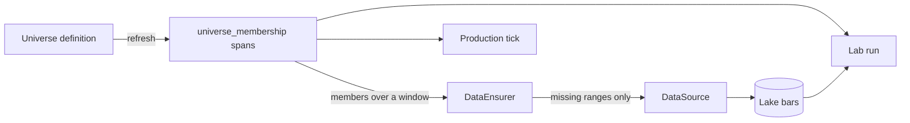

# Universes and on-demand data

A universe is the set of tickers a strategy may trade. Stonks stores each universe as a named object and keeps its members point in time. A backtest on a date sees the names that were members on that date, including names that later died (principle P14).

Data follows the universe. You no longer ingest a fixed ticker list up front. When a lab run or an operator needs a universe over a window, Stonks fetches only the bars that are missing.



## Kinds of universe

| Kind | What it holds | Spec |
|---|---|---|
| `list` | Fixed tickers, or dated spans | `tickers`, `spans`, `start_date`. Also CSV import. |
| `exchange` | Every symbol a source lists on an exchange, delisted ones too | `exchange`, `source`, `security_types`, `include_delisted`, `start_date` |
| `rule` | Filters checked on the lake at each rebalance date | `start`, `end`, `rebalance`, `min_adv`, `min_price`, `asset_classes`, `sectors`, `exclude_sectors`, `exchanges` |
| `index` | Index members rebuilt from a change history | `index_id`, `source`, `start_date` |

A plain `list` has survivorship bias unless its spans say when names joined and left. The lab preflight warns about it.

## Refresh

A refresh turns a definition into rows of `universe_membership` (migration 015). A ticker is a member from `start_date` up to the day before `end_date`. The refresh replaces the universe's rows each time, so running it twice changes nothing.

- **exchange**: a span starts at the listing date, else the first bar, else `start_date`. A delisted name ends at its delisting date, else the day after its last bar. A delisted name with no dates and no bars stays a member up to the refresh date, with a warning. Ensure its data and refresh again to tighten it. The listings also fill the `instruments` table.
- **rule**: the filters run on each rebalance date (weekly, monthly or quarterly). A name joins on the date it passes and leaves on the date it fails. Rules read only the lake, so ensure the candidates' data first.
- **index**: the history is a snapshot of members plus dated additions and removals. Stonks walks back from the snapshot. Import a history as CSV or JSON, or name an adapter such as `wikipedia_sp500`.

CSV for an index history:

```text
date,ticker,action
2024-01-02,AAPL.US,member
2023-06-01,NEWCO.US,add
2023-06-01,OLDCO.US,remove
```

## On-demand data

`DataEnsurer` (`ingest/ensure.py`) takes tickers, a window and an interval.

1. It clips the window to today and to the plan's limit. The EODHD free tier keeps one year of daily prices and has no intraday or bulk data, so the start moves and the report warns.
2. It subtracts what the lake already has and the ranges it already asked for (`bar_fetch_ranges`). A dead name with no data is not asked for again.
3. It drops gaps that hold no closed session: weekends, market holidays, and today before the close. The market calendar decides. A ticker with no known calendar counts every weekday.
4. It fetches the gaps on a thread pool, with one rate limiter per source.
5. On a paid plan, an exchange that misses the same few days is fetched with one bulk call a day. If that fails it falls back to one call per ticker.
6. One thread writes everything through the ingest pipeline, with quality checks and one `ingest_runs` row. A failing ticker is logged and skipped. When the pipeline has a fallback source, it asks the fallback only for that ticker's own gaps, plus the overlap below.

### Adjusted prices stay on one basis

Vendors send `adj_close` adjusted as of the day you fetch. Bars fetched on different days can sit on different bases, and a split then looks like a crash (P13). So:

- Each daily fetch starts 5 stored bars before the gap (`overlap_bars`). In bulk mode the last stored day is fetched too.
- If the vendor's `adj_close / close` on an overlapping bar differs from the stored one by more than `adjustment_tolerance` (0.05%), a split or dividend happened since the last fetch. The ticker's whole history is fetched again in the same run. The report lists it under `readjusted`.
- Bars older than the vendor's history limit (one year on the EODHD free tier) cannot be fetched again. Their `adj_close` is multiplied by the same factor.
- Every daily writer runs the same check, not only the ensurer. When `stonks ingest prices` or the scheduled ingest refetches the last few days and their basis moved, the stored bars older than the batch get their `adj_close` multiplied by the factor. The run's quality summary lists the ticker under `readjusted`.
- A fallback source is asked for the overlap too, so its rows get the same check.

### Unfinished daily bars are never stored

A vendor's bar for today holds the latest trade until the session closes. The ingest pipeline drops any daily bar whose session has not closed yet, for every ingest, not only the ensurer. The ensurer does not record that day as fetched, so it asks again after the close. A partial bar stored before this rule existed is overwritten by the overlap of the next fetch.

## Settings

`[ensure]` in `config/default.toml` sets how fetches run.

| Key | Default | Meaning |
|---|---|---|
| `max_workers` | 8 | Fetches at once |
| `requests_per_second` | `eodhd = 10`, `yahoo = 2` | Rate limit per source |
| `default_requests_per_second` | 5 | Rate limit for other sources |
| `plans` | `eodhd = "free"` | Data plan per source. It sets the history, intraday and bulk limits. |
| `bulk` | false | One bulk call per exchange and day, on plans that allow it |
| `bulk_max_days`, `bulk_min_tickers` | 5, 20 | When bulk is worth it |
| `prefetch_window` | 64 | Fetches kept ahead of the writer |
| `settle_days` | 14 | Empty answers this recent are asked again |

`[production].universe` is a ticker list or a universe id:

```toml
[production]
universe = "sp500"          # members on the tick's date
# universe = ["AAPL.US", "MSFT.US"]   # a fixed list works as before
```

## Commands

```bash
uv run stonks universe list
uv run stonks universe create mine --tickers AAPL.US,MSFT.US
uv run stonks universe create mine --csv mine.csv
uv run stonks universe create us_all --kind exchange --spec '{"exchange": "US"}'
uv run stonks universe refresh mine [--as-of 2026-01-02]
uv run stonks universe show mine
uv run stonks universe members mine --as-of 2026-01-02
uv run stonks universe ensure mine --start 2025-01-01 --end 2025-12-31 [--interval 1d --source eodhd]
uv run stonks universe import-index sp500 history.csv
uv run stonks universe delete mine --yes
uv run stonks lab run momentum --universe-id mine --ensure-data --start 2025-01-01 --end 2025-12-31
```

These commands open the lake. While `stonks serve` runs, use the API or the console.

## Where it is used

- **Lab**: `stonks lab run --universe-id` takes every member over the window. `--ensure-data` fetches the missing bars first (window plus the strategy's warm-up). Over the API, a lab run takes `universe_id` and `ensure_data`. The fetch runs as its own `lab_ensure` job on the lake writer lane before the lab job, and the result names it in `ensure_job_id`.
- **Tick**: with a universe id in `[production].universe`, the tick trades the members on its date. Explicit tickers (`--tickers`, the request's `tickers`) still win. A universe with no members stops the tick with a clear error.
- **Sweeps**: `POST /api/lab/sweeps` takes `universe` or `universe_id`.
- **Scheduler**: the default `universes_refresh` job runs 20 minutes after the NYSE close, before the ingest and the tick. It refreshes every stored universe, then fetches missing bars over the last `ensure_days` (default 10). It skips when no universe is stored. Params: `ensure_days`, `interval`, `source`, `ensure = false` to only refresh.
- **API**: `/api/universes` lists, shows, creates and deletes. `/members?as_of=` gives members on a day. `POST /{id}/refresh` and `POST /{id}/ensure` run as background jobs, because DuckDB has one writer. `POST /index-history` imports a history.
- **MCP**: `list_universes`, `get_universe`, `get_universe_members`, and the guarded `create_universe`, `refresh_universe`, `ensure_universe_data`, `import_index_history` and `delete_universe`, which need `confirm=true`. `wait_for_job` returns the typed refresh and ensure results.

## Adding a kind or an index source

A new kind is one module in `universes/providers/` with a `UniverseProvider` subclass. A new index adapter is one module in `universes/index_sources/` with an `IndexSource` subclass. Both registries find them. Vendor parsing stays in the adapter.
