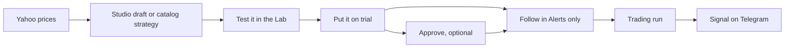

# Stonks without a broker

You can use Stonks with no broker at all. No IB Gateway, no broker connection and no broker account. Out of the box the broker is the simulated one, and no connection provider is turned on.

This page walks through one journey that always works that way: build a strategy, test it, turn it on and get its new signals on Telegram. Nothing trades. `tests/integration/test_no_broker_signal_path.py` and `tests/e2e/test_journeys_no_broker.py` check this journey on every change.

## What works without a broker

| Works | Needs a broker |
|---|---|
| Price data from Yahoo, the lake, charts and the screener | Real-money portfolios (the Real money stages) |
| The Strategy Studio and the Lab | Approve each trade and Automatic follows at a broker |
| On trial strategies and their test books | Broker paper accounts and broker sync |
| Approving a strategy | Reconciliation, the IB Gateway jobs and Going live |
| Alerts only and Paper follows on a Simulated portfolio | |
| Trading runs, the feed, Web Push, email and Telegram | |

The broker jobs of the scheduler (`broker_health`, the IB Gateway checks, `live_submit`, `ingest_borrow` and the rest) skip when there is no gateway, and none of them ever halts trading because a broker is missing.

## The journey



### 1. Install and load prices

```bash
uv sync
uv run stonks db init
uv run stonks users bootstrap --email you@example.com
uv run stonks ingest prices --source yahoo --tickers SPY.US,QQQ.US,AAPL.US --since 2024-01-01
uv run stonks ingest metadata --source yahoo --tickers SPY.US,QQQ.US,AAPL.US
```

Yahoo needs no key. Load the metadata too: it tells Stonks each ticker's asset class. A trading run skips a ticker whose asset class it does not know, even when the Lab could test it. After that the scheduler keeps both fresh: its daily price update reads Yahoo while no `EODHD_API_KEY` is set, and its metadata update always reads Yahoo.

Set the tickers the trading run looks at in `[production] universe`, or in the console under Settings. `stonks users bootstrap` sets ten liquid funds when none is set.

### 2. Make a strategy

Either way works:

- **Studio.** Open Studio, click New draft, start from a template (for example SMA trend following) or from blank rules, and create the draft.
- **Catalog.** Pick one of the ready strategies in the Lab.

### 3. Test it in the Lab

Open the Lab. The Test a strategy form needs a strategy, the tickers and a start and end date. Click Test it. From the shell:

```bash
uv run stonks lab run momentum --tickers SPY.US,QQQ.US,AAPL.US --start 2024-06-01 --end 2025-09-01
```

A Studio draft has its own backtest on its page.

### 4. Put it on trial

A strategy On trial runs its own test book every trading run with simulated money. Its signals are real signals.

- Studio: Put on trial, in the Ship panel of the draft.
- Lab: after a test that passed, click Put it on trial, then start the lab run it sets up.
- Shell: `stonks lab run ... --register` puts it on trial when every robustness test passes.

### 5. What "turn it on" means when you only want alerts

For a person who only wants alerts, turning a strategy on means **following it in Alerts only**. That works for an On trial strategy and for an Approved one. The alerts of an On trial strategy say "(on trial)".

Approving is optional. You may still want it, for example so other people can follow it. Approving needs a passing go-live check. A new strategy has no trial days yet, so an admin approves it with an override and a reason of at least 20 characters:

- Console: on the strategy's page click Override…, give the reason, type override and click Override and approve.
- Shell: `uv run stonks registry promote STRATEGY_ID --override --reason "Alerts only for me, nothing trades it."`

The override and its reason are kept in the strategy's history.

Approving also makes your default portfolio follow the strategy in Paper. That trades simulated money, never a broker. If you want nothing to trade at all, switch that follow to Alerts only in the next step.

### 6. Follow it in Alerts only

On the strategy's page, in the Follow panel, choose Alerts only and click Follow. When your portfolio already follows it (after an approval), the panel shows that follow instead: pick Alerts only there. You can also follow from the Welcome guide.

Alerts only places no order and writes no fill. You get the signals and nothing else.

### 7. Link Telegram

1. Make a bot with @BotFather in Telegram and copy its token.
2. Put it in `.env` as `STONKS_TELEGRAM_BOT_TOKEN`. Every process that sends or queues alerts reads `.env`, so one line covers them all.
3. So the bot can read your link message, set `[telegram] enabled = true` and restart `stonks serve`. Or run `uv run stonks telegram poll` in a second terminal.
4. In the console open Notifications, Alert settings, Telegram and click Get a link code. From the shell: `uv run stonks telegram link-code --user you@example.com`.
5. Send `/link CODE` to your bot in a private chat within 10 minutes. Click Check the link in the console, or run `uv run stonks telegram status --user you@example.com`.

Linking needs no broker. A linked chat also counts as alerts on in the Welcome guide.

### 8. Choose Telegram only for signals

In Alert settings, the grid Which alerts go where has one row per kind of alert and one column per channel. In the Signals row, untick Push, keep Telegram ticked, and leave Email and Webhook unticked. Each box saves at once.

The in-app feed always keeps a copy. Quiet hours are set on the same page. During quiet hours your signals wait, then arrive as one summary message when the quiet hours end.

### 9. Run it every trading day

A trading run scores the strategy and moves its test book. Each new signal (a buy, a sale, an add or a trim of the test book) goes to its Alerts only followers, at most three per strategy and run. A test book fills at the next open, so the alert comes the evening the strategy decides. A second run on the same day sends nothing twice.

The notifications go out through the delivery worker, which runs next to the scheduler. Pick one of these:

- **One process.** Set `[scheduler] backend = "in_process"` and run `uv run stonks serve`. It runs the daily jobs (prices, metadata, the trading run 45 minutes after the close) and delivers the alerts.
- **Two processes.** Run `uv run stonks serve` and `uv run stonks schedule run`.
- **No scheduler.** Run `uv run stonks ingest prices --source yahoo ...` and `uv run stonks tick` from cron after the close, and `uv run python -m stonks.notify deliver` every minute.

You can also start a run by hand in the console: Orders, Trading runs, untick Dry run and click Start paper run. A dry run sends no alerts.

## Without a bot token

With `STONKS_TELEGRAM_BOT_TOKEN` unset everything above still works. Telegram is simply not offered: Alert settings shows no Telegram column, the Telegram panel says the server has no bot, and a link code is refused. Signals still reach the feed, and Web Push or email as your alert settings say.

## See also

- [Operations](operations.md): the scheduler, Telegram and alerts in full.
- [Accounts and modes](design/accounts-and-modes.md): follow modes and portfolios.
- [Vocabulary](design/vocabulary.md): On trial, Approved, Alerts only and the other words.
